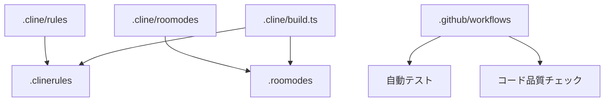

# システムパターン

## システムアーキテクチャ

このプロジェクトは、以下の主要なコンポーネントで構成されています：

1. **ルールとモード定義システム**

   - `.cline/rules`: コーディングルールを定義するマークダウンファイル
   - `.cline/roomodes`: 実装モードを定義するマークダウンファイル
   - `.cline/build.ts`: ルールとモードを生成するビルドスクリプト

2. **ユーティリティモジュール**

   - `type-predictor`: JSON データから型を予測するモジュール
   - `tdd-example`: テストファーストモードとアダプターパターンの実装例

3. **スクリプトとツール**

   - `scripts`: 単一ファイルのスクリプトとユーティリティ
   - `cmd`: コマンドラインツール

4. **CI/CD パイプライン**
   - `.github/workflows`: GitHub Actions による自動テストと検証

## 重要な技術的決定

1. [T3 Stack](https://create.t3.gg/) の採用
2. コンポーネントライブラリに[ shadcn ](https://ui.shadcn.com/)を採用
3. **テスト駆動開発（TDD）の採用**

   - vitestの使用
   - テストファーストアプローチ
   - 高いテストカバレッジの目標設定

## コンポーネントの関係

