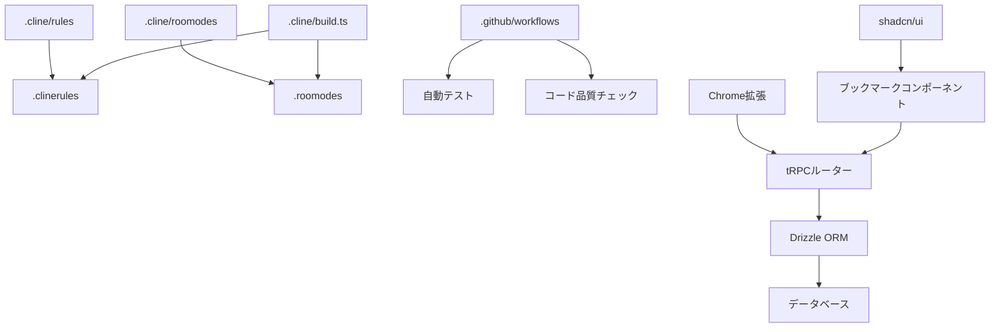
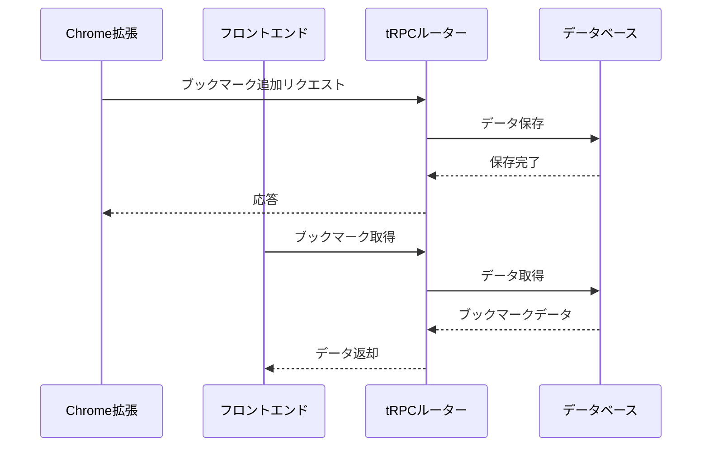

# システムパターン

## システムアーキテクチャ

このプロジェクトは、以下の主要なコンポーネントで構成されています：

1. **ルールとモード定義システム**

   - `.cline/rules`: コーディングルールを定義するマークダウンファイル
   - `.cline/roomodes`: 実装モードを定義するマークダウンファイル
   - `.cline/build.ts`: ルールとモードを生成するビルドスクリプト

2. **ブックマーク機能**

   - **フロントエンド**
     - `src/app/_components/bookmark.tsx`: ブックマークコンポーネント
     - `src/app/bookmark/edit/page.tsx`: ブックマーク編集ページ
     - shadcn/uiコンポーネントの活用

   - **バックエンド**
     - `src/server/api/routers/bookmark.ts`: tRPCルーター
     - `src/server/db/schema.ts`: Drizzleスキーマ定義
     - データベースアダプター層

   - **Chrome拡張機能**
     - `src/chrome-ext/`: 拡張機能のソースコード
     - バックグラウンドスクリプト
     - ポップアップUI

3. **ユーティリティモジュール**

   - `type-predictor`: JSON データから型を予測するモジュール
   - `tdd-example`: テストファーストモードとアダプターパターンの実装例

4. **スクリプトとツール**

   - `scripts`: 単一ファイルのスクリプトとユーティリティ
   - `cmd`: コマンドラインツール

5. **CI/CD パイプライン**
   - `.github/workflows`: GitHub Actions による自動テストと検証

## 重要な技術的決定

1. [T3 Stack](https://create.t3.gg/) の採用
   - Next.js 14 App Routerの活用
   - tRPCによるタイプセーフなAPI
   - Drizzle ORMによるデータ層の実装

2. コンポーネントライブラリに[shadcn](https://ui.shadcn.com/)を採用
   - 再利用可能なUIコンポーネント
   - カスタマイズ可能なデザインシステム

3. **テスト駆動開発（TDD）の採用**
   - vitestの使用
   - テストファーストアプローチ
   - 高いテストカバレッジの目標設定

4. **ブックマーク機能のアーキテクチャ**
   - tRPCルーターによるAPIエンドポイント定義
   - Drizzle ORMによるデータモデリング
   - Chrome拡張機能とのセキュア通信

## コンポーネントの関係

## データフロー

## 実装パターン

1. **Repositoryパターン**
   - Drizzle ORMによるデータアクセス抽象化
   - テスト容易性の向上

2. **tRPCルーター**
   - エンドポイントの型安全な定義
   - 入力バリデーション
   - エラーハンドリング

3. **コンポーネント設計**
   - 再利用可能なUIコンポーネント
   - Props型による厳格な型チェック
   - コンポーネントテストの容易さ
