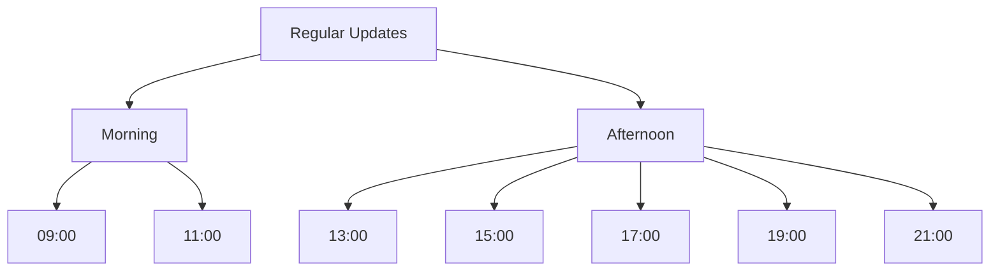

# Personal Rules

[Previous content remains unchanged...]

2. End of Work (Trigger: "Thank you for your work")
   - Create knowledge summary
   - Update memory bank
   - Create ADR (if necessary)
   - Final weekly report update
   - Commit and push

### 1.2 Knowledge Update (Auto-detection or "Update Knowledge")

- Triggers:
  1. Auto-detection: When detecting sentences containing:
     - "Issue has been clarified"
     - "Important discovery made"
     - "Knowledge gained"
     - "Improvement found"
  2. Manual: Keyword "Update knowledge"
- Process: Execute knowledge summary creation only

### 1.3 ADR Creation (Auto-detection or "Create ADR")

- Triggers:
  1. Auto-detection: When detecting sentences containing:
     - "Design policy decided"
     - "Architecture change decided"
     - "Important decision made"
     - "Decided to change to ~"
     - "Will proceed with ~ policy"
  2. Manual: Keyword "Create ADR"
- Process: Execute ADR creation only

### 1.4 Guideline Revision (Trigger: "Revise Guide")

1. Review and reflect on work
2. Revise following existing guidelines

## 2. Work Details

## 1. Regular Weekly Report Updates

### 1.1 Update Times



Regular updates at:
- 09:00: Work start
- 11:00: Mid-morning
- 13:00: After lunch
- 15:00: Mid-afternoon
- 17:00: Standard end time
- 19:00: Overtime
- 21:00: Late night work

### 1.2 Update Procedure

1. Time Check
   - Confirm current time
   - Record next update time

2. Content Collection
   - Work done since last update
   - Commit history
   - Created/updated files
   - Discussions and decisions

3. Record Update
   - Preparation
     - Always verify existing weekly report file with read_file
     - Ensure preservation of existing content
     - Maintain chronological order (newest update at top)

   - Content Addition
     - Enter timestamp (current time)
     - Record work hours
     - Summarize activities
     - Link to deliverables
     - Issues and next steps

   - Update Verification
     - Verify existing content is preserved
     - Check new content format
     - Verify chronological order

4. Next Update Preparation
   - Record next update time
   - Verify notification settings

### 1.3 Checklist

Items to verify during updates:

```markdown
Pre-update Checks:
- [ ] Verified existing weekly report file with read_file
- [ ] Ready to preserve existing content
- [ ] Understand chronological order (newest on top)

Content Checks:
- [ ] Accurate timestamp
- [ ] Correct work hours recorded
- [ ] All work content included
- [ ] Valid deliverable links
- [ ] Clear issues and next steps
- [ ] Next update time recorded

Post-update Verification:
- [ ] All existing content preserved
- [ ] New content in correct format
- [ ] Chronological order maintained
```

### 1.4 Notification System

1. Update Time Notifications
   - 15 minutes before update
   - At update time
   - Reminder for missed updates

2. Notification Content
   - Current time
   - Previous update content
   - Checklist

3. Notification Confirmation
   - Verify notification receipt
   - Start update process
   - Record completion

## 2. Update Prevention Measures

### 2.1 Reminder Settings

1. Key Update Times
   - 9:00 (Work start)
   - 17:00 (Standard end)
   - 21:00 (Late night)

2. Intermediate Checks
   - 11:00
   - 13:00
   - 15:00
   - 19:00

### 2.1 Knowledge Summary Creation

```
Location: docs/team/[teamName]/logs/ai/knowledge/[development-phase]/YYYY-MM/YYYY-MM-DD-HH-[content-title-in-english].md
Procedure:
1. Pre-summary Review
   - Review overall content
   - List key decision points
   - Organize issues

2. Reflection Process
   - Deep dive into decision rationale
   - Organize options and comparisons
   - Analyze lessons learned

3. Summary Creation
   - Specific issues and solutions
   - Technical decisions and rationale
   - Improvement suggestions and alternatives
   - Next step proposals
```

[Content will continue in next update...]