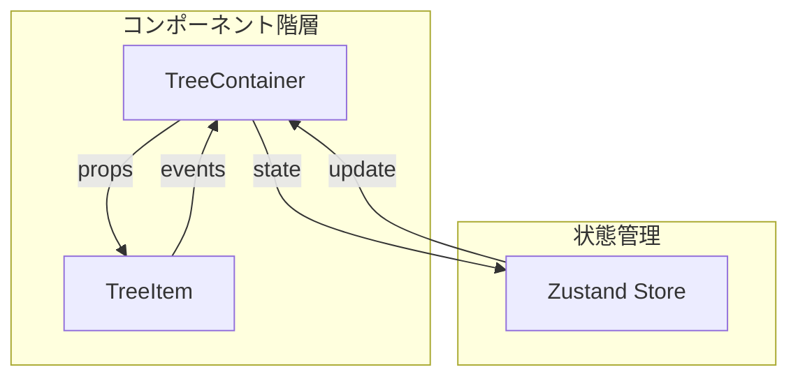
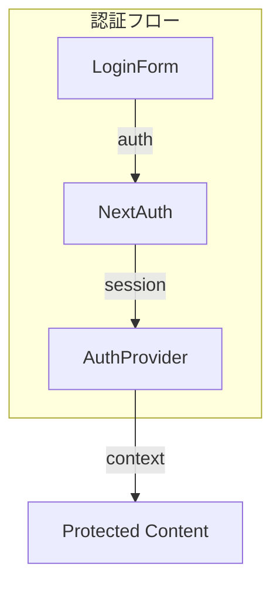
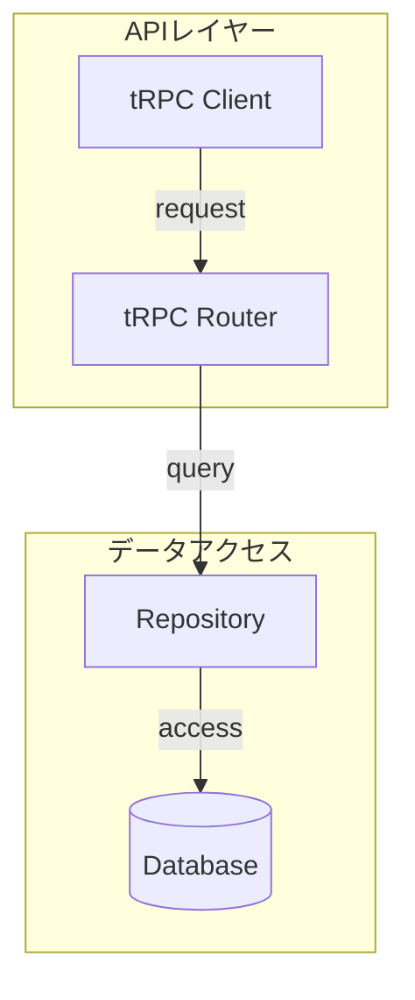

# コンポーネント構成と依存関係

## コアコンポーネント

### 1. ブックマークツリー管理

#### TreeContainer
- 責務：ツリー構造全体の管理とイベントハンドリング
- 依存：
  - Zustand store (状態管理)
  - TreeItem (表示コンポーネント)
- 主要機能：
  - ドラッグ＆ドロップ制御
  - ツリー構造の更新
  - 状態の永続化

#### TreeItem
- 責務：個別のブックマークアイテムのレンダリング
- 依存：
  - shadcn/ui コンポーネント
- 主要機能：
  - インタラクティブなUI
  - アイコン表示
  - コンテキストメニュー

### 2. 認証システム

#### AuthProvider
- 責務：認証状態の管理と提供
- 依存：
  - NextAuth.js
  - Session管理
- 主要機能：
  - セッション維持
  - 認証状態の共有
  - ルート保護

### 3. APIインターフェース

#### tRPCルーター
- 責務：型安全なAPIエンドポイントの提供
- 依存：
  - Repository層
  - バリデーション
- 主要機能：
  - エンドポイント定義
  - 入力検証
  - エラーハンドリング

## 依存関係マトリックス

| コンポーネント | 依存先 | 依存される先 |
|--------------|--------|------------|
| TreeContainer | Zustand, TreeItem | Page |
| TreeItem | shadcn/ui | TreeContainer |
| AuthProvider | NextAuth | All Protected Routes |
| tRPC Router | Repository | Client Components |
| Repository | Drizzle ORM | tRPC Router |

## コンポーネント間通信

### 1. イベントフロー
- ユーザーインタラクション → TreeItem
- TreeItem → TreeContainer（イベントバブリング）
- TreeContainer → Zustand Store（状態更新）
- Zustand Store → 関連コンポーネント（再レンダリング）

### 2. データフロー
- クライアントコンポーネント → tRPC Client
- tRPC Client → tRPC Router（バリデーション）
- tRPC Router → Repository（データ操作）
- Repository → Database（永続化）

## 拡張性と保守性

### 1. コンポーネントの分離原則
- プレゼンテーショナルコンポーネントとコンテナコンポーネントの分離
- ビジネスロジックとUIの分離
- 再利用可能なコンポーネントの抽象化

### 2. 依存性注入
- Repository パターンによるデータアクセスの抽象化
- サービスの依存関係の明確な定義
- テスト容易性の向上

### 3. 状態管理の設計原則
- 単一の信頼できる情報源
- イミュータブルな状態更新
- 予測可能な状態遷移