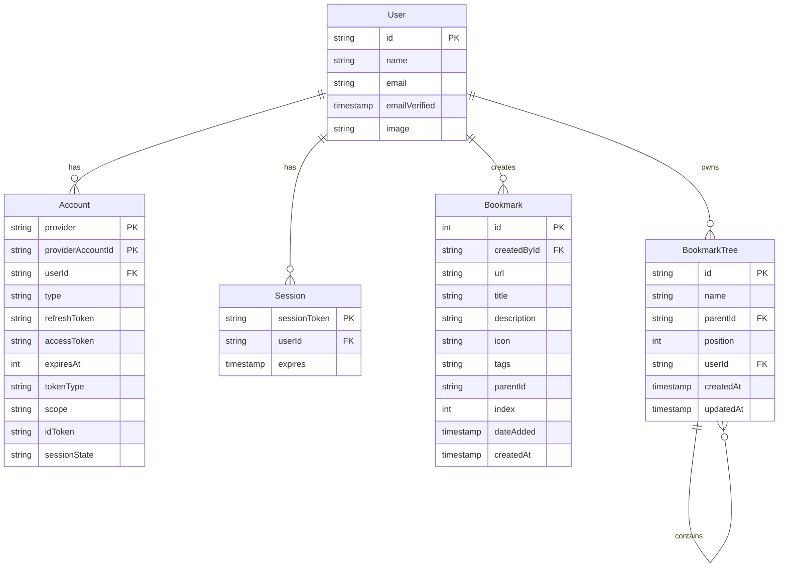

# データモデル設計

## ERD図



## データモデルの詳細

### 1. User（ユーザー）
- システムの基本となるユーザー情報を管理
- OAuth認証との連携を考慮した設計
- 属性：
  - `id`: ユーザー固有のUUID
  - `email`: メールアドレス（認証用）
  - `name`: 表示名
  - `emailVerified`: メール確認状態
  - `image`: プロフィール画像URL

### 2. Account（認証アカウント）
- OAuth認証プロバイダーとの連携情報を管理
- 複数のプロバイダーに対応
- 属性：
  - `provider` + `providerAccountId`: 複合主キー
  - `userId`: User テーブルへの参照
  - `type`: 認証タイプ
  - 各種トークン情報

### 3. Session（セッション）
- ユーザーセッション情報の管理
- セキュリティとパフォーマンスを考慮した設計
- 属性：
  - `sessionToken`: セッション識別子
  - `userId`: セッション所有者
  - `expires`: 有効期限

### 4. Bookmark（ブックマーク）
- ウェブページのブックマーク情報を管理
- Chrome互換のデータ構造
- 属性：
  - `id`: 一意の識別子
  - `url`: ブックマークURL
  - `title`: ページタイトル
  - `description`: 説明文
  - `icon`: ファビコンURL
  - `tags`: JSON形式のタグ情報
  - `parentId`: フォルダ構造の参照
  - `index`: 表示順序
  - `dateAdded`: Chrome同期用タイムスタンプ

### 5. BookmarkTree（ブックマークツリー）
- ブックマークの階層構造を管理
- Adjacency Listパターンによる実装
- 属性：
  - `id`: UUID形式の識別子
  - `name`: フォルダ/アイテム名
  - `parentId`: 親ノードの参照
  - `position`: 同階層での表示順序
  - `userId`: 所有者の参照

## データアクセスパターン

### 1. Repository層
```typescript
interface BookmarkRepository {
  findById(id: string): Promise<Bookmark>;
  findByUser(userId: string): Promise<Bookmark[]>;
  create(data: CreateBookmarkDTO): Promise<Bookmark>;
  update(id: string, data: UpdateBookmarkDTO): Promise<Bookmark>;
  delete(id: string): Promise<void>;
}
```

### 2. クエリ最適化
- インデックス戦略：
  - `bookmark_url_idx`: URL検索の高速化
  - `bookmark_parent_id_idx`: 階層構造のクエリ最適化
  - `bookmark_created_by_idx`: ユーザー別検索の効率化

### 3. データ整合性
- 外部キー制約による参照整合性の保証
- トランザクション管理による一貫性の確保
- バリデーションルール：
  - URLの最大長制限（2048文字）
  - タイトルの最大長制限（512文字）
  - 循環参照の防止（ツリー構造）

## マイグレーション管理

### 1. マイグレーションファイル
- タイムスタンプベースのバージョン管理
- 前方/後方互換性の考慮
- ロールバック手順の明確化

### 2. データ変換
- 既存データの互換性維持
- 段階的なスキーマ更新
- データ検証プロセス

## キャッシング戦略

### 1. アプリケーションレベル
- ツリー構造のメモリキャッシュ
- ユーザー設定のローカルストレージ

### 2. データベースレベル
- インデックスの効率的な利用
- クエリ結果のキャッシング
- 接続プールの最適化