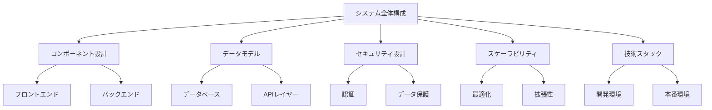

# アーキテクチャドキュメント

## 概要
このドキュメントセットは、We-Editシステムのアーキテクチャ設計を包括的に説明するものです。

## ドキュメント構成

1. [システム全体構成](./overview.md)
   - システムの全体アーキテクチャ
   - レイヤー構成
   - データフロー
   - 主要インターフェース

2. [コンポーネント設計](./components.md)
   - コアコンポーネント
   - 依存関係
   - コンポーネント間通信
   - 拡張性と保守性

3. [データモデル](./data-model.md)
   - ERD
   - テーブル定義
   - データアクセスパターン
   - マイグレーション戦略

4. [セキュリティ設計](./security.md)
   - 認証・認可
   - データ保護
   - 通信セキュリティ
   - コンプライアンス

5. [スケーラビリティ](./scalability.md)
   - パフォーマンス最適化
   - 水平スケーリング
   - システムの成長対応
   - モニタリング

6. [技術スタック](./tech-stack.md)
   - 採用技術
   - 選定理由
   - 技術の利点
   - 将来の展望

## 図表一覧

## 改訂履歴

| 日付 | バージョン | 説明 | 作成者 |
|------|------------|------|---------|
| 2025/03/02 | 1.0.0 | 初期バージョン作成 | System Architect |

## ドキュメント管理

### 更新ガイドライン
1. 各ドキュメントの更新は、プルリクエストを通じて行う
2. レビュープロセスを経て承認される
3. 変更履歴を必ず記録する

### 品質管理
- 定期的なレビュー
- 最新状態の維持
- 整合性の確認

## 関連資料
- [i18n実装計画](../i18n-implementation-plan.md)
- [システムパターン](../../.cline/memory/systemPatterns.md)