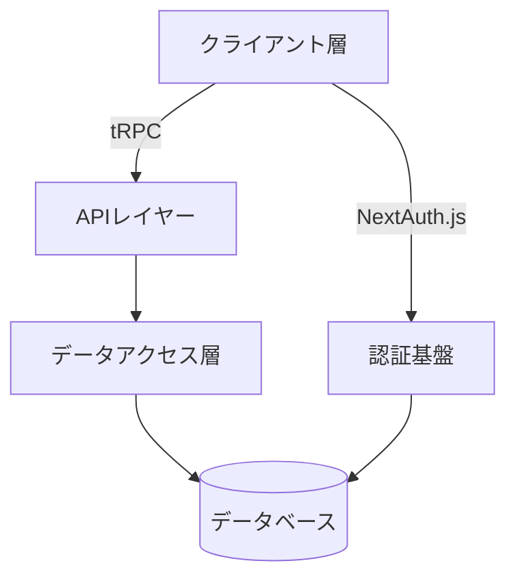
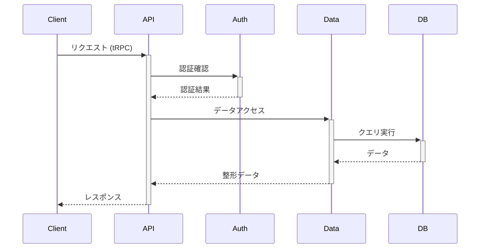

# We-Edit システムアーキテクチャ概要

## システム構成

We-Editは、モダンなWebブックマーク管理システムとして、以下の主要コンポーネントで構成されています：

## アーキテクチャの特徴

### 1. レイヤードアーキテクチャ

システムは以下の3層で構成されています：

1. **プレゼンテーション層**
   - Next.js App Router による最新のReactアーキテクチャ
   - shadcn/ui による一貫性のあるUIコンポーネント
   - Zustand による効率的な状態管理

2. **APIレイヤー**
   - End-to-end type-safe な tRPC実装
   - バリデーションとエラーハンドリング
   - セキュアなエンドポイント設計

3. **データアクセス層**
   - Repositoryパターンによる抽象化
   - Drizzle ORMによる型安全なデータアクセス
   - マイグレーション管理システム

### 2. クロスカッティング機能

- **多言語対応（i18n）**
  - 言語リソースの動的ローディング
  - 階層化された翻訳キー管理
  - フォールバックメカニズム

- **認証・認可**
  - NextAuth.jsによるOAuth/JWT認証
  - ロールベースのアクセス制御
  - セッション管理

- **パフォーマンス最適化**
  - キャッシング戦略
  - 仮想化されたリストレンダリング
  - 遅延ローディング

## データフロー

## 主要なインターフェース

1. **クライアント-APIインターフェース**
   - tRPCルーターによる型安全な通信
   - Zodによる入力バリデーション
   - エラーハンドリング

2. **データアクセスインターフェース**
   - Repositoryパターンによる抽象化
   - トランザクション管理
   - マイグレーション制御

3. **認証インターフェース**
   - OAuth2.0プロトコル
   - JWTトークン管理
   - セッション制御