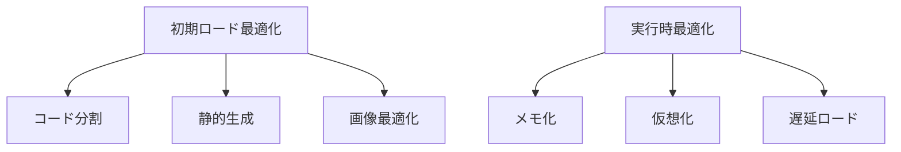
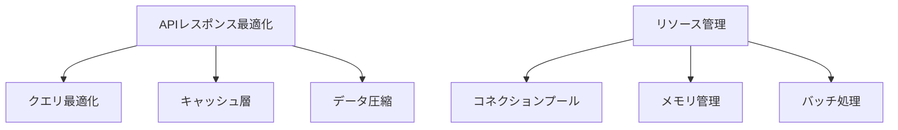
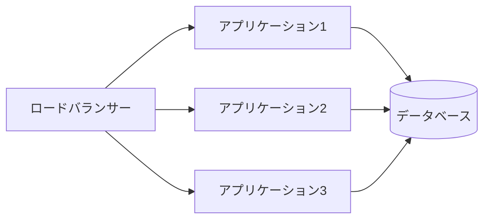
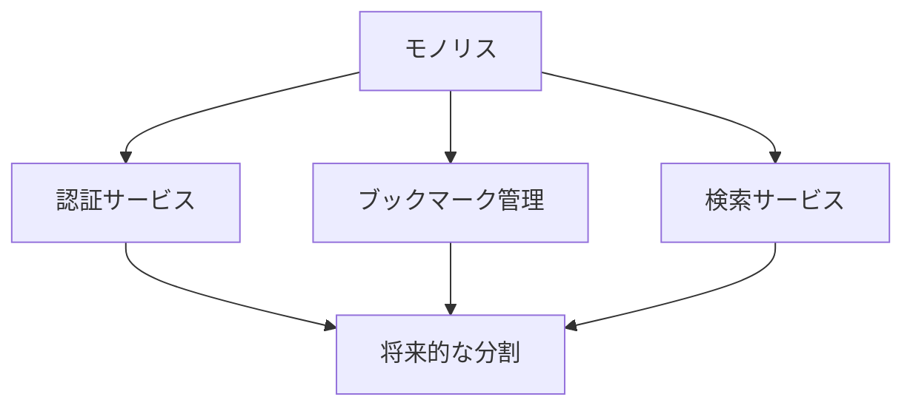

# スケーラビリティと最適化設計

## パフォーマンス最適化

### 1. フロントエンド最適化



#### 実装戦略
- **コード分割**
  - ダイナミックインポート
  - ルートベースの分割
  - コンポーネントの遅延ロード

- **データ取得の最適化**
  - SWR/React Query
  - キャッシュ戦略
  - プリフェッチ

- **レンダリング最適化**
  - 仮想化されたリスト表示
  - React.memo による不要な再レンダリング防止
  - CSS-in-JS の最適化

### 2. バックエンド最適化



#### 実装戦略
- **データベース最適化**
  - インデックス戦略
  - クエリチューニング
  - 接続プール管理

- **キャッシュ戦略**
  - レスポンスキャッシュ
  - クエリ結果キャッシュ
  - 静的アセットキャッシュ

## スケーラビリティ設計

### 1. 水平スケーリング



#### 設計方針
- ステートレスなアプリケーション設計
- セッション管理の分散化
- データベース接続の最適化

### 2. マイクロサービス化への準備



#### 実装戦略
- サービス境界の明確な定義
- ドメイン駆動設計の適用
- APIゲートウェイの導入準備

## システムの成長対応

### 1. データ量の増加対策

#### インデックス戦略
```sql
-- 検索性能の最適化
CREATE INDEX idx_bookmarks_url ON bookmarks(url);
CREATE INDEX idx_bookmarks_tags ON bookmarks(tags);
CREATE INDEX idx_bookmarks_user_id ON bookmarks(user_id);
```

#### パーティショニング戦略
- ユーザーIDによるシャーディング
- 時系列データの分割
- コールドストレージの活用

### 2. トラフィック増加対策

#### キャッシュ階層
1. ブラウザキャッシュ
2. CDNキャッシュ
3. アプリケーションキャッシュ
4. データベースキャッシュ

#### レート制限
```typescript
// レート制限の実装例
const rateLimiter = {
  window: 60000, // 1分
  max: 100,      // リクエスト数
  message: 'Too many requests, please try again later.'
};
```

## モニタリングと最適化

### 1. パフォーマンスメトリクス

#### 監視項目
- レスポンスタイム
- スループット
- エラーレート
- リソース使用率

#### 実装例
```typescript
const metrics = {
  responseTime: new Histogram({
    name: 'http_request_duration_seconds',
    help: 'HTTP request duration in seconds',
    labelNames: ['method', 'route', 'status']
  }),
  // その他のメトリクス
};
```

### 2. アラート設定

#### トリガー条件
- レスポンスタイム > 500ms
- エラーレート > 1%
- CPU使用率 > 80%
- メモリ使用率 > 85%

## 将来の拡張性

### 1. 機能拡張への準備

#### プラグインシステム
- 機能の動的追加
- サードパーティ連携
- カスタマイズ可能なUI

#### API拡張性
- バージョニング戦略
- 下位互換性の維持
- 段階的な機能追加

### 2. インフラストラクチャの進化

#### クラウドネイティブ化
- コンテナ化
- オーケストレーション
- サーバーレス統合

#### データベース進化
- NoSQLの統合
- 時系列データベース
- 検索エンジンの統合