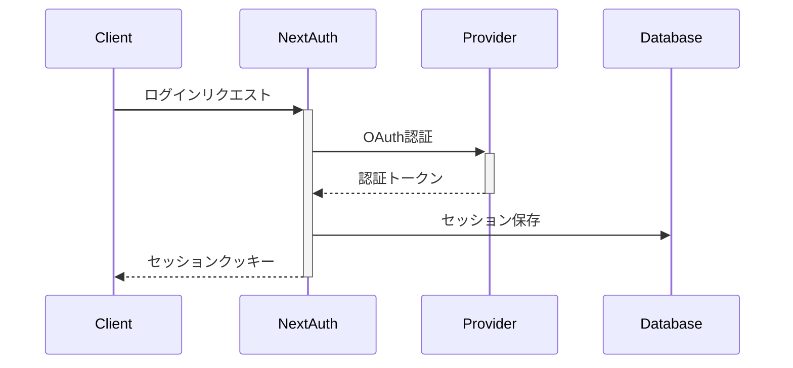

# セキュリティ設計仕様

## 認証システム

### 1. NextAuth.js実装



#### 実装詳細
- OAuth 2.0/OpenID Connectプロトコル採用
- JWTベースのセッション管理
- セキュアクッキーの使用
  - httpOnly: true
  - secure: true（本番環境）
  - sameSite: 'lax'

### 2. セッション管理
- セッションの有効期限設定
- 自動更新メカニズム
- セッションの無効化処理

## アクセス制御

### 1. ルートプロテクション
```typescript
// ルートプロテクションの実装例
export const routeConfig = {
  public: ['/login', '/about'],
  protected: ['/dashboard', '/settings'],
  roleRequired: {
    '/admin': ['ADMIN'],
    '/team': ['ADMIN', 'TEAM_MEMBER']
  }
};
```

### 2. APIセキュリティ
- tRPCミドルウェアによる認証チェック
- レート制限の実装
- APIエンドポイントの保護

## データセキュリティ

### 1. 入力バリデーション
```typescript
// Zodスキーマによるバリデーション例
const bookmarkSchema = z.object({
  url: z.string().url().max(2048),
  title: z.string().max(512),
  description: z.string().max(2048).optional(),
  tags: z.array(z.string()).max(50)
});
```

### 2. SQLインジェクション対策
- Drizzle ORMのパラメータ化クエリ
- プリペアドステートメントの使用
- エスケープ処理の徹底

### 3. XSS対策
- コンテンツセキュリティポリシー（CSP）の設定
- 出力エスケープの徹底
- サニタイゼーション処理

## 通信セキュリティ

### 1. HTTPS
- 全通信のTLS暗号化
- 証明書の自動更新
- HSTS（HTTP Strict Transport Security）の有効化

### 2. APIセキュリティヘッダー
```typescript
// セキュリティヘッダーの設定例
const securityHeaders = {
  'Content-Security-Policy': `
    default-src 'self';
    script-src 'self' 'unsafe-inline' 'unsafe-eval';
    style-src 'self' 'unsafe-inline';
    img-src 'self' data: https:;
  `,
  'X-Frame-Options': 'DENY',
  'X-Content-Type-Options': 'nosniff',
  'Referrer-Policy': 'strict-origin-when-cross-origin'
};
```

## エラーハンドリングとロギング

### 1. セキュアなエラー処理
- 本番環境でのスタックトレース非表示
- ユーザーフレンドリーなエラーメッセージ
- センシティブ情報の除外

### 2. セキュリティログ
- 認証試行のログ記録
- APIアクセスログ
- 異常検知システム

## コードセキュリティ

### 1. 依存関係管理
- 定期的な脆弱性スキャン
- 自動更新システム
- パッケージのバージョン管理

### 2. シークレット管理
- 環境変数による設定
- シークレットの暗号化
- 本番環境でのセキュアな管理

## セキュリティテスト

### 1. 自動化テスト
- セキュリティユニットテスト
- 脆弱性スキャン
- ペネトレーションテスト

### 2. 継続的なセキュリティ監視
- リアルタイムの異常検知
- セキュリティ監査ログ
- インシデント対応計画

## コンプライアンス要件

### 1. データプライバシー
- GDPR準拠
- 個人情報の保護
- データ削除要求への対応

### 2. アクセシビリティ
- WCAG 2.1準拠
- キーボード操作対応
- スクリーンリーダー対応