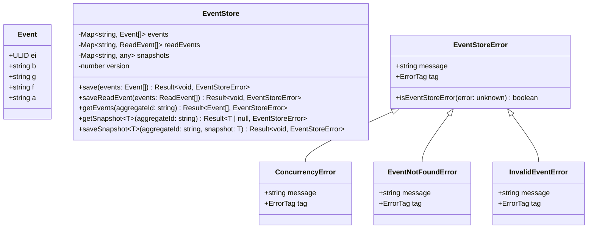
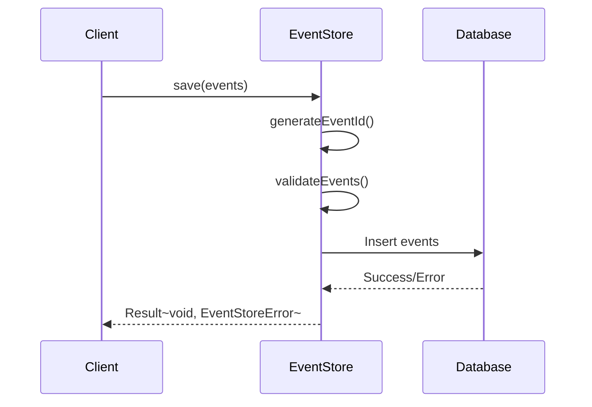
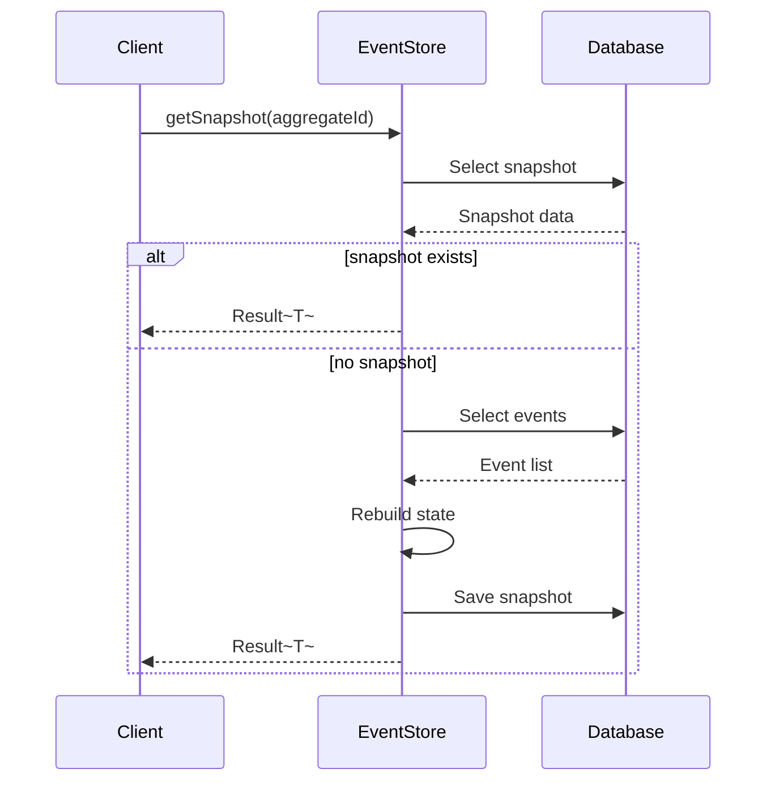

# イベントコンポーネント設計

## 概要

イベントコンポーネントは、システム全体のイベントソーシングの基盤となる機能を提供します。

## クラス図



## データベーススキーマ

```sql
-- events table
CREATE TABLE events (
    id TEXT PRIMARY KEY,  -- ULID
    bounded_context CHAR(1) NOT NULL,  -- b: bounded context
    group_context CHAR(1) NOT NULL,    -- g: group context
    feature_context CHAR(1) NOT NULL,  -- f: feature context
    action_type VARCHAR(10) NOT NULL,  -- a: action type
    aggregate_id TEXT NOT NULL,
    data JSONB NOT NULL,
    version INTEGER NOT NULL,
    created_at TIMESTAMP WITH TIME ZONE NOT NULL DEFAULT CURRENT_TIMESTAMP,
    UNIQUE(aggregate_id, version)
);

-- read_events table
CREATE TABLE read_events (
    id TEXT PRIMARY KEY,  -- ULID
    bounded_context CHAR(1) NOT NULL,
    group_context CHAR(1) NOT NULL,
    feature_context CHAR(1) NOT NULL,
    action_type VARCHAR(10) NOT NULL,
    aggregate_id TEXT NOT NULL,
    data JSONB NOT NULL,
    created_at TIMESTAMP WITH TIME ZONE NOT NULL DEFAULT CURRENT_TIMESTAMP
);

-- snapshots table
CREATE TABLE snapshots (
    aggregate_id TEXT PRIMARY KEY,
    data JSONB NOT NULL,
    version INTEGER NOT NULL,
    created_at TIMESTAMP WITH TIME ZONE NOT NULL DEFAULT CURRENT_TIMESTAMP
);
```

## 重要な相互作用

### イベント保存フロー



### スナップショット管理



## エラー処理戦略

1. 結果型の使用
```typescript
import { Result, ok, err } from "neverthrow";

function processEvent(event: Event): Result<void, EventStoreError> {
    if (!isValidEvent(event)) {
        return err(new InvalidEventError("Invalid event structure"));
    }
    return ok(undefined);
}
```

2. エラー階層
```typescript
EventStoreError
├── ConcurrencyError
├── EventNotFoundError
└── InvalidEventError
```

## パフォーマンス考慮事項

1. インデックス戦略
   - aggregate_id + version の複合インデックス
   - created_at のインデックス
   - bounded_context + group_context のインデックス

2. スナップショット
   - 定期的なスナップショット生成
   - イベント数に基づく動的なスナップショットトリガー

3. キャッシュ戦略
   - 頻繁にアクセスされるスナップショットのメモリキャッシュ
   - イベントストリームのキャッシュ

## 拡張性

1. 新しいイベントタイプの追加
   ```typescript
   type NewEventType = {
       b: "x";  // 新しい境界付けられたコンテキスト
       g: "y";  // 新しいグループコンテキスト
       f: "z";  // 新しい機能コンテキスト
       a: "new_action";
       ei: ULID;
       data: {
           // イベント固有のデータ
       };
   };
   ```

2. カスタムストレージの実装
   ```typescript
   interface EventStorage {
       saveEvents(events: Event[]): Promise<Result<void, EventStoreError>>;
       getEvents(aggregateId: string): Promise<Result<Event[], EventStoreError>>;
   }