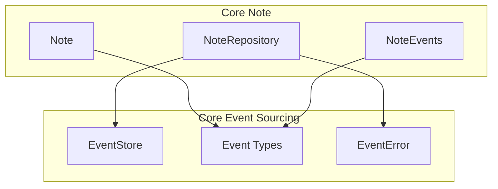
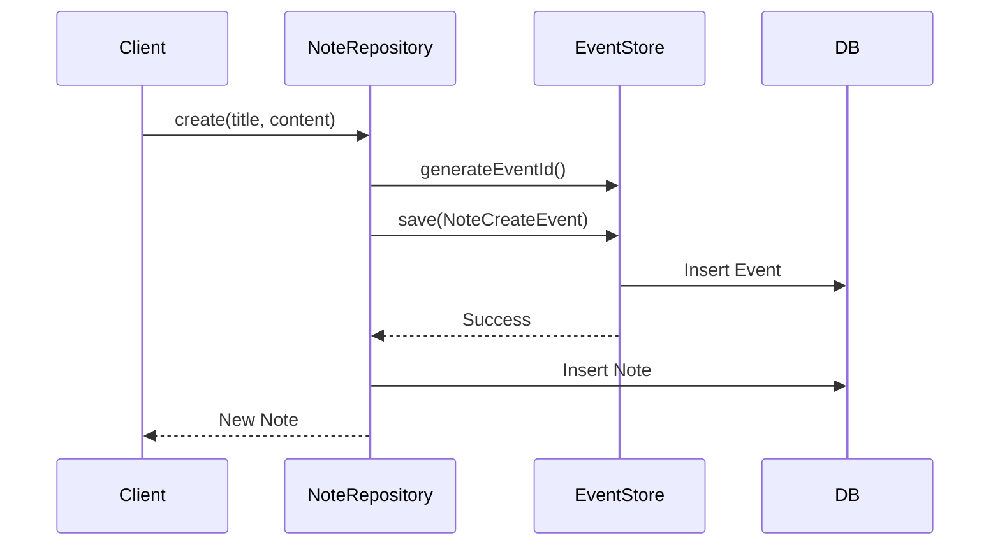
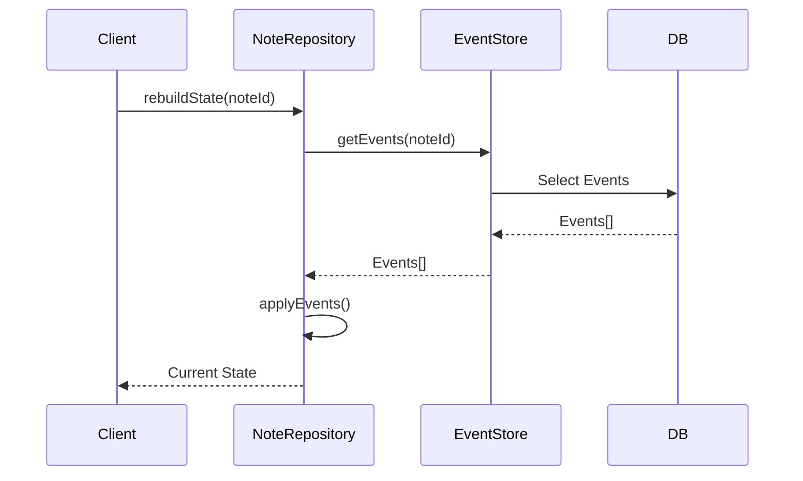

# コンポーネント統合設計

## イベントとノートの統合

### コンポーネント依存関係



### 共有される型定義

```typescript
// src/types/shared.ts
export type ULID = string;

export type BoundedContext = {
    note: "n";
    event: "e";
    // ... other contexts
};

export type EventBase = {
    ei: ULID;
    b: keyof BoundedContext;
    g: string;
    f: string;
    a: string;
    data: unknown;
};
```

## イベントフロー

### ノート作成時のフロー



### 状態再構築のフロー



## エラー処理の統合

```typescript
// 基底エラー型の共有
abstract class DomainError extends Error {
    constructor(
        message: string,
        public readonly tag: string,
        public readonly context: string
    ) {
        super(message);
    }
}

// イベントストアのエラー
class EventStoreError extends DomainError {
    constructor(message: string, tag: string) {
        super(message, tag, "event-store");
    }
}

// ノートのエラー
class NoteError extends DomainError {
    constructor(message: string, tag: string) {
        super(message, tag, "note");
    }
}

// エラー処理の統合
function handleDomainError(error: DomainError): Result<void, DomainError> {
    logError(error);
    return err(error);
}
```

## スナップショット戦略

### スナップショットの生成条件

```typescript
interface SnapshotStrategy {
    shouldTakeSnapshot(events: Event[]): boolean;
    generateSnapshot<T>(events: Event[]): T;
}

class DefaultSnapshotStrategy implements SnapshotStrategy {
    shouldTakeSnapshot(events: Event[]): boolean {
        return events.length >= 100;  // 100イベントごと
    }

    generateSnapshot<T>(events: Event[]): T {
        return events.reduce(applyEvent, getInitialState());
    }
}
```

### スナップショットの保存と復元

```typescript
class SnapshotManager {
    constructor(
        private eventStore: EventStore,
        private strategy: SnapshotStrategy
    ) {}

    async saveSnapshotIfNeeded(aggregateId: string): Promise<Result<void, EventStoreError>> {
        const events = await this.eventStore.getEvents(aggregateId);
        if (events.isErr()) return events;

        if (this.strategy.shouldTakeSnapshot(events.value)) {
            const snapshot = this.strategy.generateSnapshot(events.value);
            return this.eventStore.saveSnapshot(aggregateId, snapshot);
        }

        return ok(undefined);
    }
}
```

## キャッシュ戦略

### マルチレベルキャッシュ

```typescript
interface CacheStrategy {
    get<T>(key: string): Promise<T | null>;
    set<T>(key: string, value: T, ttl?: number): Promise<void>;
    invalidate(key: string): Promise<void>;
}

class NoteCacheManager {
    constructor(
        private readonly memoryCache: CacheStrategy,
        private readonly redisCache: CacheStrategy
    ) {}

    async getNote(id: string): Promise<Result<Note, NoteError>> {
        // メモリキャッシュをチェック
        const memResult = await this.memoryCache.get<Note>(id);
        if (memResult) return ok(memResult);

        // Redisキャッシュをチェック
        const redisResult = await this.redisCache.get<Note>(id);
        if (redisResult) {
            await this.memoryCache.set(id, redisResult);
            return ok(redisResult);
        }

        // データベースから取得
        const noteResult = await this.repository.findById(id);
        if (noteResult.isOk()) {
            await this.setCache(id, noteResult.value);
        }
        return noteResult;
    }
}
```

## パフォーマンス最適化

### クエリ最適化

```sql
-- Joined index for efficient event retrieval
CREATE INDEX idx_notes_events ON note_events (note_id, version, created_at);

-- Partial index for active notes
CREATE INDEX idx_active_notes ON notes (updated_at)
WHERE deleted_at IS NULL;

-- BRIN index for time-based queries
CREATE INDEX idx_notes_timerange ON notes
USING BRIN (created_at, updated_at);
```

### バッチ処理

```typescript
class NoteBatchProcessor {
    async processBatch(noteIds: string[]): Promise<Result<void, NoteError>> {
        const chunks = this.chunkArray(noteIds, 100);
        
        for (const chunk of chunks) {
            const events = await this.eventStore.getEventsBatch(chunk);
            if (events.isErr()) return events;
            
            await this.processEvents(events.value);
        }
        
        return ok(undefined);
    }
}
```

## 監視と分析

### メトリクス収集

```typescript
interface MetricsCollector {
    recordEvent(event: Event): void;
    recordError(error: DomainError): void;
    recordLatency(operation: string, duration: number): void;
}

class NoteMetrics implements MetricsCollector {
    recordEvent(event: Event): void {
        metrics.increment(`note.event.${event.a}`);
    }

    recordError(error: DomainError): void {
        metrics.increment(`note.error.${error.tag}`);
    }

    recordLatency(operation: string, duration: number): void {
        metrics.histogram(`note.latency.${operation}`, duration);
    }
}
```

### ヘルスチェック

```typescript
interface HealthCheck {
    check(): Promise<Result<void, DomainError>>;
}

class NoteSystemHealth implements HealthCheck {
    async check(): Promise<Result<void, DomainError>> {
        const checks = await Promise.all([
            this.checkEventStore(),
            this.checkNoteRepository(),
            this.checkCache()
        ]);

        return checks.every(r => r.isOk())
            ? ok(undefined)
            : err(new DomainError("Health check failed", "HEALTH", "system"));
    }
}