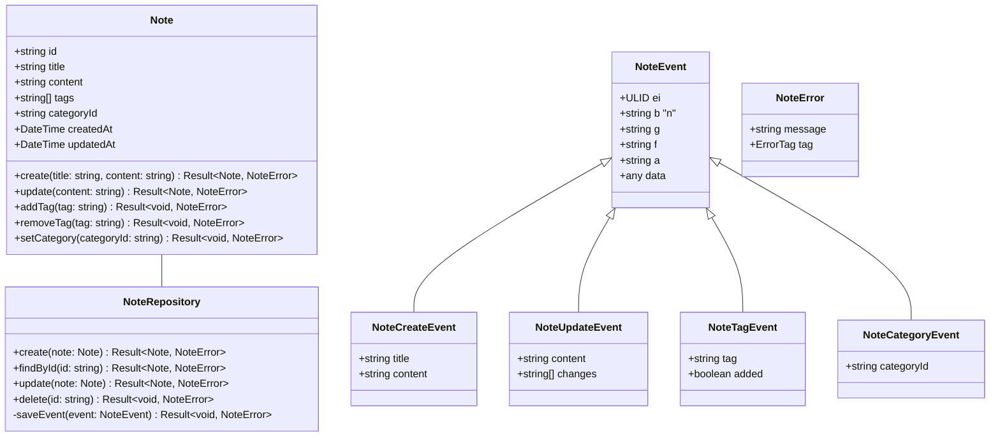
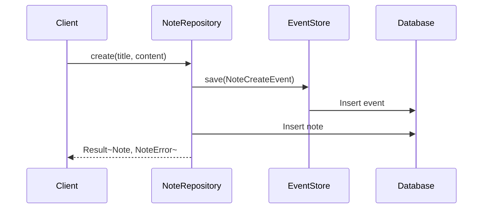
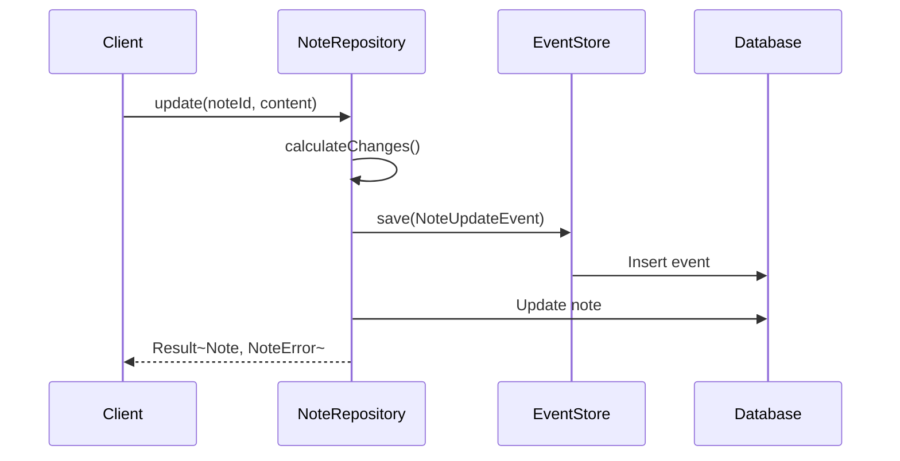

# ノートコンポーネント設計

## 概要

ノートコンポーネントはテキストベースのコンテンツ管理を提供し、イベントソーシングを活用して変更履歴を追跡します。

## クラス図



## データベーススキーマ

```sql
-- notes table (current state)
CREATE TABLE notes (
    id TEXT PRIMARY KEY,
    title TEXT NOT NULL,
    content TEXT NOT NULL,
    category_id TEXT REFERENCES categories(id),
    created_at TIMESTAMP WITH TIME ZONE NOT NULL DEFAULT CURRENT_TIMESTAMP,
    updated_at TIMESTAMP WITH TIME ZONE NOT NULL DEFAULT CURRENT_TIMESTAMP
);

-- note_tags (many-to-many relationship)
CREATE TABLE note_tags (
    note_id TEXT REFERENCES notes(id) ON DELETE CASCADE,
    tag_id TEXT REFERENCES tags(id) ON DELETE CASCADE,
    created_at TIMESTAMP WITH TIME ZONE NOT NULL DEFAULT CURRENT_TIMESTAMP,
    PRIMARY KEY (note_id, tag_id)
);

-- note_events (event sourcing)
CREATE TABLE note_events (
    id TEXT PRIMARY KEY, -- ULID
    note_id TEXT NOT NULL REFERENCES notes(id) ON DELETE CASCADE,
    bounded_context CHAR(1) NOT NULL DEFAULT 'n',
    group_context CHAR(1) NOT NULL,
    feature_context CHAR(1) NOT NULL,
    action_type VARCHAR(10) NOT NULL,
    data JSONB NOT NULL,
    version INTEGER NOT NULL,
    created_at TIMESTAMP WITH TIME ZONE NOT NULL DEFAULT CURRENT_TIMESTAMP,
    UNIQUE(note_id, version)
);

-- note_snapshots
CREATE TABLE note_snapshots (
    note_id TEXT PRIMARY KEY REFERENCES notes(id) ON DELETE CASCADE,
    data JSONB NOT NULL,
    version INTEGER NOT NULL,
    created_at TIMESTAMP WITH TIME ZONE NOT NULL DEFAULT CURRENT_TIMESTAMP
);
```

## イベントタイプ

### NoteCreateEvent
```typescript
type NoteCreateEvent = {
    b: "n";              // note context
    g: "c";              // content group
    f: "n";              // note feature
    a: "create";
    ei: ULID;
    data: {
        title: string;
        content: string;
    };
};
```

### NoteUpdateEvent
```typescript
type NoteUpdateEvent = {
    b: "n";
    g: "c";
    f: "n";
    a: "update";
    ei: ULID;
    data: {
        content: string;
        changes: {
            from: number;
            to: number;
            text: string;
        }[];
    };
};
```

### NoteTagEvent
```typescript
type NoteTagEvent = {
    b: "n";
    g: "t";              // tag group
    f: "n";
    a: "addTag" | "removeTag";
    ei: ULID;
    data: {
        tagId: string;
    };
};
```

## 主要なユースケース

### ノート作成



### コンテンツ更新



## エラー処理

```typescript
type NoteErrorTag = 
    | "NOT_FOUND"
    | "VALIDATION"
    | "CONCURRENCY"
    | "STORAGE";

class NoteError extends Error {
    constructor(
        message: string,
        public readonly tag: NoteErrorTag
    ) {
        super(message);
    }
}

// Example usage
function updateNote(id: string, content: string): Result<Note, NoteError> {
    const note = findNote(id);
    if (!note) {
        return err(new NoteError("Note not found", "NOT_FOUND"));
    }
    if (!isValidContent(content)) {
        return err(new NoteError("Invalid content", "VALIDATION"));
    }
    return ok(note);
}
```

## 変更履歴の追跡

1. イベントベースの履歴管理
   ```typescript
   type HistoryEntry = {
       timestamp: Date;
       eventType: string;
       changes: {
           type: "content" | "tag" | "category";
           before: any;
           after: any;
       };
   };
   ```

2. 差分計算
   ```typescript
   function calculateDiff(oldContent: string, newContent: string): Change[] {
       // テキストの差分を計算
       return changes;
   }
   ```

## パフォーマンス最適化

1. インデックス戦略
   ```sql
   CREATE INDEX idx_notes_category ON notes(category_id);
   CREATE INDEX idx_note_events_note_version ON note_events(note_id, version);
   CREATE INDEX idx_note_tags_tag ON note_tags(tag_id);
   ```

2. キャッシュ戦略
   - 頻繁にアクセスされるノートのキャッシュ
   - タグとカテゴリの関連付けキャッシュ
   - 最新のイベントのメモリキャッシュ

## 拡張性

1. プラグイン機能
   ```typescript
   interface NotePlugin {
       onBeforeCreate?(note: Note): Result<void, NoteError>;
       onAfterCreate?(note: Note): Promise<void>;
       onBeforeUpdate?(note: Note, changes: Change[]): Result<void, NoteError>;
       onAfterUpdate?(note: Note): Promise<void>;
   }
   ```

2. カスタムフィールド
   ```typescript
   type CustomField = {
       name: string;
       type: "text" | "number" | "date" | "boolean";
       value: any;
   };

   interface NoteExtension {
       customFields: CustomField[];
   }