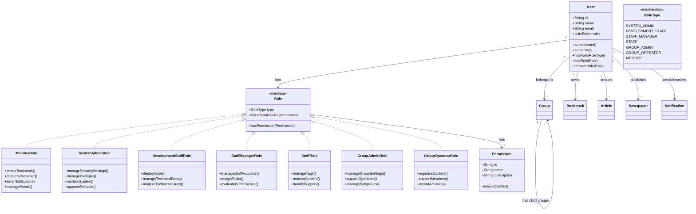

# ロールベースシステムクラス図

## 設計変更の背景

現在の設計では、アクターがUserクラスを継承する形で実装されていますが、以下の問題があります：

1. 役割と実装が密結合している
2. 複数の役割を持つことが難しい
3. 役割の追加・削除が柔軟でない

これらの問題を解決するため、UserがRoleを持つ（Has-a関係）形に設計を変更します。

## クラス図

## 主要な変更点

1. ユーザーとロールの関係
   - 継承関係を Has-a 関係に変更
   - User クラスが Role のリストを持つ
   - 複数の役割を持つことが可能に

2. Role インターフェース
   - 共通の役割インターフェースを導入
   - 各役割を具象クラスとして実装
   - 権限（Permission）との関連を追加

3. 権限管理の強化
   - Permission クラスの導入
   - Role と Permission の多対多関係
   - コンテキストベースの権限チェック

## メリット

1. 柔軟性の向上
   - 役割の動的な追加・削除が可能
   - 複数の役割を持つことが可能
   - 役割と実装の分離

2. 保守性の向上
   - 役割の変更が他の部分に影響を与えにくい
   - 新しい役割の追加が容易
   - 権限の集中管理が可能

3. セキュリティの強化
   - きめ細かい権限制御
   - コンテキストベースの認可
   - 役割と権限の明確な分離

## 実装時の注意点

1. ユーザーの役割チェック
   - hasRole() メソッドによる役割確認
   - 権限の継承関係の考慮
   - パフォーマンスへの配慮

2. 権限の管理
   - 権限の階層構造の実装
   - キャッシュ戦略の検討
   - 権限変更の監査ログ

3. マイグレーション
   - 既存のユーザーデータの移行
   - 役割データの初期化
   - 下位互換性の確保