# 更新版：ロールベースシステムクラス図

## 設計方針

overview.mdの詳細な仕様に基づき、以下の方針でクラス図を更新しました：

1. Role-Permission構造の詳細化
2. システム仕様に基づく関連の整理
3. アクター別の具体的な責任範囲の明確化

## クラス図

```mermaid
classDiagram
    class User {
        +String id
        +String name
        +String email
        +List~Role~ roles
        +authenticate()
        +authorize()
        +hasRole(RoleType)
        +addRole(Role)
        +removeRole(Role)
        +List~Group~ groups
    }

    class Role {
        <<interface>>
        +RoleType type
        +Set~Permission~ permissions
        +hasPermission(Permission)
        +checkPermission(Context)
    }

    class Permission {
        +String id
        +String name
        +String description
        +PermissionScope scope
        +validate(Context)
    }

    class PermissionScope {
        <<enumeration>>
        SYSTEM
        GROUP
        CONTENT
        MEMBER
    }

    class Context {
        +User actor
        +Resource target
        +Action action
        +Map~String, String~ attributes
    }

    class SystemAdminRole {
        +manageSecuritySettings()
        +manageBackups()
        +monitorSystem()
        +approveRefunds()
        +manageUserRoles()
    }

    class DevelopmentStaffRole {
        +deployCode()
        +manageTechnicalDocs()
        +analyzeTechnicalIssues()
        +implementFeatures()
    }

    class StaffManagerRole {
        +manageStaffAccounts()
        +assignTasks()
        +evaluatePerformance()
        +defineOperationalPolicies()
    }

    class StaffRole {
        +manageTags()
        +monitorContent()
        +handleSupport()
        +manageCategories()
    }

    class GroupAdminRole {
        +manageGroupSettings()
        +appointOperators()
        +manageSubgroups(max: 100)
        +manageGroupContent()
    }

    class GroupOperatorRole {
        +organizeContent()
        +supportMembers()
        +recordActivities()
        +manageGroupMembers()
    }

    class MemberRole {
        +createBookmark()
        +createNewspaper()
        +sendNotification()
        +managePoints()
        +joinGroups()
    }

    class Group {
        +String id
        +String name
        +Group parent
        +List~Group~ children
        +int maxChildren
        +addMember()
        +createChildGroup()
        +manageContent()
        +validateHierarchy()
    }

    class Content {
        <<interface>>
        +String id
        +String title
        +DateTime createdAt
        +Category category
        +List~Tag~ tags
        +share()
        +delete()
    }

    class Bookmark {
        +String url
        +Folder folder
        +import()
        +export()
    }

    class Article {
        +String content
        +Newspaper newspaper
    }

    class Newspaper {
        +List~Article~ articles
        +publish()
        +addArticle()
    }

    class Tag {
        +String id
        +String name
        +TagType type
        +create()
        +attach()
    }

    class Category {
        +String id
        +String name
        +create()
        +attach()
    }

    class Notification {
        +String content
        +DateTime sentAt
        +NotificationType type
        +List~NotificationStatus~ status
        +send()
        +forward()
        +trackStatus()
    }

    class Point {
        +PointType type
        +int amount
        +DateTime expiredAt
        +validate()
        +transfer()
        +use()
    }

    class Payment {
        +String stripePaymentId
        +PaymentStatus status
        +Money amount
        +process()
        +refund()
    }

    class GraphRelation {
        +String sourceId
        +String targetId
        +RelationType type
        +Map~String, String~ properties
        +create()
        +validate()
    }

    User "1" --> "*" Role : has
    Role "*" --> "*" Permission : has
    Role <|.. SystemAdminRole
    Role <|.. DevelopmentStaffRole
    Role <|.. StaffManagerRole
    Role <|.. StaffRole
    Role <|.. GroupAdminRole
    Role <|.. GroupOperatorRole
    Role <|.. MemberRole

    User "1" --> "*" Group : belongs to
    Group "1" --> "*" Group : has child groups
    User "1" --> "*" Content : owns
    User "1" --> "*" Notification : sends/receives
    User "1" --> "*" Point : has
    User "1" --> "*" Payment : makes

    Content <|.. Bookmark
    Content <|.. Article
    Content <|.. Newspaper
    Content "1" --> "1" Category : categorized by
    Content "*" --> "*" Tag : tagged with

    Tag <|-- Category

    class RoleType {
        <<enumeration>>
        SYSTEM_ADMIN
        DEVELOPMENT_STAFF
        STAFF_MANAGER
        STAFF
        GROUP_ADMIN
        GROUP_OPERATOR
        MEMBER
    }

    class TagType {
        <<enumeration>>
        MEMBER
        OFFICIAL
    }

    class PointType {
        <<enumeration>>
        FREE_LOGIN
        FREE_MISSION
        FREE_ACTION
        PAID_MEMBER
        PAID_FRIEND
        PAID_SYSTEM
    }

    class NotificationType {
        <<enumeration>>
        SYSTEM
        USER
        GROUP
    }

    class PaymentStatus {
        <<enumeration>>
        PENDING
        COMPLETED
        FAILED
        REFUNDED
    }

    class RelationType {
        <<enumeration>>
        MEMBER_GROUP
        NEWSPAPER_ARTICLE
        NEWSPAPER_MEMBER
        TAG_CATEGORY
    }
```

## 主な変更点

### 1. ロール・権限システムの強化

- Roleインターフェースの導入
  - 各ロールの責任を明確に定義
  - 権限チェックの統一的な方法を提供

- Permission（権限）の詳細化
  - スコープによる権限の分類
  - コンテキストベースの権限検証

### 2. アクターの責任範囲の明確化

- 各ロールクラスに具体的な操作を定義
  - システム管理者の全体管理権限
  - 開発スタッフの技術的権限
  - グループ管理者の制限付き権限

### 3. システム仕様への対応

- グループの階層構造サポート
  - 最大100の子グループ制限
  - 階層の検証機能

- コンテンツ管理の統一
  - 共通インターフェースの導入
  - カテゴリとタグの関連付け

- ポイントシステムの詳細化
  - 有償/無償の区分
  - 有効期限管理

### 4. 関係管理の改善

- GraphRelationクラスの強化
  - 関係型の明確な定義
  - バリデーション機能の追加

## 実装時の注意点

1. 権限チェック
   - 各操作前の権限検証
   - スコープに基づく制限
   - コンテキストの適切な構築

2. グループ管理
   - 階層の深さと幅の制限
   - 循環参照の防止
   - 権限の継承

3. コンテンツ管理
   - 一貫した共有メカニズム
   - カテゴリとタグの適切な使い分け
   - アクセス制御の統一

4. ポイントシステム
   - 種類ごとの適切な管理
   - 有効期限の監視
   - 残高の整合性確保