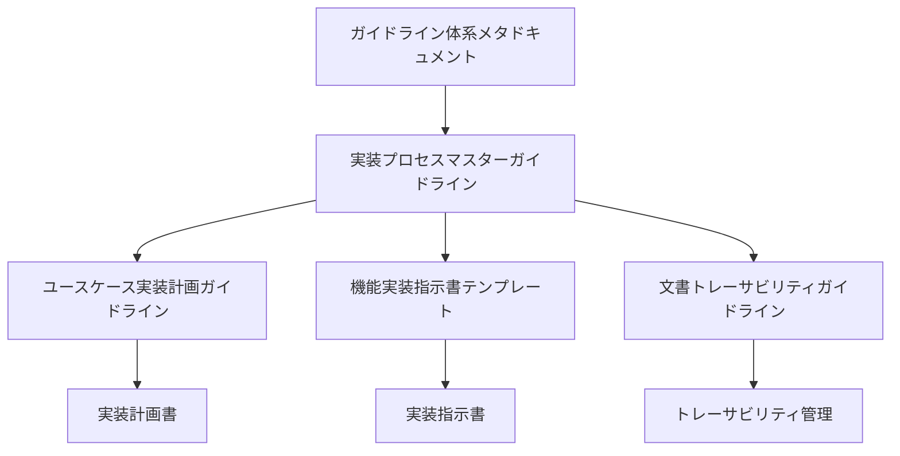

# ガイドライン体系メタドキュメント

## 概要

このドキュメントは、AIによる機能実装プロセスで使用される一連のガイドラインの関係性と使用方法を定義します。

## ガイドライン体系

## 文書間の関係

### 1. マスターガイドライン
- [実装プロセスマスターガイドライン](./implementation-process-master.md)
  - 全体のプロセスを定義
  - 各フェーズの関係を規定
  - 品質基準を設定

### 2. 計画フェーズ
- [ユースケース実装計画ガイドライン](./implementation-planning-with-usecases.md)
  - ユースケースの分析方法
  - 技術要件の抽出
  - 実装計画の立案

### 3. 実装フェーズ
- [機能実装指示書テンプレート](./feature-implementation-instruction-template.md)
  - 具体的な実装手順
  - コーディング規約
  - テクニカルガイダンス

### 4. 管理フェーズ
- [文書トレーサビリティガイドライン](./document-traceability.md)
  - 文書間の関連付け
  - 変更管理
  - 品質保証

## 使用プロセス

### 1. プロセス開始時
1. 全ガイドラインを読み込む
2. 対象ユースケースを確認
3. 技術要件を把握

### 2. 計画フェーズ
1. ユースケース実装計画ガイドラインに従い分析
2. 実装計画書を作成
3. トレーサビリティを確保

### 3. 実装フェーズ
1. 実装指示書テンプレートを使用
2. 具体的な実装手順を作成
3. コード生成の準備

## 品質保証の仕組み

### 1. 文書品質
- ガイドラインへの準拠確認
- 相互参照の整合性チェック
- フォーマットの統一

### 2. 実装品質
- 型安全性の確保
- エラーハンドリングの完全性
- パフォーマンスの考慮

### 3. プロセス品質
- トレーサビリティの確保
- レビュー可能性の担保
- 変更管理の徹底

## 参照する技術ガイドライン

### 1. フロントエンド
- docs/guidelines/react-components.md
- docs/guidelines/i18n-guidelines.md
- docs/guidelines/mock-api-with-trpc.md

### 2. バックエンド
- docs/guidelines/data-fetching.md
- docs/guidelines/implementation-planning.md

### 3. AIガイドライン
- docs/ai/guidelines/execution.md
- docs/ai/guidelines/documentation.md
- docs/ai/guidelines/validation.md

## チェックリスト

### 1. 開始時
- [ ] すべてのガイドラインを読み込んだ
- [ ] ユースケースを理解した
- [ ] 技術要件を確認した

### 2. 計画時
- [ ] 適切なガイドラインを参照している
- [ ] トレーサビリティを確保している
- [ ] 品質基準を満たしている

### 3. 実装時
- [ ] テンプレートを正しく使用している
- [ ] 必要な情報をすべて含めている
- [ ] 相互参照が適切に行われている

## 更新プロセス

### 1. ガイドラインの更新
1. 更新の必要性を評価
2. 影響範囲を分析
3. 関連文書を更新
4. レビューを実施

### 2. バージョン管理
- メジャーバージョン：大きな変更
- マイナーバージョン：機能追加
- パッチバージョン：バグ修正

## 注意事項

1. すべてのガイドラインを熟読してから作業を開始
2. 文書間の整合性を常に確認
3. トレーサビリティを維持
4. 変更の影響範囲を考慮

## 更新履歴

- 2025-03-04: メタガイドライン初版作成
- 相互参照システムの確立
- ガイドライン体系の整理