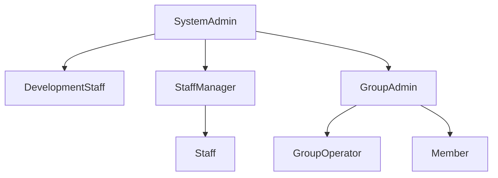

# Role モデリングガイドライン

## 概要

本ガイドラインは、システム全体のRole（役割）設計に関する原則と実装方針を定義します。Roleは認可の基盤となる重要な概念であり、慎重な設計が必要です。

## 設計原則

### 1. 役割の階層構造



1. 最上位権限
   - SystemAdmin: システム全体の管理権限
   - 最終的な判断と緊急対応の権限を持つ

2. 管理権限
   - DevelopmentStaff: 技術基盤の管理
   - StaffManager: 運用スタッフの管理
   - GroupAdmin: グループの管理

3. 実行権限
   - Staff: 日常的な運用業務
   - GroupOperator: グループ内の実務
   - Member: 一般利用者

### 2. 権限の粒度設計

1. コンテキスト別の権限
   - bookmark: ブックマーク管理権限
   - article: 記事管理権限
   - newspaper: 新聞管理権限
   - system: システム管理権限

2. 操作レベルの権限
   - 作成（Create）
   - 参照（Read）
   - 更新（Update）
   - 削除（Delete）
   - 承認（Approve）
   - 管理（Manage）

### 3. 実装戦略

1. 権限チェックの階層
   ```typescript
   interface Permission {
     context: string;    // 境界付けられたコンテキスト
     action: string;     // 操作種別
     resource: string;   // リソース種別
     conditions?: any;   // 追加条件
   }
   ```

2. ロールベースの権限管理
   ```typescript
   interface Role {
     name: string;
     permissions: Permission[];
     inherits?: Role[];  // 継承する役割
   }
   ```

### 4. セキュリティ考慮事項

1. 最小権限の原則
   - 必要最小限の権限のみを付与
   - 過剰な権限は定期的に見直し

2. 権限の分離
   - 開発環境と本番環境の分離
   - 管理機能と一般機能の分離

3. 監査とトレーサビリティ
   - 権限変更の履歴保持
   - 重要操作のログ記録

## ベストプラクティス

1. Role設計時の考慮点
   - 責務の明確な分離
   - 拡張性を考慮した設計
   - 運用負荷の最小化

2. 権限設計のパターン
   - 階層型：上位役割が下位の権限を包含
   - 機能型：特定機能に特化した権限
   - ハイブリッド：状況に応じた柔軟な組み合わせ

3. 実装時の注意点
   - 権限チェックの一貫性確保
   - パフォーマンスへの配慮
   - エラー処理の標準化

## 関連ドキュメント

- [権限システムの設計](./permissions.md)
- [役割の階層構造](./hierarchy.md)
- [他コンテキストとの関係](./relationships.md)
- [実装例とユースケース](./examples/)

## 更新履歴

- 2025-03-06: 初版作成
  - 基本的な設計原則の定義
  - 階層構造の明確化
  - 実装戦略の策定