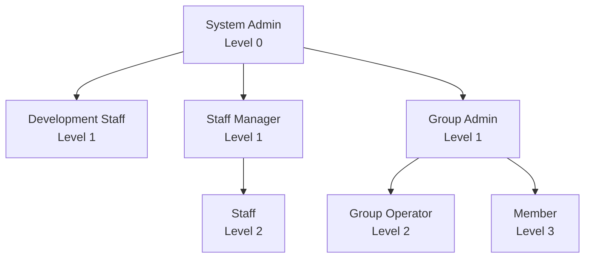

# 役割の階層構造ガイドライン

## 概要

システムにおける役割（Role）の階層構造について、その設計原則と実装方針を定義します。

## 役割の定義

```typescript
const ROLE_TYPES = {
  SYSTEM_ADMIN: 'system_admin',
  DEVELOPMENT_STAFF: 'development_staff',
  STAFF_MANAGER: 'staff_manager',
  STAFF: 'staff',
  GROUP_ADMIN: 'group_admin',
  GROUP_OPERATOR: 'group_operator',
  MEMBER: 'member'
} as const;

type RoleType = typeof ROLE_TYPES[keyof typeof ROLE_TYPES];

type Role = {
  type: RoleType;
  permissions: Permission[];
  meta: {
    level: number;        // 階層レベル（低いほど権限が強い）
    maxSubordinates?: number;  // 管理可能な下位ユーザー数
    scope: 'global' | 'group' | 'limited';
  };
}
```

## 階層構造



## 役割ごとの責務と制限

### 1. システム管理者（Level 0）
```typescript
const SYSTEM_ADMIN_CONFIG = {
  type: ROLE_TYPES.SYSTEM_ADMIN,
  meta: {
    level: 0,
    scope: 'global',
    permissions: [...SYSTEM_PERMISSIONS]
  }
} as const;
```

- 最高位の権限を持つ
- システム全体の設定変更が可能
- 他のすべての役割を管理可能

### 2. 第一階層（Level 1）

```typescript
const LEVEL_1_CONFIGS = {
  [ROLE_TYPES.DEVELOPMENT_STAFF]: {
    meta: {
      level: 1,
      scope: 'global',
      permissions: [DEVELOPMENT_PERMISSIONS]
    }
  },
  [ROLE_TYPES.STAFF_MANAGER]: {
    meta: {
      level: 1,
      scope: 'global',
      maxSubordinates: 50,
      permissions: [MANAGEMENT_PERMISSIONS]
    }
  },
  [ROLE_TYPES.GROUP_ADMIN]: {
    meta: {
      level: 1,
      scope: 'group',
      maxSubordinates: 100,
      permissions: [GROUP_PERMISSIONS]
    }
  }
} as const;
```

### 3. 第二階層（Level 2）

```typescript
const LEVEL_2_CONFIGS = {
  [ROLE_TYPES.STAFF]: {
    meta: {
      level: 2,
      scope: 'limited',
      permissions: [OPERATIONAL_PERMISSIONS]
    }
  },
  [ROLE_TYPES.GROUP_OPERATOR]: {
    meta: {
      level: 2,
      scope: 'group',
      permissions: [GROUP_OPERATIONAL_PERMISSIONS]
    }
  }
} as const;
```

### 4. 第三階層（Level 3）

```typescript
const MEMBER_CONFIG = {
  type: ROLE_TYPES.MEMBER,
  meta: {
    level: 3,
    scope: 'limited',
    permissions: [BASIC_PERMISSIONS]
  }
} as const;
```

## 階層間の関係制御

### 1. 上位下位関係の検証

```typescript
type HierarchyChecker = {
  canManage(manager: Role, subordinate: Role): boolean;
  getManageableRoles(role: Role): RoleType[];
  validateHierarchy(roles: Role[]): boolean;
}

const hierarchyChecker: HierarchyChecker = {
  canManage(manager: Role, subordinate: Role): boolean {
    // 1. レベルチェック
    if (manager.meta.level >= subordinate.meta.level) return false;

    // 2. スコープチェック
    if (manager.meta.scope === 'limited') return false;
    if (manager.meta.scope === 'group' && subordinate.meta.scope === 'global') return false;

    return true;
  }
}
```

### 2. 制約の実装

```typescript
type HierarchyConstraints = {
  maxLevel: number;
  maxSubordinates: Record<RoleType, number>;
  allowedScopes: Record<RoleType, Array<'global' | 'group' | 'limited'>>;
}

const HIERARCHY_CONSTRAINTS: HierarchyConstraints = {
  maxLevel: 3,
  maxSubordinates: {
    [ROLE_TYPES.SYSTEM_ADMIN]: Infinity,
    [ROLE_TYPES.STAFF_MANAGER]: 50,
    [ROLE_TYPES.GROUP_ADMIN]: 100,
    [ROLE_TYPES.GROUP_OPERATOR]: 25
  },
  allowedScopes: {
    [ROLE_TYPES.SYSTEM_ADMIN]: ['global'],
    [ROLE_TYPES.STAFF_MANAGER]: ['global', 'group'],
    [ROLE_TYPES.GROUP_ADMIN]: ['group']
  }
} as const;
```

## 実装のベストプラクティス

1. 階層レベルの管理
   - 明確な数値による階層レベル定義
   - レベルに基づく権限の継承
   - 循環参照の防止

2. スコープの制御
   - グローバル/グループ/限定の区分け
   - スコープに基づく権限の制限
   - 適切な権限の伝播

3. 拡張性の考慮
   - 新しい役割の追加容易性
   - 既存階層への影響最小化
   - 下位互換性の維持

## 更新履歴

- 2025-03-06: 初版作成
  - 階層構造の基本定義
  - 実装例の追加
  - type const形式での定義採用