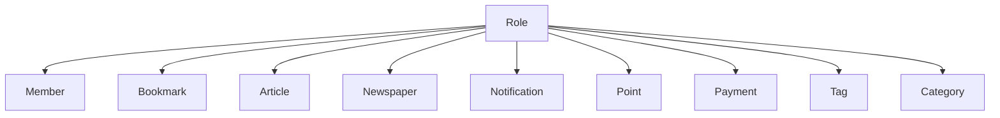

# 他コンテキストとの関係性ガイドライン

## 概要

Role（役割）システムと他の境界付けられたコンテキストとの関係性について、その設計原則と実装方針を定義します。

## コンテキスト間の関係



## 境界付けられたコンテキストとの関係定義

### 1. Member Context

```typescript
const MEMBER_ROLE_RELATIONS = {
  VIEW_PROFILE: 'member:profile:view',
  EDIT_PROFILE: 'member:profile:edit',
  MANAGE_GROUPS: 'member:groups:manage'
} as const;

type MemberContext = {
  memberId: string;
  roles: RoleType[];
  groups: {
    groupId: string;
    roleType: RoleType;
  }[];
}
```

### 2. Content Contexts (Bookmark, Article, Newspaper)

```typescript
const CONTENT_ACCESS_TYPES = {
  VIEW: 'view',
  EDIT: 'edit',
  DELETE: 'delete',
  SHARE: 'share',
  MANAGE: 'manage'
} as const;

type ContentAccess = typeof CONTENT_ACCESS_TYPES[keyof typeof CONTENT_ACCESS_TYPES];

type ContentPermissionScope = {
  contextType: 'bookmark' | 'article' | 'newspaper';
  access: ContentAccess[];
  ownership: boolean;
  groupId?: string;
}
```

### 3. Management Contexts (Tag, Category)

```typescript
const MANAGEMENT_SCOPE = {
  CREATE_OFFICIAL: 'create:official',
  EDIT_OFFICIAL: 'edit:official',
  DELETE_OFFICIAL: 'delete:official',
  MANAGE_USER_CREATED: 'manage:user_created'
} as const;

type ManagementScope = typeof MANAGEMENT_SCOPE[keyof typeof MANAGEMENT_SCOPE];

type ManagementPermission = {
  scope: ManagementScope[];
  contextType: 'tag' | 'category';
}
```

## コンテキスト間の通信

### 1. イベントベースの通信

```typescript
type RoleEvent = {
  type: 'role_changed' | 'permission_updated' | 'hierarchy_modified';
  payload: {
    userId: string;
    roles: RoleType[];
    timestamp: Date;
  };
  metadata: {
    source: string;
    version: string;
  };
}
```

### 2. 同期的な権限チェック

```typescript
type PermissionQuery = {
  userId: string;
  context: string;
  action: string;
  resource?: {
    id: string;
    type: string;
  };
}

type PermissionResponse = {
  granted: boolean;
  reason?: string;
  restrictions?: {
    timeLimit?: Date;
    usageLimit?: number;
    scope?: string;
  };
}
```

## データの整合性維持

### 1. トランザクション境界

```typescript
type RoleTransaction = {
  operations: {
    type: 'add' | 'remove' | 'modify';
    role: RoleType;
    context: string;
  }[];
  compensation: {
    type: 'rollback' | 'compensate';
    steps: string[];
  };
}
```

### 2. 整合性チェック

```typescript
type ConsistencyCheck = {
  checkType: 'role_hierarchy' | 'permission_conflict' | 'scope_validation';
  contexts: string[];
  validation: () => Promise<boolean>;
  resolution: () => Promise<void>;
}
```

## 実装のベストプラクティス

### 1. コンテキスト分離の原則

- 各コンテキストは独自の権限モデルを持つ
- Roleコンテキストは基本となる権限構造を提供
- 詳細な権限は各コンテキストで管理

```typescript
type ContextPermissionModel = {
  baseRole: RoleType;
  contextSpecificPermissions: string[];
  validationRules: Array<() => boolean>;
}
```

### 2. イベント駆動アーキテクチャ

- 権限変更は全コンテキストに伝播
- 非同期での整合性確保
- 失敗時の補償トランザクション

### 3. キャッシュ戦略

- 権限情報のローカルキャッシュ
- 定期的な整合性チェック
- キャッシュ無効化の適切な伝播

## 変更管理

### 1. バージョニング

```typescript
const ROLE_VERSIONS = {
  CURRENT: '1.0.0',
  SUPPORTED: ['1.0.0', '0.9.0'],
  DEPRECATED: ['0.8.0']
} as const;
```

### 2. マイグレーション

```typescript
type RoleMigration = {
  fromVersion: string;
  toVersion: string;
  steps: Array<{
    action: 'add' | 'remove' | 'modify';
    target: string;
    value: any;
  }>;
}
```

## 更新履歴

- 2025-03-06: 初版作成
  - コンテキスト間の関係定義
  - イベントベースの通信設計
  - 整合性維持の方針策定