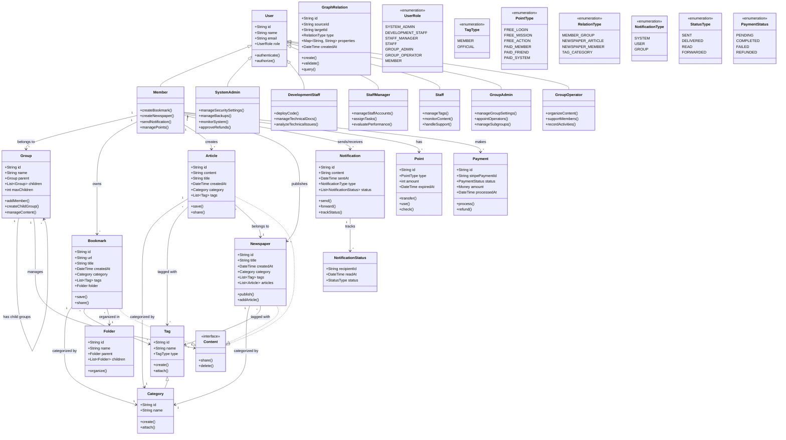

# システム概要クラス図（ラフ版）

## 作成背景

このクラス図は以下の資料を元に作成されました：

- docs/usecases/overview.md（2025年3月6日時点）
  - 境界付けられたコンテキスト一覧
  - アクターの説明
  - アクター別ユースケース概要
  - コアシステム仕様

このクラス図は初期の設計フェーズにおける概要を示すものであり、詳細な実装仕様ではありません。実装時には各コンテキストごとに詳細な設計が必要です。

## クラス図

## システムの主要コンポーネント

1. ユーザー権限システム
   - 7つの役割（システム管理者からメンバーまで）
   - 階層的な権限管理
   - 操作の分離と制御

2. グループ管理システム
   - 最大100の子グループをサポート
   - グループ管理者とグループ運営者の分離
   - コンテンツとメンバーの管理

3. コンテンツ管理システム
   - 共通インターフェースによる統一的な管理
   - カテゴリとタグによる柔軟な分類
   - フォルダ構造によるブックマークの整理

4. 通知システム
   - 複数の通知タイプをサポート
   - 転送と状態追跡機能
   - 詳細な配信状態管理

5. ポイントと決済システム
   - 無償/有償ポイントの区分け
   - Stripe決済の統合
   - 返金処理のサポート

6. 関係管理システム
   - グラフDBベースの設計
   - 柔軟な関係性の表現
   - 高度なクエリ機能

## 注意事項

- このクラス図は概要レベルの設計を示すものです
- 実装時には各クラスの詳細な属性やメソッドの追加が必要です
- 具体的なデータベーススキーマは別途設計が必要です
- セキュリティやパフォーマンスの詳細は実装フェーズで検討します

## 次のステップ

1. 各境界付けられたコンテキストの詳細設計
2. データベーススキーマの設計
3. APIインターフェースの設計
4. セキュリティ設計の詳細化

## 作成・更新履歴

- 2025-03-06: 初版作成（概要仕様に基づく基本設計）