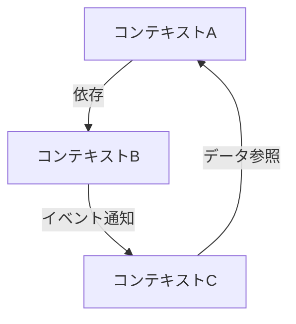
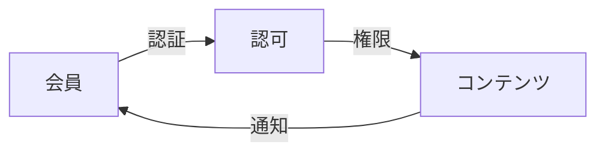

# モデリングガイドライン

## 概要

このガイドラインは、複数の境界付けられたコンテキストを持つシステムのモデリングについて、overview.mdからの知見を基に作成されました。

## モデリング原則

### 1. コンテキスト境界の明確化

- 各コンテキストの責務を明確に定義する
- コンテキスト間の関係性を明示的に記述する
- 共有モデルと専用モデルを区別する

### 2. 依存関係の管理



- 循環依存を避ける
- イベントドリブンな連携を優先する
- 必要最小限の依存関係に留める

### 3. 共有概念の定義

共有される概念（SharedKernel）は以下の規則で管理：

| 概念 | 定義場所 | 利用コンテキスト | 変更ルール |
|------|----------|------------------|------------|
| ID体系 | core | 全て | コア開発チームの承認必要 |
| 基本型 | common | 必要なコンテキスト | 影響範囲の確認必要 |
| ドメインイベント | events | イベント関連 | 後方互換性の維持 |

### 4. バージョン管理

- メジャーバージョン：互換性のない変更
- マイナーバージョン：機能追加
- パッチバージョン：バグ修正

## モデリングプロセス

### 1. 準備フェーズ

1. 対象コンテキストの特定
   - 主要な機能を列挙
   - 依存関係の初期評価
   - リスクの洗い出し

2. チーム編成
   - コンテキストごとの担当者決定
   - 共有領域の管理者任命
   - コミュニケーション計画

### 2. 設計フェーズ

1. コンテキストマップの作成


2. 共有モデルの定義
   - 基本データ型
   - エンティティのID体系
   - 共有イベント定義

3. 境界の明確化
   - API定義
   - イベントスキーマ
   - データ構造

### 3. レビューフェーズ

1. 整合性確認
   - モデル間の矛盾チェック
   - 命名規則の統一
   - 重複の排除

2. 性能評価
   - 通信オーバーヘッド
   - データ一貫性
   - スケーラビリティ

## 実装時の注意点

### 1. コード構成

```
src/
├── core/           # 共有コア機能
├── common/         # 共通ユーティリティ
└── contexts/       # 各コンテキスト
    ├── member/
    ├── article/
    └── newspaper/
```

### 2. インターフェース定義

```typescript
// 共有インターフェース例
interface DomainEvent {
  type: string;
  timestamp: Date;
  payload: unknown;
}

// コンテキスト固有の実装例
class ArticleCreatedEvent implements DomainEvent {
  type = 'article.created';
  timestamp: Date;
  payload: {
    id: string;
    title: string;
  };
}
```

### 3. テスト戦略

1. ユニットテスト
   - コンテキスト内の整合性
   - ビジネスルールの検証

2. 結合テスト
   - コンテキスト間の連携
   - イベント伝搬の確認

3. システムテスト
   - エンドツーエンドシナリオ
   - パフォーマンス検証

### 4. Draw.ioでのクラス図作成

VSCodeでDraw.ioを使用したクラス図作成には、以下の2段階アプローチを採用します：

1. テキストファイルとしての作成
   ```xml
   <mxfile>
     <diagram>
       <mxGraphModel>
         <!-- クラス図の定義 -->
       </mxGraphModel>
     </diagram>
   </mxfile>
   ```
   - 拡張子は一時的に.txtとして保存
   - mxfile形式のXMLで記述
   - クラス、関係、属性を明確に定義

2. Draw.io形式への変換
   - .txt → .drawioへリネーム
   - VSCodeまたはDraw.ioで開いて編集可能に

このアプローチにより、以下の利点があります：
- VSCodeでの直接編集が可能
- バージョン管理が容易
- チーム間でのレビューが効率的

## 改訂履歴

- 2025-03-06: 初版作成
  - overview.mdの分析結果を反映
  - 複数コンテキストの並行開発に関する知見を追加
  - モデリングプロセスの体系化
- 2025-03-06: Draw.ioでのクラス図作成手順を追加
  - 2段階アプローチの導入
  - XML形式での定義方法を明確化