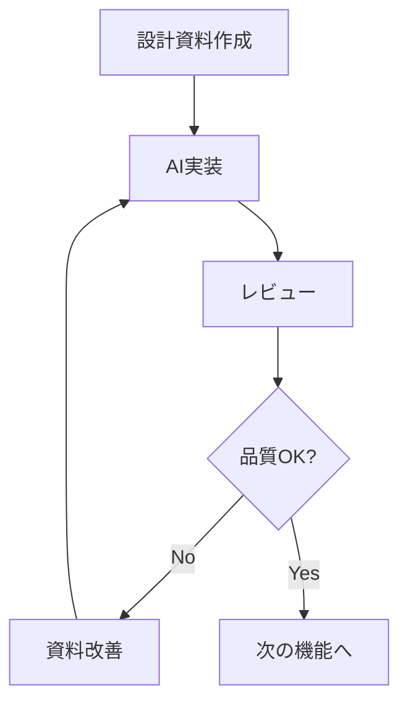

# AIを活用したドメインモデリングワークフロー

## 概要

本ガイドラインでは、AIと協働してドメインモデルを設計・実装するためのワークフローと必要なドキュメントを定義します。

## 開発プロセス

### 1. 反復的なドメインモデル開発

開発は以下のステップを反復的に実行し、コアドメインから段階的に設計・実装を進めていきます：

1. **ユースケース記述の作成**
   - 機能の概要を把握
   - 主要なシナリオを特定
   - ビジネス要件を明確化

2. **ドメインモデルの抽出**
   - ユースケースから重要な概念を抽出
   - モデル間の関係性を分析
   - ビジネスルールを整理

3. **設計資料の作成（AI協働）**
   - モデルの詳細設計
   - インターフェースの定義
   - 振る舞いの設計

4. **実装計画の作成（AI担当）**
   - 型定義の設計
   - 関数シグネチャの定義
   - テスト計画の立案

5. **チームレビュー**
   - 設計の妥当性確認
   - 実装方針の検証
   - 改善点の特定

6. **モデルの実装（AI担当）**
   - 計画に基づく実装
   - テストの作成
   - ドキュメントの更新

### 2. 段階的な開発アプローチ

1. **コアドメインの確立**
   - 重要なドメインモデルを特定
   - 反復的な設計・実装
   - モデルの洗練化

2. **周辺機能への展開**
   - コアモデルを基準に拡張
   - 整合性の確保
   - 再利用の促進

## AIとの協働モデル

### 1. 役割分担

- **開発チーム**
  - ドメインの理解と要件定義
  - 設計資料の作成と改善
  - レビューと品質保証

- **AI**
  - 実装計画の立案
  - コードの生成
  - テストの作成

### 2. 品質向上サイクル

1. **設計資料の作成**
   - 明確な要件定義
   - 詳細な設計指示
   - エッジケースの明示

2. **AI実装**
   - 設計に忠実な実装
   - テストの網羅
   - ドキュメントの生成

3. **レビューと改善**
   - 実装の検証
   - 資料の改善
   - 再実装の指示

## 必要なドキュメント

### 1. ワークフロー関連
- ユースケース記述
- ドメインモデル抽出書
- 設計資料
- 実装計画書
- レビュー記録

### 2. 命名規則
- prefix: `usecase-`, `domain-`, `design-`, `impl-`, `review-`
- suffix: `-overview`, `-extraction`, `-design`, `-plan`, `-feedback`

## 成功の指標

1. **設計品質**
   - モデルの一貫性
   - ビジネスルールの網羅
   - 拡張性の確保

2. **実装品質**
   - テストカバレッジ
   - コード品質
   - パフォーマンス

3. **生産性**
   - 反復速度
   - 手戻りの最小化
   - 知識の蓄積

## 更新履歴

- 2025-03-07: 初版作成
  - 基本ワークフローの定義
  - AIとの協働モデルの確立
  - ドキュメント体系の整備