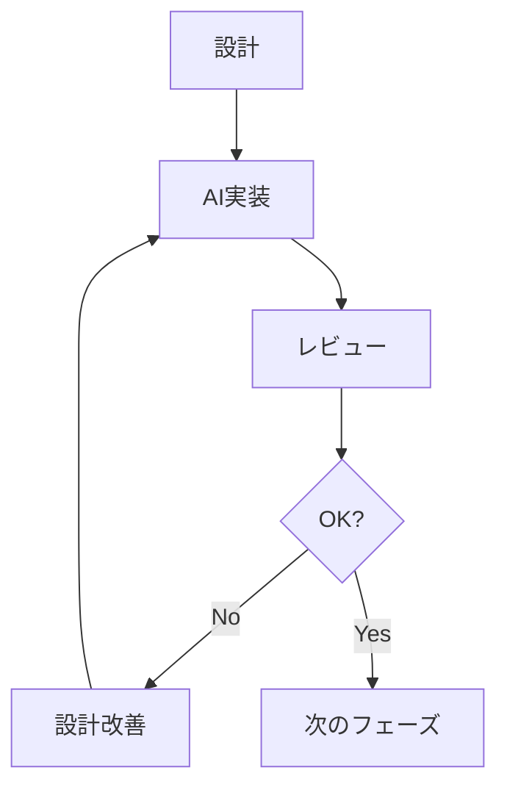

# AIを活用したドメインモデリングワークフロー

## 概要

本ガイドラインでは、AIとチームの協働によるドメインモデリングの開発プロセスを定義します。このプロセスは、人間の設計能力とAIの実装能力を最適に組み合わせ、品質の高いドメインモデルを効率的に実現することを目指します。

## 開発プロセスの全体像

本プロジェクトでは、以下の手順で開発を進めます：

1. 全体の粗めのユースケース記述作成
2. ユースケースからの重要なドメインモデル抽出
3. AIとの協働による設計資料作成
4. AIによるドメインモデル実装計画書作成
5. チームによる実装計画書のレビュー
6. AIによるドメインモデル実装

この作業をコアチームが反復的に実行し、コアドメインと各機能の主要なドメインモデルの設計・実装を段階的に洗練化していきます。ドメイン設計が安定した後、機能開発チームとコアチームが協業して各機能の詳細な実装に着手します。

## チーム構成と役割

### コアチーム
- ドメイン全体の設計責任
- 主要なドメインモデルの設計
- AIへの設計指示とレビュー
- 設計資料の改善と更新
- 他チームとの調整

### 機能開発チーム
- 担当機能のユースケース作成
- コアチームとの設計調整
- 機能固有のモデル設計
- 実装結果の検証
- フィードバックの提供

## 必要なドキュメント一覧

### 1. ユースケースフェーズ
- `usecase-overview-[機能名].md`
  - 目的：機能の全体像を把握
  - 場所：docs/usecases/[機能名]/
  - テンプレート：[usecase-writing-guidelines.md](./usecase-writing-guidelines.md)

- `usecase-detail-[機能名]-[ユースケース名].md`
  - 目的：個別ユースケースの詳細定義
  - 場所：docs/usecases/[機能名]/details/
  - テンプレート：[usecase-writing-guidelines.md](./usecase-writing-guidelines.md)

### 2. モデル抽出フェーズ
- `domain-extract-[機能名]-[日付].md`
  - 目的：ドメインモデルの抽出記録
  - 場所：docs/design/modeling/[機能名]/extraction/
  - テンプレート：[domain-model-extraction.md](../templates/development-process/domain-model-extraction.md)

### 3. 設計フェーズ
- `domain-design-[機能名]-[モデル名]-[日付].md`
  - 目的：詳細な設計記録
  - 場所：docs/design/modeling/[機能名]/design/
  - テンプレート：[domain-design.md](../templates/development-process/domain-design.md)

### 4. 実装計画フェーズ
- `impl-plan-[機能名]-[モデル名]-[日付].md`
  - 目的：実装の詳細計画
  - 場所：docs/[機能名]/logs/ai/plans/
  - テンプレート：[implementation-plan.md](../templates/development-process/implementation-plan.md)

### 5. レビューフェーズ
- `impl-review-[機能名]-[モデル名]-[日付].md`
  - 目的：実装のレビュー記録
  - 場所：docs/[機能名]/logs/ai/reviews/
  - テンプレート：要作成

## AIへの指示方法

### 基本原則
- 一度に1つのタスクのみを依頼
- 必要なドキュメントを明示的に指定
- 期待する出力形式を具体的に説明
- エッジケースや制約を明確に提示

### 実装指示の例
```markdown
# 実装指示

## 前提条件
以下のドキュメントを読んでから実装を開始してください：

1. ユースケース記述: docs/usecases/role/role-creation.md
2. ドメイン設計書: docs/design/modeling/role/design/domain-design-role-model.md
3. 実装計画書: docs/role/logs/ai/plans/impl-plan-role-model.md

## 実装要件
特に以下の点に注意して実装してください：

1. 型の安全性を最大限確保
2. Result型による一貫したエラー処理
3. 不変性の保証
4. テストの網羅性

## 期待する成果物
1. モデルの実装コード
2. 単体テストコード
3. E2Eテストコード
```

## フィードバックサイクル

### AIの実装が理想的でない場合
1. 問題点の特定と文書化
2. 設計資料の改善
3. 改善された資料でAIに再実装を依頼

### 設計の改善サイクル


## 開発フロー詳細

### 1. ユースケース作成
1. 機能の概要を記述
2. 具体的なシナリオを作成
3. 制約条件を明確化

### 2. モデル抽出
1. 名詞と動詞を抽出
2. モデル候補を特定
3. 関係性を分析

### 3. モデル設計
1. 責務を明確化
2. インターフェースを定義
3. 振る舞いを設計

### 4. 実装計画
1. 型定義を設計
2. 関数シグネチャを定義
3. テスト計画を立案

### 5. 実装とレビュー
1. AIがコードを生成
2. チームがレビュー
3. 必要に応じて改善

## 品質管理

### 1. 設計品質
- ドメインルールの網羅性
- モデル間の整合性
- インターフェースの使いやすさ

### 2. 実装品質
- 型安全性の確保
- テストカバレッジ
- パフォーマンス要件の充足

## 更新履歴

- 2025-03-07: 改訂
  - プロセスの詳細化
  - ドキュメント体系の整理
  - AIへの指示方法の具体化
