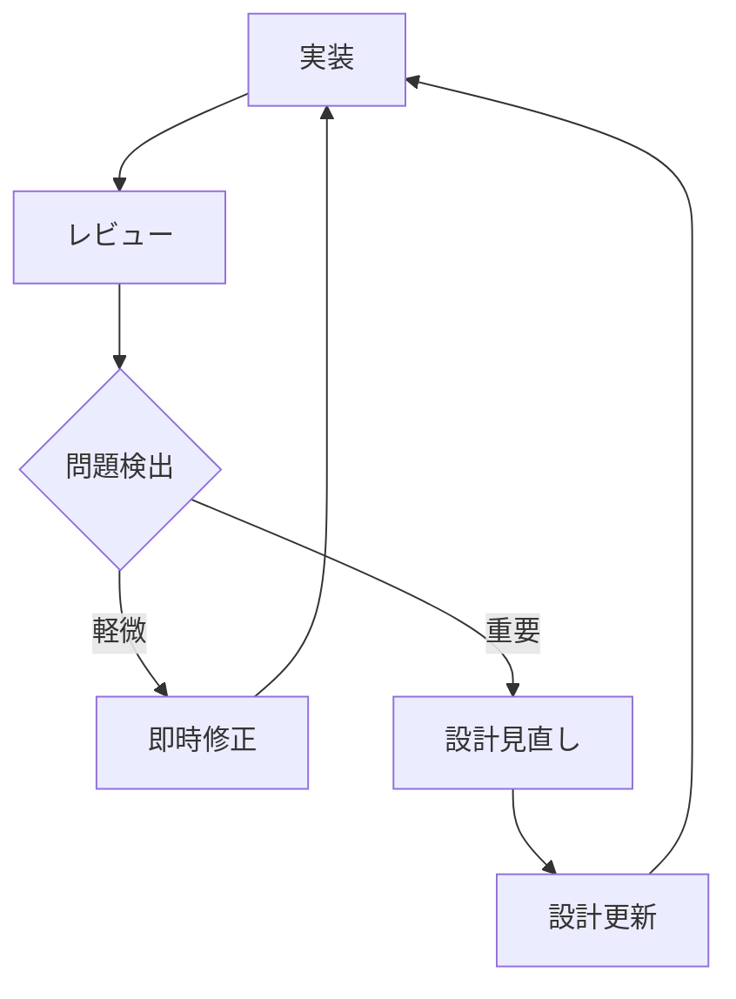

# AIを活用したドメインモデリングワークフロー

## 概要

本ガイドラインでは、AIとチームの協働によるドメインモデリングの手法について定義します。この手法は、人間の設計能力とAIの実装能力を最適に組み合わせ、品質の高いドメインモデルを効率的に実現することを目指します。

## 基本原則

### ドメイン駆動開発プロセス
チーム全体で以下のプロセスを反復的に実行し、段階的にドメインモデルを洗練化していきます：

1. **ユースケース記述の作成**
   - 全体像の把握
   - シナリオの具体化
   - 境界の明確化

2. **重要なドメインモデルの抽出**
   - ユースケースからの概念抽出
   - モデル間の関係性分析
   - 制約とルールの整理

3. **AIとの協働による設計**
   - モデルの詳細設計
   - インターフェースの定義
   - 実装方針の策定

4. **AIによる実装計画の作成**
   - 型定義の設計
   - 関数シグネチャの定義
   - テスト計画の立案

5. **チームによる実装計画のレビュー**
   - 設計との整合性確認
   - 実装方針の検証
   - 改善点の特定

6. **AIによるドメインモデルの実装**
   - コードの生成
   - テストの作成
   - ドキュメントの更新

## AIとの効果的な協働

### 1. AIへの指示方法

#### 実装指示の基本構造
```markdown
以下のドキュメントを読んでから実装を開始してください：

1. [ユースケース記述へのパス]
2. [ドメイン設計書へのパス]
3. [実装計画書へのパス]

特に以下の点に注意して実装してください：
1. [重要な考慮点1]
2. [重要な考慮点2]
3. [重要な考慮点3]
```

#### コード生成時の注意点
- 一度に生成する量を適切に制限
- 型定義から段階的に実装
- テストコードを同時に生成
- エラーケースの網羅的な考慮

### 2. フィードバックと改善

#### 実装失敗時の対応フロー
1. エラーの特定と分析
   ```markdown
   発生している問題：
   [具体的な問題の説明]

   確認済みの点：
   1. [確認項目1]
   2. [確認項目2]

   追加で必要な情報：
   1. [必要な情報1]
   2. [必要な情報2]
   ```

2. 設計の見直し
   ```markdown
   設計上の問題点：
   1. [問題点1]
   2. [問題点2]

   提案される修正：
   1. [修正案1]
   2. [修正案2]
   ```

3. 再実装の指示
   ```markdown
   修正された設計に基づいて、以下の点を考慮して再実装してください：
   1. [考慮点1]
   2. [考慮点2]
   ```

## チーム連携プロセス

### 1. コアチームと機能開発チームの協働

#### 定例ミーティング
| タイミング | 目的 | 参加者 | 成果物 |
|------------|------|---------|---------|
| 週次設計会議 | 設計方針の共有 | 両チーム | 設計更新計画 |
| デイリースタンドアップ | 進捗確認 | 両チーム | 課題リスト |
| 実装レビュー | コード品質確認 | レビュワー | レビュー記録 |

#### 成果物の共有
```
docs/[機能名]/
├── design/          # 設計資料
├── review/          # レビュー記録
└── feedback/        # フィードバック記録
```

### 2. 品質改善サイクル

#### フィードバックループ


#### 改善プロセスの例
1. 問題の特定
   ```markdown
   課題：型の整合性エラーが多発
   原因：型定義の不明確さ
   対策：型定義の詳細化と検証強化
   ```

2. 設計の改善
   ```markdown
   改善点：
   - 型定義の詳細化
   - バリデーションの追加
   - テストケースの拡充
   ```

3. 実装の修正
   ```markdown
   修正内容：
   - 型定義の更新
   - バリデーション実装
   - テスト追加
   ```

## ベストプラクティス

### 1. 設計フェーズ
- ユースケースの具体化
- モデル境界の明確化
- インターフェースの簡潔化

### 2. 実装フェーズ
- 段階的な実装
- 継続的なレビュー
- テスト駆動開発

### 3. 改善フェーズ
- フィードバックの文書化
- 知見の共有
- パターンの抽出

## 更新履歴

- 2025-03-07: 改訂
  - AIとの協働方法の詳細化
  - チーム連携プロセスの追加
  - 改善サイクルの具体化
