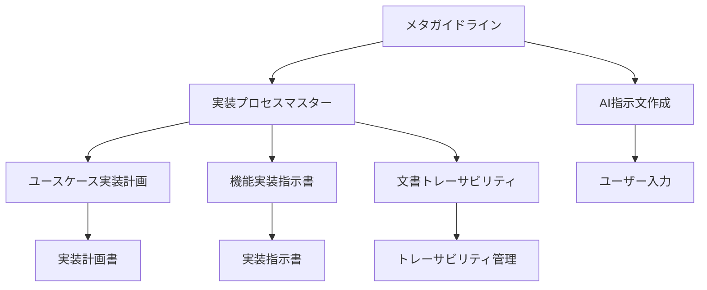

# ガイドライン体系メタドキュメント

## 概要

このドキュメントは、AIによる機能実装プロセスで使用される一連のガイドラインの関係性と使用方法を定義します。

## ガイドライン体系

## 文書体系

### 1. ユーザー向けガイドライン
- [AI指示文作成ガイドライン](./ai-instruction-writing.md)
  - 効果的な指示の書き方
  - 必要情報の提供方法
  - 問題解決プロセス

### 2. プロセスガイドライン
- [実装プロセスマスターガイドライン](./implementation-process-master.md)
  - 全体のプロセスを定義
  - 各フェーズの関係を規定
  - 品質基準を設定

### 3. 計画フェーズ
- [ユースケース実装計画ガイドライン](./implementation-planning-with-usecases.md)
  - ユースケースの分析方法
  - 技術要件の抽出
  - 実装計画の立案

### 4. 実装フェーズ
- [機能実装指示書テンプレート](./feature-implementation-instruction-template.md)
  - 具体的な実装手順
  - コーディング規約
  - テクニカルガイダンス

### 5. 管理フェーズ
- [文書トレーサビリティガイドライン](./document-traceability.md)
  - 文書間の関連付け
  - 変更管理
  - 品質保証

## 使用プロセス

### 1. ユーザーによる指示作成
1. AI指示文作成ガイドラインの参照
2. 必要な情報の収集
3. 構造化された指示の作成

### 2. AIによる文書生成
1. 全ガイドラインの読み込み
2. 対象ユースケースの確認
3. 技術要件の把握

### 3. 成果物の作成
1. 適切なテンプレートの選択
2. ガイドラインに従った実装
3. トレーサビリティの確保

## 品質管理

### 1. 指示品質
- 明確性と具体性
- 必要情報の完全性
- コンテキストの提供

### 2. 文書品質
- ガイドラインへの準拠
- 相互参照の整合性
- フォーマットの統一

### 3. 実装品質
- 型安全性の確保
- エラーハンドリング
- パフォーマンス

## 改善プロセス

### 1. フィードバックの収集
- ユーザーからのフィードバック
- 実装結果の評価
- 問題点の特定

### 2. ガイドラインの更新
- 新しい知見の反映
- ベストプラクティスの追加
- 問題への対応

### 3. バージョン管理
- 変更履歴の記録
- 影響範囲の分析
- 移行計画の策定

## チェックリスト

### 1. ユーザー向け
- [ ] AI指示文作成ガイドラインを確認
- [ ] 必要な情報を収集
- [ ] 構造化された指示を作成

### 2. AI向け
- [ ] すべてのガイドラインを読み込み
- [ ] ユースケースを理解
- [ ] 技術要件を確認

### 3. 品質確認
- [ ] 指示内容の妥当性
- [ ] ガイドラインへの準拠
- [ ] トレーサビリティの確保

## 更新履歴

- 2025-03-04: メタガイドライン初版作成
- 2025-03-04: AI指示文作成ガイドラインの追加
- 2025-03-04: ガイドライン体系の更新