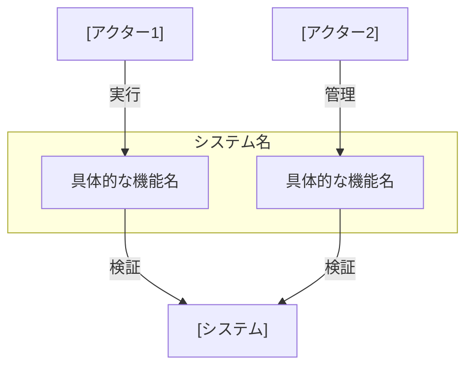

# ユースケース記述ガイドライン

## 概要

ユースケースを効果的に記述するためのガイドラインです。
実際のプロジェクトでの経験から得られた知見をもとに、ベストプラクティスをまとめています。

## 基本原則

1. 明確性
   - 一つのユースケースは一つの目的に集中
   - シンプルで理解しやすい記述
   - 具体的な例示

2. 一貫性
   - 統一された用語の使用
   - 標準的な構造の維持
   - 命名規則の遵守

3. 追跡可能性
   - 要件との紐付け
   - 関連ユースケースの参照
   - 変更履歴の管理

## ファイル構成

```
docs/usecases/
├── README.md           # 全体のユースケース図
├── [BC名]/            # 境界付けられたコンテキストごとのディレクトリ
│   ├── README.md      # コンテキスト固有の説明
│   └── [機能名].md    # 個別ユースケース
```

## 記述スタイル

### 1. 文書構造

```markdown
# ユースケース名

## ユースケース概要
目的と概要を簡潔に説明

## アクター
関係者を列挙

## 事前条件
必要な前提条件

## 想定シナリオ
[タイトル]
ペルソナを用いた物語形式の記述（500字程度）

## 基本フロー
具体的なステップ

## 代替フロー
別パターンの流れ

## 例外フロー
エラー時の処理

## 事後条件
完了時の状態

## 関連オブジェクト
使用するオブジェクト

## 補足情報
図表や追加情報
```

### 2. 表記ルール

1. アクターの表記
   ```markdown
   - [会員] - システムのユーザー
   - [システム] - システム自体
   - [外部システム] - 連携システム
   ```

2. シナリオの書き方
   ```markdown
   [ペルソナ名]（[年齢]歳、[役割]）は、[目的や動機]を抱えていました。

   [現状の課題や問題点]を感じていた[ペルソナ名]は、[解決策]を思いつきました。

   [具体的な行動と実装]を行い、[システムの利用方法]を決めました。

   後日、[結果や効果]となり、[最終的な価値]が得られました。
   ```

3. フローの記述
   ```markdown
   1. [アクター]は[具体的な操作]を実行
   2. [システム]は[具体的な処理]を実行
   3. [アクター]は[具体的な確認]を実行
   ```

## ユースケース図の描き方

### 1. 基本構造



### 2. 実装状況の表示

README.mdには以下を含める：

```markdown
### 実装済みユースケース
- [機能名](ファイルパス) - 簡単な説明

### 未実装ユースケース
- 機能名 - 簡単な説明
```

## シナリオ作成のポイント

1. ペルソナ設定
   - 名前、年齢、役割は必須
   - 現実的な課題や動機
   - 具体的な目的

2. 物語構造（起承転結）
   - 起：現状の課題
   - 承：解決策の発見
   - 転：システムの利用
   - 結：得られた価値

3. 実用的な詳細
   - 具体的な数値
   - 実際の使用例
   - 測定可能な効果

## レビューポイント

1. 完全性
   - 500字程度のシナリオ
   - 必要な情報の網羅
   - 具体的な例示

2. 正確性
   - 業務要件との整合
   - 技術的な実現性
   - 制約条件の考慮

3. 一貫性
   - 用語の統一
   - 表記ルールの遵守
   - 他ユースケースとの整合

## よくある問題と対策

1. 抽象的なシナリオ
   ```markdown
   ❌ 社員が新聞を作る
   ⭕ 中堅IT企業のエンジニア（28歳）が、チームの技術情報共有のために...
   ```

2. 不明確な価値
   ```markdown
   ❌ 便利になった
   ⭕ 情報共有の時間が1日30分削減され、過去の記事も60秒以内に見つけられるように...
   ```

3. 具体性の不足
   ```markdown
   ❌ データを入力する
   ⭕ 「TechTrends Daily」という名前で、Technology カテゴリを選択し...
   ```

## 改訂履歴

- 2025-03-05: 改訂
  - 想定シナリオの書き方を具体化
  - ユースケース図の構造を標準化
  - ファイル構成を明確化
  - シナリオの物語構造を追加