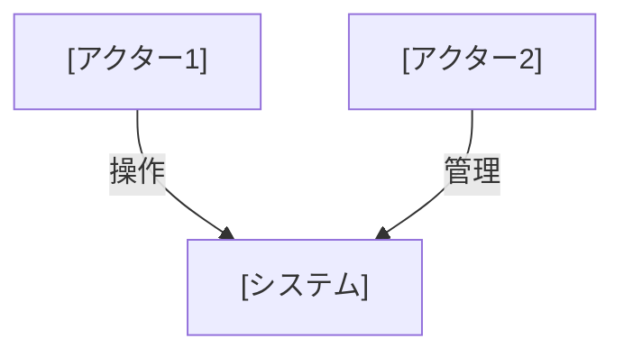
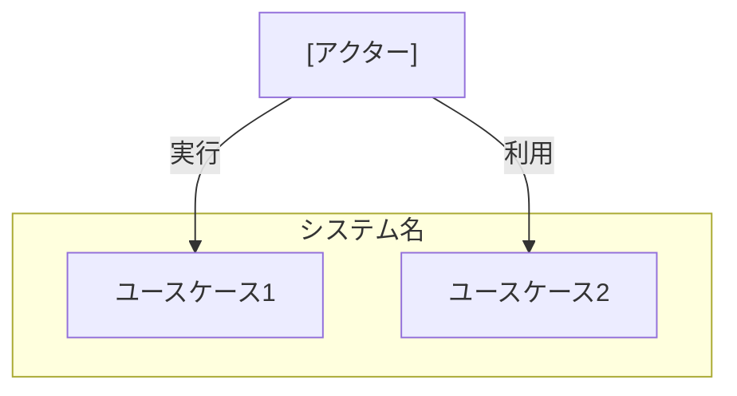
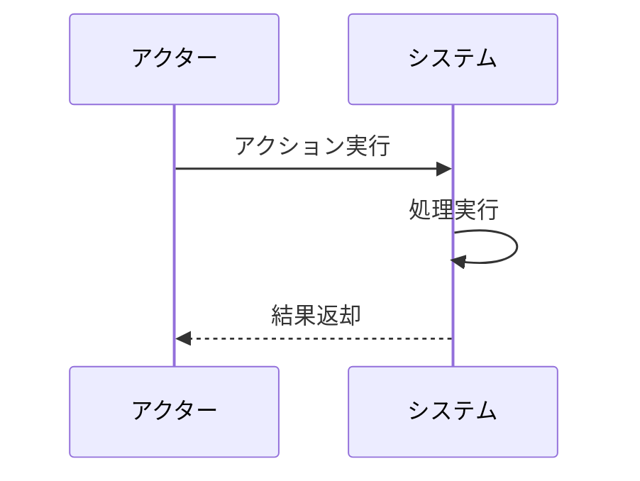

# ユースケース記述ガイドライン

## 概要

ユースケースを効果的に記述するためのガイドラインです。
実際のプロジェクトでの経験から得られた知見をもとに、ベストプラクティスをまとめています。

## 基本原則

1. 明確性
   - 一つのユースケースは一つの目的に集中
   - シンプルで理解しやすい記述
   - 具体的な例示

2. 一貫性
   - 統一された用語の使用
   - 標準的な構造の維持
   - 命名規則の遵守

3. 追跡可能性
   - 要件との紐付け
   - 関連ユースケースの参照
   - 変更履歴の管理

## 記述スタイル

### 1. 文書構造

```markdown
# ユースケース名

## ユースケース概要
目的と概要を簡潔に説明

## アクター
関係者を列挙

## 事前条件
必要な前提条件

## 基本フロー
### シナリオ：具体的な状況
シナリオの説明
具体的なステップ

## 代替フロー
別パターンの流れ

## 例外フロー
エラー時の処理

## 事後条件
完了時の状態

## 関連オブジェクト
使用するオブジェクト

## 補足資料
図表や追加情報
```

### 2. 表記ルール

1. アクターの表記
   ```markdown
   - [会員] - システムのユーザー
   - [システム] - システム自体
   - [外部システム] - 連携システム
   ```

2. シナリオの書き方
   ```markdown
   ペルソナ名（年齢、役割）は、〜しようとしています。
   
   状況説明と背景...
   
   具体的な操作手順...
   ```

3. フローの記述
   ```markdown
   1. [アクター]は操作を実行
   2. [システム]は処理を実行
   3. [アクター]は結果を確認
   ```

## シナリオ作成のポイント

1. ペルソナの設定
   - 具体的な属性（年齢、職業、役割）
   - 現実的な動機や目的
   - 課題や要望

2. 状況設定
   - 具体的な業務シーン
   - 実際の使用文脈
   - 制約条件

3. 操作手順
   - 明確な順序
   - 具体的な入力値
   - 期待される結果

## 図の描き方

### 1. アクター関係図



### 2. ユースケース図



### 3. シーケンス図



## レビューポイント

1. 完全性
   - 必要な情報が揃っているか
   - 欠落している視点はないか
   - 十分な具体性があるか

2. 正確性
   - 業務要件と整合しているか
   - 技術的に実現可能か
   - 制約条件を満たしているか

3. 一貫性
   - 用語の使用は統一されているか
   - 表記ルールは守られているか
   - 他のユースケースと矛盾しないか

## 運用のポイント

1. バージョン管理
   - 変更履歴の記録
   - 変更理由の明記
   - レビュー記録の保持

2. 関連ドキュメント
   - 要件定義書との紐付け
   - テスト仕様書への反映
   - 設計書での参照

3. メンテナンス
   - 定期的な見直し
   - 最新状態の維持
   - フィードバックの反映

## よくある問題と対策

1. 抽象的な記述
   ```markdown
   ❌ 会員が情報を入力する
   ⭕ 会員が氏名（漢字）、生年月日（YYYY/MM/DD）を入力する
   ```

2. 不明確な条件
   ```markdown
   ❌ 正しい情報を入力する
   ⭕ メールアドレスが@を含み、パスワードが8文字以上である
   ```

3. 一貫性の欠如
   ```markdown
   ❌ Customer, 利用者, ユーザー（同じ意味で異なる用語）
   ⭕ [会員]（統一された用語）
   ```

## 参考文献

1. 要件定義・設計ガイドライン
2. ユースケース作成の実践的アプローチ
3. アジャイル開発におけるユースケース活用

## 改訂履歴

- 2025-03-05: 初版作成
  - プロジェクトでの実践経験を反映
  - 具体的な例示を追加
  - 図の描き方を整理