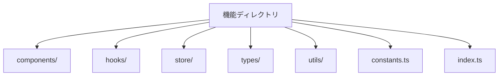
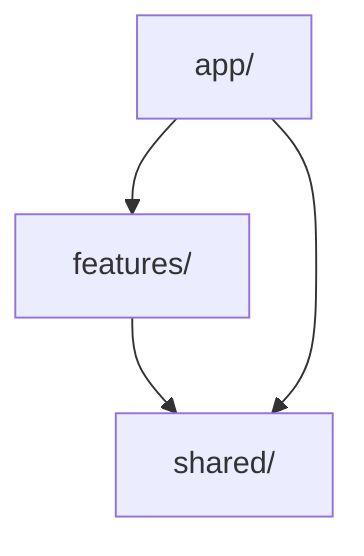

# プロジェクト推奨のパッケージ構造ルール

## 1. 基本原則

### 1.1 Package by Feature

機能グループ単位(境界つけられたコンテキスト単位)でパッケージを分割し、関連する機能を集約します：

```
src/
├── features/                  # 機能グループのディレクトリ
│   ├── auth/                 # 認証機能グループ
│   │   ├── login/           # ログイン機能
│   │   │   ├── components/  # コンポーネント
│   │   │   ├── hooks/      # カスタムフック
│   │   │   ├── store/      # 状態管理
│   │   │   ├── types/      # 型定義
│   │   │   └── utils/      # ユーティリティ
│   │   │
│   │   ├── signup/         # サインアップ機能
│   │   │   ├── components/
│   │   │   ├── hooks/
│   │   │   ├── store/
│   │   │   ├── types/
│   │   │   └── utils/
│   │   │
│   │   └── common/         # 認証機能グループの共通コンポーネント
│   │       ├── components/
│   │       ├── hooks/
│   │       └── utils/
│   │
│   ├── article/            # 記事機能グループ
│   │   ├── editor/        # エディタ機能
│   │   ├── viewer/        # ビューワー機能
│   │   ├── comment/       # コメント機能
│   │   └── common/        # 記事機能グループの共通コンポーネント
│   │
│   └── bookmarks/         # ブックマーク機能グループ
│       ├── list/          # 一覧機能
│       ├── tags/          # タグ管理機能
│       └── common/        # ブックマーク機能グループの共通コンポーネント
│
└── common/                # プロジェクト全体の共通コンポーネント
    ├── components/        # UI共通コンポーネント
    ├── hooks/            # 共通フック
    ├── styles/           # グローバルスタイル
    └── utils/            # 共通ユーティリティ
```

機能グループと機能の分類例：

1. 認証機能グループ（auth）

   - ログイン（login）
   - サインアップ（signup）
   - パスワードリセット（password-reset）
   - 2要素認証（2fa）

2. 記事機能グループ（article）

   - エディタ（editor）
   - ビューワー（viewer）
   - コメント（comment）
   - 検索（search）

3. ブックマーク機能グループ（bookmarks）
   - 一覧表示（list）
   - タグ管理（tags）
   - インポート/エクスポート（import-export）
   - 検索（search）

### 1.2 コロケーション

関連するファイルは同じディレクトリに配置します：

```
features/auth/
  ├── components/
  │   ├── LoginForm/
  │   │   ├── LoginForm.tsx
  │   │   ├── LoginForm.test.tsx
  │   │   ├── LoginForm.stories.tsx
  │   │   └── LoginForm.module.css
  │   │
  │   └── SignupForm/
  │       ├── SignupForm.tsx
  │       ├── SignupForm.test.tsx
  │       ├── SignupForm.stories.tsx
  │       └── SignupForm.module.css
  │
  └── hooks/
      ├── useAuth.ts
      └── useAuth.test.ts
```

## 2. ディレクトリ構造規則

### 2.1 特徴的なディレクトリ

- `features/`: 機能単位のコード
- `common/`: 共有リソース
- `app/`: アプリケーションのエントリーポイント
- `types/`: グローバルな型定義

### 2.2 機能ディレクトリの内部構造

各機能ディレクトリには以下を含めます：



## 3. 依存関係管理

### 3.1 依存方向



### 3.2 インポートルール

- 絶対パスを使用（`@features/auth`など）
- 循環依存を禁止
- 親から子への一方向の依存のみ許可

## 4. コロケーションルール

### 4.1 必須の同一配置

以下のファイルは必ず同じディレクトリに配置：

1. コンポーネントファイル

   - メインのコンポーネント（.tsx）
   - テストファイル（.test.tsx）
   - ストーリーファイル（.stories.tsx）
   - スタイルファイル（.module.css）

2. フックファイル
   - メインのフック（.ts）
   - テストファイル（.test.ts）

### 4.2 命名規則

- ディレクトリ名はPascalCase
- ファイル名はコンポーネント名と同じ
- インデックスファイルは小文字

## 5. 共有リソース管理

### 5.1 共有コンポーネント

- アトミックデザインに基づく構造
- 再利用可能なコンポーネントのみ配置
- 明確なインターフェース定義

### 5.2 共有フック

- 複数の機能で使用されるフックのみ
- シンプルで明確な責務
- 十分なテストカバレッジ

## 6. テストとドキュメント

### 6.1 テストファイルの配置

- ユニットテスト：実装ファイルと同じディレクトリ
- 統合テスト：`__tests__`ディレクトリ
- E2Eテスト：`e2e`ディレクトリ

### 6.2 ドキュメント

- README.md：各機能ディレクトリのルートに配置
- API文書：実装ファイルと同じディレクトリ
- 使用例：Storybookファイル内に記載

## 7. バンドル最適化

### 7.1 Dynamic Import

- 大きな機能は動的インポート
- ルーティングベースの分割
- 共有モジュールの最適化

### 7.2 Tree Shaking

- 使用していないコードの削除
- サイドエフェクトの明示
- モジュールの最適化
