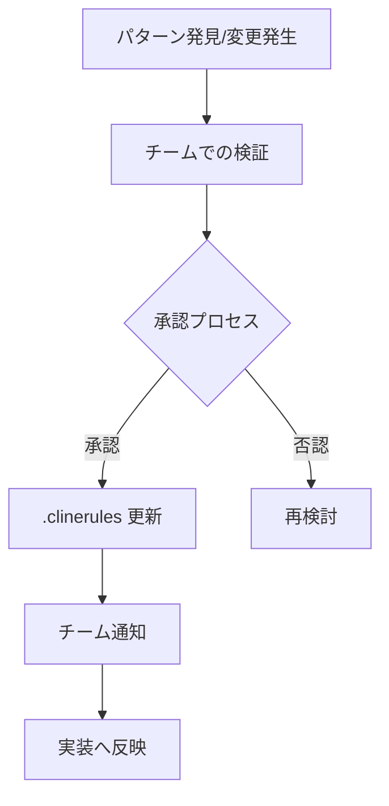

# .clinerules ガイドライン

## 概要

.clinerules は、プロジェクトの重要な実装規約、設定、およびプロジェクトインテリジェンスを捉えるための生きたドキュメントです。このファイルは、AIアシスタントとプロジェクトチーム間の効果的なコラボレーションを実現するための重要な橋渡しとなります。

## 1. 基本原則

### 1.1 目的

- プロジェクト固有の実装規約の定義
- AIアシスタントの動作ガイドラインの提供
- チーム間の一貫性のある開発プラクティスの確立
- プロジェクトの技術的な意思決定の記録

### 1.2 重要性

- AIセッション間での一貫性の維持
- プロジェクトの知見の蓄積
- チーム間のコミュニケーション効率の向上
- 実装の品質と一貫性の確保

## 2. ファイル構造

### 2.1 必須セクション

1. **重要な前提条件**
   - AIアシスタントの役割と制約
   - プロジェクト固有の重要な考慮事項
   - テスト駆動開発の方針

2. **共通処理**
   - 多言語対応要件
   - 実装標準への参照
   - プロジェクト共通の処理規約

3. **プロジェクト情報**
   - チーム名
   - メンバー情報
   - プロジェクト固有の設定

4. **技術スタック**
   - 使用言語とバージョン
   - フレームワークとライブラリ
   - 開発ツール

5. **セキュリティガイドライン**
   - 機密情報の取り扱い
   - セキュリティ対策
   - 禁止事項

### 2.2 オプションセクション

- コミットメッセージ規約
- プルリクエスト作成規約
- CI/CD設定
- 環境固有の設定

## 3. メンテナンスルール

### 3.1 更新タイミング

以下の場合に.clinerules を更新します：

1. 新しいプロジェクトパターンの発見時
2. 重要な技術的決定の後
3. 実装規約の変更時
4. プロジェクト設定の変更時
5. セキュリティ要件の変更時

### 3.2 更新プロセス

### 3.3 品質基準

- 明確で簡潔な記述
- 実行可能な具体的な指示
- 最新の状態を維持
- トレーサビリティの確保

## 4. セキュリティ考慮事項

### 4.1 機密情報の管理

- 環境変数の使用
- 機密ファイルの除外
- アクセス制御の設定

### 4.2 セキュリティベストプラクティス

- コード内の機密情報の排除
- セキュアなログ出力
- 認証情報の適切な管理

## 5. 実装時の注意点

### 5.1 コーディング規約

- TypeScript/React の標準規約の遵守
- プロジェクト固有のコーディングスタイル
- コンポーネント設計原則

### 5.2 テスト要件

- ユニットテストの必須化
- テストカバレッジの基準
- テスト実装パターン

### 5.3 パフォーマンス考慮事項

- バンドルサイズの制限
- レンダリング最適化
- メモリ使用量の考慮

## 6. レビュープロセス

### 6.1 コードレビュー基準

- レビュー対象の明確化
- レビューチェックリスト
- フィードバックプロセス

### 6.2 品質メトリクス

- コード品質基準
- パフォーマンス基準
- アクセシビリティ要件

## 7. ドキュメント管理

### 7.1 必要なドキュメント

- 技術仕様書
- API文書
- デプロイ手順
- トラブルシューティングガイド

### 7.2 ドキュメント更新ルール

- 更新頻度
- レビュープロセス
- バージョン管理

## 更新履歴

- 2025-03-08: 初版作成
  - .clinerules の基本構造とガイドラインを定義
  - メンテナンスルールとセキュリティ考慮事項を追加
  - 実装時の注意点とレビュープロセスを明確化