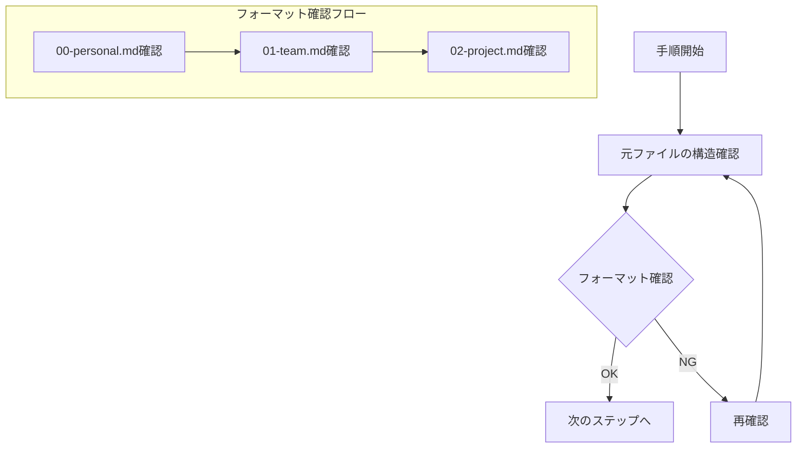

# .clinerules更新手順の改善提案 v4

## 1. 改善の背景

### 1.1 現状の課題
- フォーマット確認プロセスが不明確
- ファイル間の関係性の説明が不足
- エラー防止メカニズムが不十分

### 1.2 改善の必要性
- 一貫性のある文書生成の保証
- 効率的な更新作業の実現
- エラー発生リスクの低減

## 2. 具体的な改善提案

### 2.1 フォーマット確認プロセスの強化



1. フォーマット確認の明確化
   ```markdown
   # フォーマット確認チェックリスト
   
   ## 1. ファイル構造の確認
   - [ ] セクション階層の確認
   - [ ] インデントの確認
   - [ ] 箇条書きスタイルの確認
   
   ## 2. 内容の整合性確認
   - [ ] 各ルール階層の関係確認
   - [ ] 参照パスの正確性確認
   - [ ] 用語の一貫性確認
   ```

2. ファイル構造の明示化
   ```yaml
   フォーマット参照:
     個人ルール: "00-personal.md"
     チームルール: "01-team.md"
     プロジェクトルール: "02-project.md"
   ```

### 2.2 ファイル間関係性の明確化

1. 階層構造の説明追加
   ```mermaid
   graph TD
       A[00-personal.md] -->|参照| B[01-team.md]
       B -->|参照| C[02-project.md]
       D[create-clinerules-plan.md] -->|フォーマット| E[計画書]
       E -->|反映| F[プレビュー]
   ```

2. 相互参照ルールの追加
   - 上位ファイルから下位ファイルへの参照方法
   - 下位ファイルから上位ファイルへの影響確認
   - 整合性チェックポイントの設定

### 2.3 エラー防止メカニズムの拡充

1. 事前チェック項目の追加
   ```yaml
   チェック項目:
     フォーマット:
       - セクション構造
       - インデント
       - 記述スタイル
     
     内容:
       - ルール間の整合性
       - 参照の正確性
       - 用語の統一
     
     検証:
       - 構造の妥当性
       - 内容の完全性
       - 更新の反映
   ```

2. エラー検出ポイントの明確化
   - フォーマット逸脱の検出
   - 内容の矛盾の検出
   - 更新漏れの検出

## 3. 改善後の手順書構成

### 3.1 計画書作成フェーズ
1. フォーマット確認
   - 元ファイルの構造把握
   - チェックリストによる確認
   - エラー検出ポイントの確認

2. 内容作成
   - 階層構造の維持
   - 相互参照の確認
   - 整合性の確保

3. 検証プロセス
   - 構造の検証
   - 内容の検証
   - 更新の確認

### 3.2 プレビュー作成フェーズ
1. フォーマット適用
   - 構造の転記
   - スタイルの統一
   - インデントの調整

2. 内容の反映
   - ルール階層の維持
   - 参照関係の確保
   - 用語の統一

### 3.3 実装フェーズ
1. 変換プロセス
   - 日本語版の生成
   - 英語版への変換
   - 整合性の確認

2. 検証プロセス
   - 構造の確認
   - 内容の確認
   - 動作の確認

## 4. 改善の効果

### 4.1 期待される効果
1. 品質の向上
   - フォーマットの一貫性確保
   - エラーの早期発見
   - 修正コストの削減

2. 効率の改善
   - 作業時間の短縮
   - 手戻りの削減
   - メンテナンス性の向上

3. 安定性の向上
   - エラー発生率の低下
   - トラブル対応の迅速化
   - 品質の安定化

### 4.2 評価指標
1. 定量的指標
   - エラー発生率
   - 作業時間
   - 修正回数

2. 定性的指標
   - 可読性
   - メンテナンス性
   - ユーザー満足度

## 5. 実装計画

### 5.1 更新手順
1. 既存ファイルの更新
   - update-clinerules.mdの改訂
   - create-clinerules-plan.mdの更新
   - 関連ドキュメントの調整

2. 新規コンテンツの追加
   - チェックリストの追加
   - エラー防止ガイドの作成
   - サンプルコードの追加

### 5.2 展開計画
1. 段階的な導入
   - パイロット適用
   - フィードバック収集
   - 本格展開

2. フォローアップ
   - 効果測定
   - 課題収集
   - 継続的改善

## 6. まとめ

### 6.1 改善のポイント
- フォーマット確認プロセスの強化
- ファイル間関係性の明確化
- エラー防止メカニズムの拡充

### 6.2 期待される成果
- 一貫性のある文書生成
- 効率的な更新作業
- 安定した品質確保