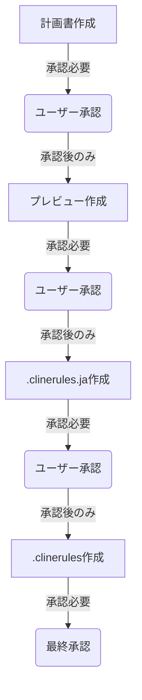

# Clineルール更新手順の改善提案

## 1. 変更内容

### 1.1 作業フローの明確化



### 1.2 チェックポイントの追加

```yaml
必須チェックポイント:
  計画フェーズ:
    - 計画書の作成完了
    - ユーザーの承認取得
    - 次フェーズへの移行判断

  プレビューフェーズ:
    - プレビューの作成完了
    - ユーザーの承認取得
    - 次フェーズへの移行判断

  実装フェーズ:
    - .clinerules.ja の作成完了
    - ユーザーの承認取得
    - .clinerules の作成完了
    - 最終承認の取得
```

### 1.3 エラー防止メカニズムの強化

```yaml
エラー防止策:
  承認チェック:
    - 各フェーズでの承認状態の記録
    - 承認なしでの次フェーズ移行を禁止
    - 承認履歴のトレース機能

  依存関係管理:
    - フェーズ間の依存関係の明確化
    - 前提条件の自動チェック
    - 手順の順序性の保証
```

## 2. 変更理由

### 2.1 現状の課題

1. 承認プロセスが不明確
   - 承認のタイミングが不明瞭
   - 承認の必要性が明示されていない
   - 承認状態の管理が不十分

2. フェーズ間の関係性が不明確
   - 依存関係の説明が不足
   - 前提条件の記述が不十分
   - 移行条件が明確でない

3. エラー防止が不十分
   - チェックポイントの不足
   - 検証プロセスの曖昧さ
   - フィードバックの仕組みが弱い

### 2.2 改善による効果

1. プロセスの明確化
   - 各フェーズの責任範囲の明確化
   - 承認ポイントの可視化
   - 作業の順序性の保証

2. 品質の向上
   - エラーの早期発見
   - 一貫性の確保
   - トレーサビリティの向上

3. 効率の改善
   - 手戻りの削減
   - 承認プロセスの効率化
   - 問題の早期解決

## 3. 影響範囲

### 3.1 影響を受ける部分

1. ドキュメント構造
   - update-clinerules.mdの全体構成
   - 関連する参照ドキュメント
   - テンプレートファイル

2. 作業プロセス
   - AIの作業フロー
   - ユーザーの承認プロセス
   - エラー処理の手順

3. 品質管理
   - レビュープロセス
   - 検証手順
   - 記録管理方法

### 3.2 リスク分析

1. 移行リスク
   - 既存プロセスとの整合性
   - 過去の作業との互換性
   - 学習コストの発生

2. 運用リスク
   - プロセスの複雑化
   - 承認待ち時間の増加
   - 記録管理の負荷

## 4. 期待される効果

### 4.1 短期的効果

1. エラーの削減
   - 手順の飛ばしの防止
   - 承認漏れの防止
   - 不整合の早期発見

2. 品質の向上
   - レビュー品質の向上
   - 一貫性の確保
   - トレーサビリティの確保

### 4.2 長期的効果

1. プロセスの最適化
   - 作業効率の向上
   - 問題解決の迅速化
   - メンテナンス性の向上

2. 知見の蓄積
   - ベストプラクティスの確立
   - 改善点の明確化
   - ノウハウの体系化