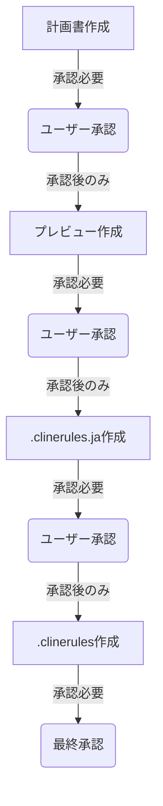

# Clineルール更新手順（AI用）改訂案

## 0. 重要な前提

- ルールのメンテナンスはユーザーの責任
- AIは分析と改善案作成と更新作業を担当
- ルールの更新は必ずユーザーの承認が必要
- 各フェーズは前フェーズの承認後のみ開始可能

## 1. 作業フロー概要



## 2. 計画フェーズ

### 2.1 前提確認

1. ファイル構造の確認
   ```bash
   list_files docs/setup/cline/rules/detail --recursive
   ```

2. テンプレート確認
   - docs/setup/cline/rules/00-personal.md
   - docs/setup/cline/rules/01-team.md
   - docs/setup/cline/rules/02-project.md

3. チーム・メンバールール確認
   - docs/team/[teamName]/rules/
   - docs/team/[teamName]/member/[userName]/rules/

### 2.2 計画書作成

1. 計画書の構造
   - 前提確認セクション
   - 作業計画セクション
   - 検証計画セクション

2. エラー防止の組込み
   - 確認ポイントの設定
   - エラー対応の定義
   - 実装前検証項目

### 2.3 計画書の保存と承認取得

1. 保存場所
   ```
   docs/setup/cline/logs/ai/advice/[teamName]/[userName]/YYYY-MM-DD-HH-clinerules-plan.md
   ```

2. 承認フロー
   - 計画書の提出
   - ユーザーレビュー
   - フィードバック対応
   - 承認取得

## 3. プレビューフェーズ

### 3.1 前提条件

1. 計画書の承認確認
   - すべてのセクションが完了
   - ユーザーの承認取得済み

2. 必要情報の確認
   - メンバー情報
   - チームルール
   - プロジェクトルール

### 3.2 プレビュー作成

1. 構造設計
   - 3層構造の確立
   - 依存関係の整理
   - 優先順位の設定

2. 内容作成
   - 個人設定の反映
   - チーム設定の統合
   - プロジェクト設定の反映

### 3.3 プレビューの保存と承認取得

1. 保存場所
   ```
   docs/setup/cline/logs/ai/advice/[teamName]/[userName]/YYYY-MM-DD-HH-clinerules-preview.md
   ```

2. 承認フロー
   - プレビューの提出
   - ユーザーレビュー
   - フィードバック対応
   - 承認取得

## 4. 実装フェーズ

### 4.1 .clinerules.ja 作成

1. 前提条件
   - プレビューの承認確認
   - 最終調整の反映

2. 作成と保存
   ```
   .clinerules.ja
   ```

3. 承認フロー
   - 内容の確認
   - ユーザーレビュー
   - フィードバック対応
   - 承認取得

### 4.2 .clinerules 作成

1. 変換方針
   - トークン数の削減
   - 文脈の維持
   - 技術用語の適切性

2. 作成と保存
   ```
   .clinerules
   ```

3. 最終承認
   - 内容の確認
   - ユーザーレビュー
   - フィードバック対応
   - 最終承認取得

## 5. エラー防止と品質保証

### 5.1 チェックポイント管理

1. フェーズ移行時
   - 前フェーズの完了確認
   - 承認状態の確認
   - 依存関係の確認

2. 実装時
   - 構文の確認
   - 整合性の確認
   - セキュリティチェック

### 5.2 承認状態管理

1. 承認記録
   - 承認者の記録
   - 承認日時の記録
   - 承認内容の記録

2. 状態追跡
   - 進捗状況の管理
   - 承認履歴の保持
   - 変更履歴の管理

## 6. 作業記録

### 6.1 ログの保存

1. 記録内容
   - 作業内容と判断
   - 発生した問題と対応
   - 承認履歴

2. 保存場所
   ```
   docs/setup/cline/logs/ai/advice/[teamName]/[userName]/YYYY-MM/
   ```

### 6.2 改善提案の管理

1. 提案形式
   ```
   YYYY-MM-DD-HH-mm-[改善内容の英名].md
   ```

2. 記録項目
   - 変更内容と理由
   - 影響範囲の分析
   - 期待される効果