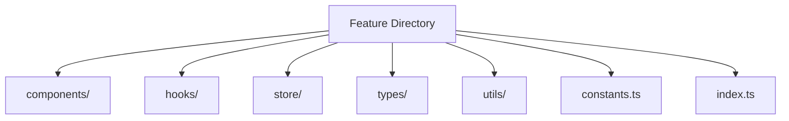
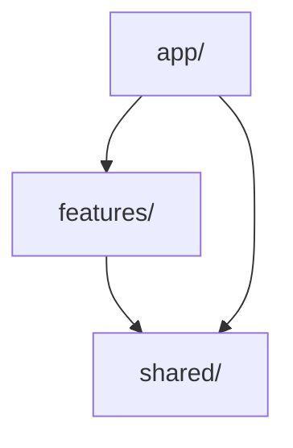

# Recommended Package Structure Rules for Projects

## 1. Basic Principles

### 1.1 Package by Feature

Divide packages by functional groups (bounded context units) and consolidate related features:

```
src/
├── features/                  # Directory for feature groups
│   ├── auth/                 # Authentication feature group
│   │   ├── login/           # Login feature
│   │   │   ├── components/  # Components
│   │   │   ├── hooks/      # Custom hooks
│   │   │   ├── store/      # State management
│   │   │   ├── types/      # Type definitions
│   │   │   └── utils/      # Utilities
│   │   │
│   │   ├── signup/         # Signup feature
│   │   │   ├── components/
│   │   │   ├── hooks/
│   │   │   ├── store/
│   │   │   ├── types/
│   │   │   └── utils/
│   │   │
│   │   └── common/         # Common components for auth feature group
│   │       ├── components/
│   │       ├── hooks/
│   │       └── utils/
│   │
│   ├── article/            # Article feature group
│   │   ├── editor/        # Editor feature
│   │   ├── viewer/        # Viewer feature
│   │   ├── comment/       # Comment feature
│   │   └── common/        # Common components for article feature group
│   │
│   └── bookmarks/         # Bookmark feature group
│       ├── list/          # List feature
│       ├── tags/          # Tag management feature
│       └── common/        # Common components for bookmark feature group
│
└── common/                # Project-wide common components
    ├── components/        # UI common components
    ├── hooks/            # Common hooks
    ├── styles/           # Global styles
    └── utils/            # Common utilities
```

Examples of feature groups and feature classifications:

1. Authentication Feature Group (auth)

   - Login (login)
   - Signup (signup)
   - Password Reset (password-reset)
   - Two-Factor Authentication (2fa)

2. Article Feature Group (article)

   - Editor (editor)
   - Viewer (viewer)
   - Comments (comment)
   - Search (search)

3. Bookmarks Feature Group (bookmarks)
   - List View (list)
   - Tag Management (tags)
   - Import/Export (import-export)
   - Search (search)

### 1.2 Colocation

Place related files in the same directory:

```
features/auth/
  ├── components/
  │   ├── LoginForm/
  │   │   ├── LoginForm.tsx
  │   │   ├── LoginForm.test.tsx
  │   │   ├── LoginForm.stories.tsx
  │   │   └── LoginForm.module.css
  │   │
  │   └── SignupForm/
  │       ├── SignupForm.tsx
  │       ├── SignupForm.test.tsx
  │       ├── SignupForm.stories.tsx
  │       └── SignupForm.module.css
  │
  └── hooks/
      ├── useAuth.ts
      └── useAuth.test.ts
```

## 2. Directory Structure Rules

### 2.1 Characteristic Directories

- `features/`: Code organized by feature units
- `common/`: Shared resources
- `app/`: Application entry points
- `types/`: Global type definitions

### 2.2 Internal Structure of Feature Directories

Each feature directory should include:



## 3. Dependency Management

### 3.1 Dependency Direction



### 3.2 Import Rules

- Use absolute paths (e.g., `@features/auth`)
- Prohibit circular dependencies
- Allow only unidirectional dependencies from parent to child

## 4. Colocation Rules

### 4.1 Required Colocation

The following files must be placed in the same directory:

1. Component Files

   - Main component (.tsx)
   - Test file (.test.tsx)
   - Story file (.stories.tsx)
   - Style file (.module.css)

2. Hook Files
   - Main hook (.ts)
   - Test file (.test.ts)

### 4.2 Naming Conventions

- Directory names use PascalCase
- File names match component names
- Index files use lowercase

## 5. Shared Resource Management

### 5.1 Shared Components

- Structure based on Atomic Design
- Place only reusable components
- Clear interface definitions

### 5.2 Shared Hooks

- Only hooks used by multiple features
- Simple and clear responsibilities
- Sufficient test coverage

## 6. Testing and Documentation

### 6.1 Test File Placement

- Unit tests: Same directory as implementation files
- Integration tests: `__tests__` directory
- E2E tests: `e2e` directory

### 6.2 Documentation

- README.md: Placed at the root of each feature directory
- API documentation: Same directory as implementation files
- Usage examples: Included in Storybook files

## 7. Bundle Optimization

### 7.1 Dynamic Import

- Dynamic import for large features
- Routing-based code splitting
- Optimization of shared modules

### 7.2 Tree Shaking

- Remove unused code
- Explicit side effects
- Module optimization