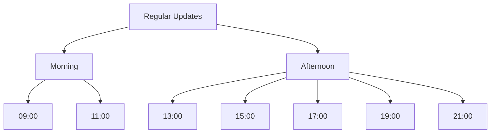

# Project Rule Settings

# Security

## Confidential Files

The following files are restricted from reading and modification:

- .env files
- All files containing API keys, tokens, and authentication information

## Security Measures

- Never commit confidential files
- Use environment variables for secret information
- Do not include authentication information in logs or output

## 1. Prompt Trigger List

### 1.1 Regular Update Triggers

1. Weekly Report Regular Updates

   - System automatically triggers periodically
   - Trigger times: 9:00, 11:00, 13:00, 15:00, 17:00, 19:00, 21:00
   - Timing and significance:
     - 09:00: Start of morning work
     - 11:00: Mid-morning
     - 13:00: After lunch break
     - 15:00: Mid-afternoon
     - 17:00: Standard end of work
     - 19:00: Overtime work
     - 21:00: Late night work
   - Manual trigger: "Update weekly report"

2. At Work Completion (Trigger: "Good work")
   - Create knowledge summary
   - Update memory bank
   - ADR creation decision and implementation (if necessary)
   - Final weekly report update
   - Commit and push

### 1.2 Knowledge Update (Automatic Detection or "Knowledge Update")

- Triggers:
  1. Automatic detection: When text contains the following keywords
     - "Issues have been clarified"
     - "Important discovery made"
     - "Knowledge gained"
     - "Areas for improvement found"
  2. Manual: Using the keyword "Knowledge Update"
- Process: Execute knowledge summary creation only

### 1.3 ADR Creation (Automatic Detection or "Create ADR")

- Triggers:
  1. Automatic detection: When text contains the following keywords
     - "Design policy has been decided"
     - "Architecture change decided"
     - "Important decision made"
     - "Decided to change to ~"
     - "Will proceed with ~ policy"
  2. Manual: Using the keyword "Create ADR"
- Process: Execute ADR creation only

### 1.4 Guideline Revision (Trigger: "Guide Revision")

1. Review and reflect on work
2. Revise following existing guidelines

## 2. Detailed Work Procedures

## 1. Weekly Report Regular Updates

### 1.1 Update Times



Regular updates are performed at the following times:

- 09:00: Start of morning work
- 11:00: Mid-morning
- 13:00: After lunch break
- 15:00: Mid-afternoon
- 17:00: Standard end of work
- 19:00: Overtime work
- 21:00: Late night work

### 1.2 Update Procedure

1. Time Check

   - Confirm current time
   - Record next update time

2. Content Collection

   - Work content since last update
   - Commit history
   - Created/updated files
   - Discussions and decisions

3. Record Update

   - Update Preparation

     - Always confirm existing weekly report file using read_file
     - Ensure complete retention of existing content
     - Maintain chronological order (newest updates at top)

   - Content Addition

     - Enter timestamp (current time)
     - Record work hours
     - Summarize activities
     - Link to deliverables
     - Issues and next steps

   - Update Verification
     - Confirm existing content is retained
     - Verify new content format is correct
     - Confirm chronological order is maintained

4. Next Update Preparation
   - Record next update time
   - Confirm notification settings

### 1.3 Checklist

Items to confirm during updates:

```markdown
Pre-update confirmation:

- [ ] Confirmed existing weekly report file using read_file
- [ ] Prepared to retain existing content
- [ ] Understand chronological order (newest updates at top)

Update content confirmation:

- [ ] Timestamp is accurate
- [ ] Work hours are correctly recorded
- [ ] All work content is included
- [ ] Links to deliverables are valid
- [ ] Issues and next steps are clear
- [ ] Next update time is recorded

Post-update verification:

- [ ] All existing content is retained
- [ ] New additions are in correct format
- [ ] Chronological order is properly maintained
```

### 1.4 Notification System

1. Update Time Notifications

   - Notify 15 minutes before update time
   - Notify at update time
   - Re-notify to prevent missed updates

2. Notification Content

   - Current time
   - Previous update content
   - Checklist

3. Notification Confirmation
   - Confirm notification receipt
   - Start update work
   - Record completion

## 2. Update Reminder System

### 2.1 Task Execution Update Check

1. Task Start Check
   - Check last update time
   - Check for missed regular updates
   - Perform immediate update if necessary

2. Task Execution Monitoring
   - Check elapsed time every 30 minutes
   - Display time remaining until next update
   - Pre-notify scheduled update time

3. Pre-Task Completion Check
   - Check time elapsed since last update
   - Check for missed regular updates
   - Confirm update before attempt_completion

### 2.2 System Level Prevention

1. Multiple Notifications
   - VSCode extension notifications
   - System level notifications
   - Browser notifications (when possible)

2. Visualization and Monitoring
   - Display update status in status bar
   - Countdown to next update
   - Warning display for missed updates

3. Interrupt Function
   - Force notification when update time is exceeded
   - Update check at task switching
   - Regular checks during long work sessions

### 2.3 Reminder Settings

1. Major Update Times

   - 9:00 (Work start)
   - 17:00 (Standard end of work)
   - 21:00 (Late night work)

2. Mid-point Checks
   - 11:00
   - 13:00
   - 15:00
   - 19:00

### 2.1 Knowledge Summary Creation

```
Location: docs/team/[teamName]/logs/ai/knowledge/[developmentPhase]/YYYY-MM/YYYY-MM-DD-HH-[contentTitleInEnglish].md
Procedure:
1. Pre-summary Review
   - Confirm overall picture of activities
   - List key decision points
   - Organize issues encountered

2. Reflection Process
   - Deep dive into each decision's rationale
   - Organize options and comparison details
   - Analyze lessons learned

3. Summary Creation
   - Specific issues and solutions
   - Technical decisions and their rationale
   - Improvement and alternative proposals
   - Next step proposals
```

### 2.2 Memory Bank Update

### 2.3 ADR Creation

```
Location: docs/team/[teamName]/logs/ai/adr/[ADRStatus]/[developmentPhase]/YYYY/YYYY-MM-DD-[decisionContentInEnglish].md

ADR Status:
- proposed: Under proposal
- accepted: Approved
- rejected: Rejected
- deprecated: Deprecated
- superseded: Superseded by alternative

Conditions: Create when decision falls under any of these categories
1. Decisions affecting architecture
   - System structure changes
   - Component relationship changes
   - Important interface changes

2. Important pattern or convention changes
   - Design pattern adoption
   - Coding convention changes
   - Naming convention changes

3. Team collaboration method changes
   - Development process changes
   - Communication method changes
   - Role assignment changes

4. Technology selections affecting entire system
   - Framework selection
   - Library adoption
   - Tool chain changes

Record Items:
1. Status (proposed/accepted/rejected/deprecated/superseded)
2. Background and reasons for decision
3. Considered alternatives
4. Impact analysis
5. Implementation steps
```

### 2.4 Weekly Report Creation/Update

```
Location: docs/team/[teamName]/logs/work-log/[userName]/[YYYY]/YYYY-MM_[weekNumber].md
Note: Week number starts at 1 for the first week of the month

Update Timing:
1. Regular updates every 2 hours (9:00-21:00)
2. Final update at end of work

Record Content:
1. Activity Collection
   - Check work since last record (2 hours)
   - Check commit log
   - Check created/updated files
   - Check AI conversation history

2. Record Items
   - Timestamp (YYYY-MM-DD HH:MM)
   - Work hours (HH:MM-HH:MM)
   - Activity summary (2 hours of work)
   - Reference links to deliverables (existence check required)
     - Links to created knowledge
     - Links to created ADR (if exists)
     - Links to created/updated code
     - Links to created/updated documents
   - Issues and next steps

3. Link Verification Process
   1. Check existence of each linked file
   2. If not exists:
      - Confirm move or deletion with user
      - Request correct path
      - Update weekly report with updated information

Record Format:

## YYYY-MM-DD
### HH:MM Update

Work hours: HH:MM-HH:MM

#### Activities
- Activity summary
- Specific tasks

#### Deliverables
- [Deliverable name](link)
- [Knowledge title](link)
- [ADR title](link)

#### Issues & Next Steps
- Current issues
- Next planned work

Week number calculation examples:
- 3/1-3/7   → YYYY-MM_1.md
- 3/8-3/14  → YYYY-MM_2.md
- 3/15-3/21 → YYYY-MM_3.md
- 3/22-3/28 → YYYY-MM_4.md
- 3/29-3/31 → YYYY-MM_5.md