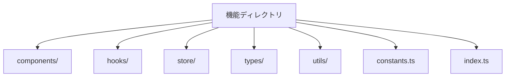
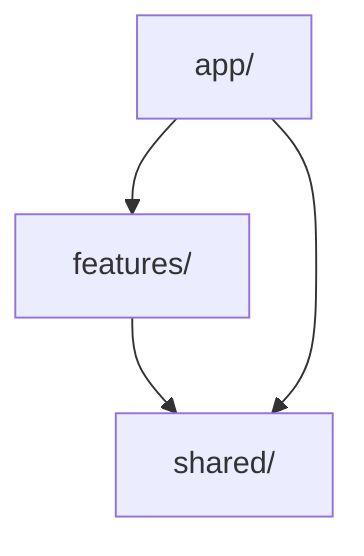

# プロジェクト推奨のパッケージ構造ルール

## 1. 基本原則

### 1.1 Package by Feature

機能単位でパッケージを分割し、関連するコードを一箇所にまとめます：

```
src/
  ├── features/              # 機能ごとのディレクトリ
  │   ├── auth/             # 認証機能
  │   │   ├── components/   # 認証関連のコンポーネント
  │   │   ├── hooks/       # 認証用カスタムフック
  │   │   ├── store/       # 認証状態管理
  │   │   ├── types/       # 型定義
  │   │   └── utils/       # ユーティリティ関数
  │   │
  │   └── article/         # 記事機能
  │       ├── components/  # 記事関連のコンポーネント
  │       ├── hooks/      # 記事用カスタムフック
  │       ├── store/      # 記事状態管理
  │       ├── types/      # 型定義
  │       └── utils/      # ユーティリティ関数
  │
  └── common/              # 共有リソース
      ├── components/      # 共通コンポーネント
      ├── hooks/          # 共通フック
      ├── styles/         # グローバルスタイル
      └── utils/          # 共通ユーティリティ
```

### 1.2 コロケーション

関連するファイルは同じディレクトリに配置します：

```
features/auth/
  ├── components/
  │   ├── LoginForm/
  │   │   ├── LoginForm.tsx
  │   │   ├── LoginForm.test.tsx
  │   │   ├── LoginForm.stories.tsx
  │   │   └── LoginForm.module.css
  │   │
  │   └── SignupForm/
  │       ├── SignupForm.tsx
  │       ├── SignupForm.test.tsx
  │       ├── SignupForm.stories.tsx
  │       └── SignupForm.module.css
  │
  └── hooks/
      ├── useAuth.ts
      └── useAuth.test.ts
```

## 2. ディレクトリ構造規則

### 2.1 特徴的なディレクトリ

- `features/`: 機能単位のコード
- `common/`: 共有リソース
- `app/`: アプリケーションのエントリーポイント
- `types/`: グローバルな型定義

### 2.2 機能ディレクトリの内部構造

各機能ディレクトリには以下を含めます：



## 3. 依存関係管理

### 3.1 依存方向



### 3.2 インポートルール

- 絶対パスを使用（`@features/auth`など）
- 循環依存を禁止
- 親から子への一方向の依存のみ許可

## 4. コロケーションルール

### 4.1 必須の同一配置

以下のファイルは必ず同じディレクトリに配置：

1. コンポーネントファイル

   - メインのコンポーネント（.tsx）
   - テストファイル（.test.tsx）
   - ストーリーファイル（.stories.tsx）
   - スタイルファイル（.module.css）

2. フックファイル
   - メインのフック（.ts）
   - テストファイル（.test.ts）

### 4.2 命名規則

- ディレクトリ名はPascalCase
- ファイル名はコンポーネント名と同じ
- インデックスファイルは小文字

## 5. 共有リソース管理

### 5.1 共有コンポーネント

- アトミックデザインに基づく構造
- 再利用可能なコンポーネントのみ配置
- 明確なインターフェース定義

### 5.2 共有フック

- 複数の機能で使用されるフックのみ
- シンプルで明確な責務
- 十分なテストカバレッジ

## 6. テストとドキュメント

### 6.1 テストファイルの配置

- ユニットテスト：実装ファイルと同じディレクトリ
- 統合テスト：`__tests__`ディレクトリ
- E2Eテスト：`e2e`ディレクトリ

### 6.2 ドキュメント

- README.md：各機能ディレクトリのルートに配置
- API文書：実装ファイルと同じディレクトリ
- 使用例：Storybookファイル内に記載

## 7. バンドル最適化

### 7.1 Dynamic Import

- 大きな機能は動的インポート
- ルーティングベースの分割
- 共有モジュールの最適化

### 7.2 Tree Shaking

- 使用していないコードの削除
- サイドエフェクトの明示
- モジュールの最適化
