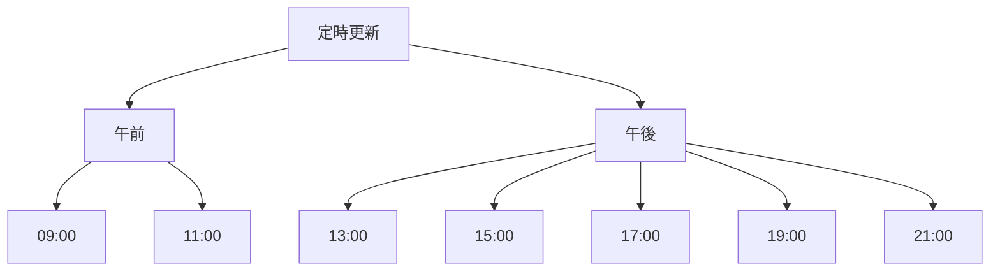

# 週報の定時更新タスク

## 1. 更新時間



定時更新を以下の時間に実施：

- 09:00: 朝の作業開始時
- 11:00: 午前の中間
- 13:00: 昼休み後
- 15:00: 午後の中間
- 17:00: 標準終業時
- 19:00: 残業時
- 21:00: 深夜作業時

## 2. 更新手順

### 2.1 基本手順

1. 時間の確認
   - 現在時刻の確認
   - 次回更新時間の記録

2. 内容の収集
   - 前回更新からの作業内容
   - コミット履歴
   - 作成・更新したファイル
   - 議論や決定事項

3. 記録の更新
   - 更新の準備
     - 必ず既存の週報ファイルを read_file で確認
     - 既存の内容を完全に保持することを確認
     - 時系列順（新しい更新が上）を維持

   - 内容の追記
     - タイムスタンプの記入（現在時刻）
     - 作業時間の記録
     - 実施内容の要約
     - 成果物へのリンク
     - 課題と次のステップ

   - 更新の検証
     - 既存の内容が保持されているか確認
     - 新規追記内容の形式が正しいか確認
     - 時系列順が維持されているか確認

4. 次回更新の準備
   - 次回更新時間の記録
   - 通知設定の確認

### 2.2 チェックリスト

更新時に確認する項目：

```markdown
更新前の確認:

- [ ] 既存の週報ファイルを read_file で確認したか
- [ ] 既存の内容を保持する準備ができているか
- [ ] 時系列順（新しい更新が上）を理解しているか

更新内容の確認:

- [ ] タイムスタンプは正確か
- [ ] 作業時間は正しく記録されているか
- [ ] すべての作業内容が含まれているか
- [ ] 成果物へのリンクは有効か
- [ ] 課題と次のステップは明確か
- [ ] 次回更新時間は記録されているか

更新後の検証:

- [ ] 既存の内容がすべて保持されているか
- [ ] 新規追記が正しい形式で行われているか
- [ ] 時系列順が適切に維持されているか
```

## 3. 通知と防止策

### 3.1 通知の仕組み

1. 更新時間の通知
   - 更新時間の15分前に通知
   - 更新時間に通知
   - 更新忘れ防止の再通知

2. 通知内容
   - 現在時刻
   - 前回の更新内容
   - チェックリスト

3. 通知の確認
   - 通知受信の確認
   - 更新作業の開始
   - 完了の記録

### 3.2 更新忘れ防止策

1. タスク実行時の更新確認
   - タスク開始時の更新状態確認
   - 30分ごとの経過時間確認
   - タスク完了前の最終確認

2. システムレベルの防止策
   - 通知の多重化
   - 状態の可視化と監視
   - インタラプト機能

3. リマインダーの設定
   - 定時の15分前
   - 定時
   - 定時の5分後（未更新の場合）
   - 30分経過時（緊急通知）

## 4. 週報フォーマット

### 4.1 ファイル名と場所

```
場所: docs/team/[teamName]/logs/work-log/[userName]/[YYYY]/YYYY-MM_[週の番号].md
注: 週の番号は月の最初の週を1とし、以降順番に2,3,4...と指定
```

週番号の計算例:
- 3/1-3/7   → YYYY-MM_1.md
- 3/8-3/14  → YYYY-MM_2.md
- 3/15-3/21 → YYYY-MM_3.md
- 3/22-3/28 → YYYY-MM_4.md
- 3/29-3/31 → YYYY-MM_5.md

### 4.2 記録フォーマット

```markdown
## YYYY-MM-DD
### HH:MM 更新

作業時間: HH:MM-HH:MM

#### 実施内容
- 作業内容の要約
- 具体的なタスク

#### 成果物
- [成果物名](リンク)
- [知見タイトル](リンク)
- [ADRタイトル](リンク)

#### 課題・次のステップ
- 現在の課題
- 次の作業予定
```

### 4.3 リンク確認プロセス

1. 各リンク先ファイルの存在確認
2. 存在しない場合:
   - ユーザーに移動または削除の確認
   - 正しいパスの提供を要求
   - 更新された情報で週報を修正

## 5. 自動記録

### 5.1 記録トリガー

以下のイベント発生時に自動的に週報に記録：

1. attempt_completion 使用時
   - タスク完了内容の記録
   - 完了時の成果物リンク
   - 次のステップ情報

2. コミット実行時
   - コミットメッセージ
   - 変更ファイル一覧
   - 関連チケット番号

3. ファイル作成・更新時
   - ファイルパス
   - 変更の概要
   - 関連する作業内容

4. ツール実行時
   - ツール名と目的
   - 実行結果のサマリー
   - 生成されたファイル

### 5.2 記録対象情報

1. タスク情報
   - チケット番号・タイトル
   - 開始・完了時刻
   - 実施内容
   - 課題・気づき事項

2. 成果物情報
   - ファイルパス
   - コミットハッシュ
   - 変更の種類（新規・更新・削除）
   - 関連するPR番号

3. コミュニケーション記録
   - レビューコメント
   - 設計上の決定事項
   - 質問と回答内容

4. 環境情報
   - ブランチ名
   - 使用ツール・バージョン
   - 実行コマンド

### 5.3 記録フロー

1. イベントの検知
   - ツール使用の監視
   - ファイル操作の追跡
   - コマンド実行の捕捉

2. 情報の収集
   - コンテキストの取得
   - 関連情報の収集
   - メタデータの付与

3. 記録の生成
   - フォーマットの適用
   - リンクの生成
   - タグ付け

4. 週報への追記
   - 適切なセクションの特定
   - 時系列順の維持
   - 重複の防止

5. 検証
   - リンクの有効性確認
   - フォーマットの整合性チェック
   - クロスリファレンスの確認

### 5.4 エラー処理

1. 記録失敗時
   - エラーの記録
   - 再試行キュー登録
   - 手動記録の促進

2. リンク切れ検出時
   - 代替パスの探索
   - 移動先の追跡
   - 更新の提案

3. フォーマット不整合時
   - 一時保存
   - フォーマット修正
   - 再記録