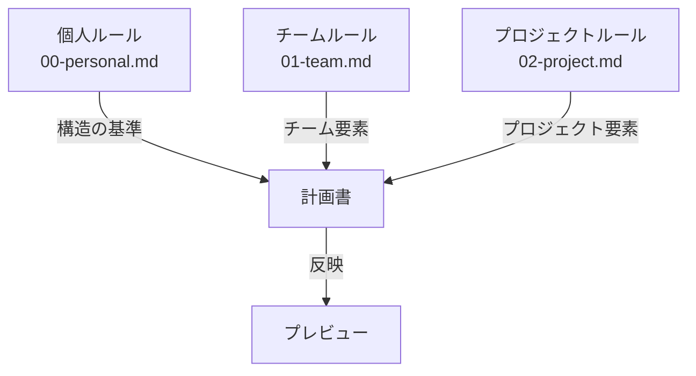

# AI用 .clinerules 作成計画書の作り方

## 0. 重要な前提

- 計画書は作業開始前に必ず作成すること
- 各階層のルールの理解度を確認すること
- ルール間の関係性を把握すること

## 1. 理解度確認プロセス

### 1.0 計画書作成の前提確認

#### 1.0.1 確認する構造



#### 1.0.2 フォーマットチェックリスト

1. 00-personal.md の構造
   - セクション1: 個人ルールの理解度確認
   - セクション2: ルール階層での位置づけ
   - セクション3: 理解度不足時の対応

2. 01-team.md の構造
   - セクション1: チームルールの理解度確認
   - セクション2: ルール階層での位置づけ
   - セクション3: 理解度不足時の対応

3. 02-project.md の構造
   - メモリバンクの概念
   - ルールの更新原則
   - Git運用ルール

#### 1.0.3 エラー防止の具体例

```yaml
エラーパターン:
  構造ミス:
    - 誤: セクション番号の欠落
    - 正: すべてのセクションに番号付与

  インデントミス:
    - 誤: ランダムなスペース
    - 正: 一貫した階層構造

  フォーマットミス:
    - 誤: 独自の書式追加
    - 正: 既存書式の踏襲
```

### 1.1 メンバールール確認（最優先）

1. 確認対象
   ```
   docs/team/[teamName]/member/[userName]/rules/
   ```

2. 確認基準
   - 完全理解：次へ進む
   - 部分的理解：不足部分を再確認
   - 不十分：全体を再読了

3. 重点項目
   - 個人開発環境設定
   - 個人ワークフロー
   - プラグイン設定

### 1.2 チームルール確認（次優先）

1. 確認対象
   ```
   docs/team/[teamName]/rules/
   ```

2. 確認基準
   - 完全理解：次へ進む
   - 部分的理解：メンバールールとの関係を再確認
   - 不十分：全体を再検討

3. 重点項目
   - チーム開発プラクティス
   - チームワークフロー
   - コミュニケーションルール

### 1.3 プロジェクトルール確認（基盤）

1. 確認対象
   ```
   docs/setup/cline/rules/detail/
   ```

2. 確認基準
   - 完全理解：実装へ進む
   - 部分的理解：他階層との関係を再確認
   - 不十分：全階層を再検討

3. 重点項目
   - プロジェクト方針
   - セキュリティ要件
   - 標準プラクティス

## 2. 計画書の構造

### 2.1 前提確認セクション

```markdown
# .clinerules 作成計画書

## 1. 理解度確認状況

### 1.1 メンバールール
- 確認状況：[完了/未完了]
- 理解度：[完全/部分的/不十分]
- 特記事項：
  - [技術特性]
  - [作業スタイル]
  - [重要な注意点]

### 1.2 チームルール
[同様の形式で記述]

### 1.3 プロジェクトルール
[同様の形式で記述]
```

### 2.2 作業計画セクション

```markdown
## 2. 作業計画

### 2.1 情報収集フェーズ
- [チームルール確認手順]
- [プロジェクトルール確認手順]

### 2.2 設計フェーズ
- [.clinerules構造設計]
- [設定項目の整理]
- [依存関係の分析]

### 2.3 検証フェーズ
- [セキュリティ検証計画]
- [機能検証計画]
```

### 2.3 検証計画セクション

```markdown
## 3. 検証計画

### 3.1 理解度の確認
- メンバールールの理解度
- チームルールとの整合性
- プロジェクトルールの遵守

### 3.2 機能の確認
- 設定の動作確認
- エラー検出
- パフォーマンス確認
```

### 2.4 バイリンガル対応計画セクション

```markdown
## 4. バイリンガル対応計画

### 4.1 日本語版（.clinerules.ja）
1. 内容構成計画
   - セクション構造
   - 記述方針
   - フォーマット定義

2. 品質管理計画
   - レビュー方法
   - 承認プロセス
   - 更新手順

### 4.2 英語版（.clinerules）
1. 変換方針
   - トークン削減アプローチ
   - 文脈維持戦略
   - 技術用語の扱い

2. 最適化計画
   - 構造の簡素化
   - 表現の効率化
   - 重複の排除
```

## 3. エラー防止メカニズム

### 3.1 確認ポイント

1. 作業開始時
   - 各階層のルール理解度
   - ルール間の関係性
   - 作業環境の準備

2. 作業中
   - 理解度の維持確認
   - エラーの早期検出
   - 問題の即時報告

3. 完了時
   - 全項目の確認
   - 整合性の検証
   - 承認の取得

### 3.2 エラー対応

1. 理解度不足
   - 再確認プロセス開始
   - 質問項目の整理
   - 承認要件の確認

2. 矛盾検出
   - 作業の一時停止
   - 問題の報告
   - 解決策の提示

### 3.4 バイリンガル対応のエラー防止

1. 日本語版の検証
   - 内容の完全性確認
   - 記述の明確性確認
   - フォーマットの一貫性

2. 英語版の検証
   - トークン効率の検証
   - 文脈維持の確認
   - 技術用語の適切性

3. バイリンガル整合性
   - 内容の対応関係
   - 重要ポイントの反映
   - 変更管理の手順

## 4. 作業記録

### 4.1 ログの保存場所

```
docs/setup/cline/logs/ai/advice/[teamName]/[userName]/YYYY-MM/
```

### 4.2 記録内容

1. 計画書
   ```
   YYYY-MM-DD-HH-clinerules-plan.md
   ```

2. プレビュー
   ```
   YYYY-MM-DD-HH-clinerules-preview.md
   ```

3. 改善提案
   ```
   YYYY-MM-DD-HH-mm-[改善内容の英名].md
   ```

### 4.3 バイリンガル開発の記録

1. 日本語版開発記録
   ```
   YYYY-MM-DD-HH-clinerules-ja-plan.md
   ```
   - 構造設計の記録
   - レビュー結果
   - 承認履歴

2. 英語版開発記録
   ```
   YYYY-MM-DD-HH-clinerules-en-plan.md
   ```
   - 変換方針の記録
   - 最適化プロセス
   - 検証結果

3. 整合性管理記録
   ```
   YYYY-MM-DD-HH-clinerules-bilingual-check.md
   ```
   - 対応関係の確認
   - 差分の管理
   - 更新履歴

## 5. 継続的改善

### 5.1 改善プロセス

1. フィードバック収集
   - ユーザーからの意見
   - エラー発生パターン
   - 効率化ポイント

2. プロセス最適化
   - 手順の見直し
   - テンプレートの改善
   - チェックリストの更新

### 5.2 知見の共有

1. 効果的な手法
   - 理解度確認方法
   - エラー防止策
   - 効率化テクニック

2. 注意点
   - よくある問題
   - 解決方法
   - 予防措置
