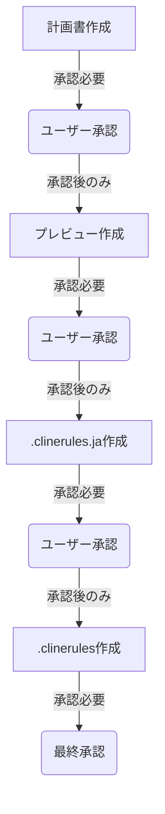

# Clineルール更新手順（AI用）

## 0. 重要な前提

- ルールのメンテナンスはユーザーの責任
- AIは分析と改善案作成と更新作業を担当
- ルールの更新は必ずユーザーの承認が必要

## 1. 前提確認

### 1.1 ファイル構造の確認

AIはプロジェクトルール確認時に以下を実行すること：

1. プロジェクトルールの確認

   ```bash
   # detail/ディレクトリの最新状態確認
   list_files docs/setup/cline/rules/detail --recursive

   # 結果の例：
   docs/setup/cline/rules/detail/
   ├── basic/
   │   ├── 00-basic.md
   │   ├── 01-trigger-task.md
   │   ├── 02-git-workflow.md
   │   └── 03-clinerules-best-practices.md
   └── trigger-task/
       ├── adr-creation.md
       ├── auto-commit-by-task.md
       ├── guideline-revision.md
       ├── knowledge-update.md
       ├── rule-improvement.md
       └── weekly-report-update.md
   ```

2. テンプレートファイルの確認

   - docs/setup/cline/rules/00-personal.md
   - docs/setup/cline/rules/01-team.md
   - docs/setup/cline/rules/02-project.md

3. チームルールの確認

   - docs/team/[teamName]/rules/配下のファイル確認
   - チーム固有の設定確認

4. メンバールールの確認
   - docs/team/[teamName]/member/[userName]/rules/配下のファイル確認
   - 個人固有の設定確認

### 1.0.2 構造変更の確認

1. 新規ファイルの確認

   - 追加されたファイルの検出
   - 新規テンプレートの適用確認

2. 更新の反映
   - 構造変更の記録
   - パス一覧の更新
   - 番号付けの調整

## 1. ルール改善のトリガー

### 1.1 自動検知

以下のキーワードを含む文章を検出した場合：

- 「ルールの問題点が見つかりました」
- 「ルールの改善が必要です」
- 「ルールの更新を提案します」
- 「ルールの矛盾を発見しました」
- 「ルールの最適化が可能です」

### 1.2 手動トリガー

ユーザーから「ルール改善」命令を受けた場合

## 1. 作業フロー概要



### 1.1 計画書フォーマット参照

AIは以下のファイルのフォーマットを厳密に遵守すること：

```
docs/setup/cline/update-guide/ai/create-clinerules-plan.md
```

### 1.5.2 計画書作成の事前チェック

1. フォーマット確認手順

   - 00-personal.md の構造を必ず確認
   - 01-team.md の構造を必ず確認
   - 02-project.md の構造を必ず確認

2. チェックリスト
   ```
   [ ] 各ファイルの最新版を確認
   [ ] セクション構造を確認
   [ ] インデントを確認
   [ ] 箇条書きスタイルを確認
   ```

### 1.5.3 計画書作成プロセス

1. ルールファイルの確認

   - 00-personal.md の構造確認
   - 01-team.md の構造確認
   - 02-project.md の構造確認

2. 計画書の構造設計

   - 前提確認セクション
   - 作業計画セクション
   - 検証計画セクション

3. エラー防止メカニズムの組込
   - 確認ポイントの設定
   - エラー対応の定義
   - 実装前検証項目の準備

### 1.5.4 計画書の保存

```
docs/setup/cline/logs/ai/advice/[teamName]/[userName]/YYYY-MM-DD-HH-clinerules-plan.md
```

## 2. メンバー理解フェーズ

### 2.1 情報収集

1. メンバールールの確認

   ```
   docs/team/[teamName]/member/[userName]/rules/
   ```

   - 00-basic.mdから開始
   - 個人情報セクションを確認
   - タスク関連設定を把握
   - AIとの協業方法を理解

2. 段階的な理解度チェック

   ```yaml
   確認項目:
     基本情報:
       - チーム名
       - ユーザー名
       - 役割

     技術特性:
       - スキルレベル
       - 得意分野
       - 不得意分野

     作業スタイル:
       - プログラミング方針
       - AIとの協業方法
       - 品質管理アプローチ
   ```

### 1.2 理解度判定基準

1. 完全理解の場合

   - すべてのルールを理解
   - 実装方法を把握
     → 作業開始可能

2. 部分的理解の場合

   - 不足部分を特定
   - 追加学習を実施
     → 再確認後に開始

3. 理解不足の場合
   - 全体的な再学習
   - 重点項目の確認
     → 完全理解後に開始

### 5.3 エラー防止プロセス

1. 事前確認（各フェーズ共通）
   - 前フェーズの承認確認
   - すべてのパスが "docs" から始まることを確認
   - 参照ファイルの存在確認
   - ファイル構造の整合性確認

2. 実行時確認
   - 変更前の状態を記録
   - 段階的な更新の実施
   - 各ステップでの整合性確認

3. 最終確認
   - パスの参照整合性
   - 内容の完全性
   - フォーマットの統一性
   - 承認状態の最終確認

## 2. 分析フェーズ

### 2.1 既存ルールの分析

- ファイル構造の確認
- 内容の分析
- 課題の特定

### 2.2 改善案の検討

- 構造の最適化
- 内容の明確化
- エラー防止の強化

## 3. 計画フェーズ

### 3.1 更新計画の立案

- タスクの分割
- 手順の具体化
- スケジュールの設定

### 3.2 リスク分析

- 潜在的問題の特定
- 対策の準備
- 検証ポイントの設定

## 3. ルール階層の分析

### 3.1 チームルールの確認

```
docs/team/[teamName]/rules/
```

チェック項目：

- メンバールールとの整合性
- チーム固有のプラクティス
- ワークフローの要件

### 3.2 プロジェクトルールの確認

```
docs/setup/cline/rules/detail/
```

チェック項目：

- プロジェクトの基本方針
- セキュリティ要件
- 標準プラクティス

## 4. プレビュー作成フェーズ

### 3.1 プレビュー作成の前提条件

1. 計画書の承認確認（必須）
   - すべてのセクションが完了
   - ユーザーの承認取得済み
   - エラー防止メカニズムの準備完了
   ※承認がない場合は次フェーズに進めない

2. 必要な情報の確認
   - メンバー情報の把握
   - チームルールの理解
   - プロジェクトルールの確認

### 4.2 プレビュー作成の事前チェック

1. フォーマット確認

   - 00-personal.md 形式での個人ルール
   - 01-team.md 形式でのチームルール
   - 02-project.md 形式でのプロジェクトルール

2. 内容確認
   ```
   [ ] 3層構造の確認
   [ ] 各層の整合性確認
   [ ] 参照パスの正確性
   ```

### 4.3 段階的な作成プロセス

1. 基本情報の組み込み

   - メンバー情報の反映
   - 技術特性の考慮
   - 作業スタイルの統合

2. ルール階層の構築

   - 個人ルールの優先度設定
   - チームルールとの整合性確保
   - プロジェクトルールの基盤化

3. 設定の最適化
   - 自動化設定の調整
   - エラー処理の追加
   - パフォーマンスの最適化

### 4.4 プレビューファイルの作成

1. ファイル生成

   ```
   docs/setup/cline/logs/ai/advice/[teamName]/[userName]/YYYY-MM-DD/YYYY-MM-DD-HH-clinerules-preview.md
   ```

2. 構造

   ```markdown
   # .clinerules プレビュー

   ## 1. 個人ルール設定

   ### 1.1 確認対象のルール

   ### 1.2 理解度判定基準

   ### 1.3 重点確認項目

   ## 2. チームルール設定

   ### 2.1 確認対象のルール

   ### 2.2 理解度判定基準

   ### 2.3 重点確認項目

   ## 3. プロジェクトルール設定

   ### 3.1 メモリバンクの基本概念

   ### 3.2 メモリバンクの構造と更新

   ### 3.3 ドキュメント更新の原則

   ### 3.4 Git運用ルール

   ### 3.5 プロジェクト基本ルール

   ### 3.6 トリガー処理ルール
   ```

3. 記述ルール
   - 明確な階層構造を維持
   - 箇条書きでの記述を基本とする
   - サブセクションは適切にインデント

## 5. エラー防止と品質保証

### 5.1 チェックポイント管理

1. フェーズ移行時
   - 前フェーズの完了確認
   - 承認状態の確認
   - 依存関係の確認

2. 実装時
   - 構文の確認
   - 整合性の確認
   - セキュリティチェック

### 5.2 承認状態管理

1. 承認記録
   - 承認者の記録
   - 承認日時の記録
   - 承認内容の記録

2. 状態追跡
   - 進捗状況の管理
   - 承認履歴の保持
   - 変更履歴の管理

## 6. 改善案の作成

### 4.1 AIの熟考プロセス

1. タスク履歴の確認

   - 過去のタスク実行状況
   - 成功/失敗の要因分析
   - 効率化可能なポイント

2. ユーザー特性の分析

   - コミュニケーションスタイル
   - 作業の優先順位付け方法
   - フィードバックの傾向

3. 改善方針の検討

   - エラー防止の強化
   - 効率の向上
   - 品質の確保

4. 実装可能性の評価
   - 技術的な実現性
   - 影響範囲の見積もり
   - リスクの分析

### 4.2 改善提案の作成と保存

1. ファイル名規則

   ```
   docs/setup/cline/logs/ai/advice/[teamName]/[userName]/YYYY-MM/YYYY-MM-DD-HH-mm-[改善内容の英名].md
   ```

2. 提案フォーマット

   ```markdown
   # [改正したいルールのタイトル]改善提案

   ## 1. 変更内容

   [変更の具体的な内容]

   ## 2. 変更理由

   [なぜこの変更が最適なのか]

   ## 3. 影響範囲

   [この変更が影響を与える範囲]

   ## 4. 期待される効果

   [変更による具体的な改善点]
   ```

## 7. 改善案のユーザー確認

### 7.1 提案時の注意点

- 具体的な改善内容を示す
- 変更の理由を明確に説明
- トークン削減効果を予測
- 影響範囲を明示

### 7.2 フィードバック対応

- 修正要求への対応
- 変更履歴の管理
- 再提案の実施

## 5. ルールの更新実行

### 5.1 更新前の確認

1. 事前チェック

   ```bash
   # 最新の構造を再確認
   list_files docs/setup/cline/rules/detail --recursive
   ```

2. バックアップの作成
   - 更新対象ファイル
   - 関連ファイル
   - 設定ファイル

### 5.2 更新の実行

1. ファイルの更新

   - 内容の変更
   - フォーマットの維持
   - 整合性の確保

2. 変更の検証
   - 構文の確認
   - リンクの確認
   - 動作の確認

### 5.3 完了確認

1. 最終チェック

   - 更新内容の確認
   - エラーの確認
   - 整合性の確認

2. 完了報告
   - 変更内容の説明
   - 検証結果の報告
   - 次のアクションの提案

## 6. 作業記録の保存

### 6.1 ログの記録

1. 作業内容

   - 実施した変更
   - 発生した問題
   - 対応内容

2. 判断根拠
   - 分析内容
   - 選択理由
   - 予測結果

### 6.2 履歴の更新

1. 変更履歴

   - 更新日時
   - 変更者
   - 変更内容

2. メタ情報
   - 関連チケット
   - 承認者
   - 検証結果

## 8. .clinerules生成フェーズ

### 8.1 日本語版の生成（clinerules.ja）

1. プレビューからの移行

   - プレビューの承認確認
   - 最終的な調整の反映
   - ファイル名の確認

2. 生成と保存

   ```
   .clinerules.ja
   ```

3. 内容の確認
   - すべてのセクションの存在確認
   - 日本語記述の適切性
   - フォーマットの正確性

### 8.2 英語版への変換（.clinerules）

1. 変換の基本方針

   - トークン数の削減を優先
   - 文脈の維持を重視
   - 技術用語の適切な使用

2. 変換プロセス

   - セクションごとの順次変換
   - 重要な文脈の抽出
   - 簡潔な表現への置き換え

3. 最適化のポイント

   - 冗長な説明の削除
   - 同じ意味の繰り返しを避ける
   - 箇条書きの活用

4. 生成と保存
   ```
   .clinerules
   ```

### 8.3 バイリンガル検証

1. 日本語版の検証

   - 内容の完全性
   - 説明の明確さ
   - フォーマットの一貫性

2. 英語版の検証

   - トークン数の確認
   - 文脈の保持確認
   - 技術用語の適切性

3. 対応関係の確認
   - 内容の一致確認
   - 重要ポイントの反映
   - 省略箇所の妥当性

## 9. 継続的改善

### 9.1 作業記録の管理

1. ログの保存

   ```yaml
   記録項目:
     作業プロセス:
       - 実施した手順
       - 判断のポイント
       - 結果と効果

     問題と解決:
       - 発生した問題
       - 対応方法
       - 予防策

     改善提案:
       - 効率化のポイント
       - 新規アイデア
       - 検討事項
   ```

### 9.2 プロセス改善

1. 定期的な見直し

   - 手順の最適化
   - テンプレートの更新
   - ツールの改善

2. フィードバックの反映
   - ユーザーからの提案
   - 効率化の検討
   - 新規要件の取り込み

### 9.3 バイリンガル版の最適化

1. トークン効率の向上

   - 英語表現の最適化
   - 構造の簡素化
   - 重複の排除

2. 文脈維持の工夫

   - 重要ポイントの明確化
   - 関係性の表現方法
   - 簡潔な説明技術

3. バージョン管理
   - 日英の同期管理
   - 更新履歴の記録
   - 差分の追跡
