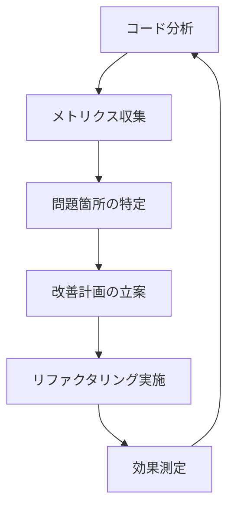

# 分析・改善フェーズの専門家ロール活用ガイド

## 著名人一覧

| 活用が効果的なタイミング | 専門家名 | 専門分野 | 代表的な貢献 |
|------------------------|----------|----------|--------------|
| ・コードの品質に課題を感じた時<br>・レガシーコードの改善が必要な時<br>・パターンベースのリファクタリングを検討する時<br>・技術的負債の解消を計画する時<br>・アーキテクチャの進化的な改善を検討する時 | Martin Fowler | リファクタリング、アナリシスパターン | ・リファクタリングパターン<br>・エンタープライズパターン<br>・継続的改善手法<br>・アーキテクチャパターン<br>・ドメイン分析手法 |
| ・ユースケース分析の初期段階<br>・要求分析の精度を上げたい時<br>・ステークホルダーとの合意形成が必要な時<br>・システムの振る舞いを明確化したい時<br>・ユーザーストーリーの詳細化が必要な時 | Alistair Cockburn, Doug Rosenber | Effective Usecase | ・ユースケース駆動開発<br>・要求分析手法<br>・アジャイル手法<br>・ユースケーステンプレート<br>・シナリオベース分析 |

## 実践的な分析・改善パターン

### 1. コード品質改善のパターン

```typescript
// Before: 複雑な条件分岐
function processOrder(order: Order) {
  if (order.type === 'standard') {
    if (order.status === 'new') {
      if (order.items.length > 0) {
        if (order.paymentMethod === 'credit') {
          // 処理ロジック
        } else if (order.paymentMethod === 'debit') {
          // 別の処理ロジック
        }
      }
    }
  }
}

// After: 早期リターンと責務の分離
function processOrder(order: Order): Result<ProcessedOrder, OrderError> {
  if (!isValidOrderType(order)) {
    return Result.fail(new OrderError('Invalid order type'));
  }

  if (!isValidOrderStatus(order)) {
    return Result.fail(new OrderError('Invalid order status'));
  }

  if (!hasItems(order)) {
    return Result.fail(new OrderError('Order has no items'));
  }

  return processPayment(order)
    .flatMap(validatePayment)
    .flatMap(finalizeOrder);
}

// 責務の分離
class OrderProcessor {
  constructor(
    private paymentGateway: PaymentGateway,
    private orderRepository: OrderRepository,
    private notificationService: NotificationService
  ) {}

  async process(order: Order): Promise<Result<ProcessedOrder, OrderError>> {
    return pipe(
      order,
      validateOrder,
      flatMap(this.processPayment.bind(this)),
      flatMap(this.saveOrder.bind(this)),
      flatMap(this.notifyCustomer.bind(this))
    );
  }

  private async processPayment(order: Order): Promise<Result<PaidOrder, PaymentError>> {
    const strategy = this.getPaymentStrategy(order.paymentMethod);
    return strategy.process(order);
  }
}
```

### 2. ユースケース分析のパターン

```typescript
// ユースケース定義の構造化
interface UseCase {
  title: string;
  actor: string;
  trigger: string;
  preconditions: string[];
  postconditions: string[];
  mainFlow: Step[];
  alternativeFlows: AlternativeFlow[];
  exceptions: ExceptionFlow[];
  businessRules: BusinessRule[];
}

interface Step {
  number: number;
  actor: string;
  action: string;
  system: string;
  validation?: ValidationRule[];
}

// ユースケース実装例
const createBookmarkUseCase: UseCase = {
  title: "ブックマークの作成",
  actor: "登録ユーザー",
  trigger: "ユーザーがWebページをブックマークに追加する",
  preconditions: [
    "ユーザーがログインしている",
    "対象のWebページが有効なURLを持つ"
  ],
  postconditions: [
    "ブックマークがデータベースに保存される",
    "ユーザーのブックマークリストが更新される",
    "タグが適切に関連付けられる"
  ],
  mainFlow: [
    {
      number: 1,
      actor: "ユーザー",
      action: "ブックマーク追加ボタンをクリック",
      system: "ブックマーク作成フォームを表示",
      validation: [
        { rule: "URLの形式チェック", severity: "error" },
        { rule: "重複チェック", severity: "warning" }
      ]
    },
    // ...他のステップ
  ],
  alternativeFlows: [
    {
      condition: "URLが既に存在する場合",
      steps: [
        {
          number: 1,
          actor: "システム",
          action: "重複を検出",
          system: "警告メッセージを表示"
        }
      ]
    }
  ],
  exceptions: [
    {
      condition: "ネットワークエラー",
      handling: "エラーメッセージを表示し、再試行オプションを提供"
    }
  ],
  businessRules: [
    {
      id: "BR1",
      description: "一つのブックマークに最大10個のタグを付与可能",
      validation: "タグ数のバリデーション"
    }
  ]
};
```

### 3. リファクタリングプロセス管理

```typescript
// リファクタリング計画の構造化
interface RefactoringPlan {
  target: {
    module: string;
    metrics: CodeMetrics;
    dependencies: string[];
  };
  steps: RefactoringStep[];
  validation: ValidationStep[];
  rollback: RollbackPlan;
}

interface CodeMetrics {
  complexity: number;
  coverage: number;
  duplication: number;
  maintainability: number;
}

// リファクタリング実行マネージャー
class RefactoringManager {
  constructor(
    private codeAnalyzer: CodeAnalyzer,
    private testRunner: TestRunner,
    private versionControl: VersionControl
  ) {}

  async executeRefactoring(plan: RefactoringPlan): Promise<Result<void, Error>> {
    const checkpoint = await this.versionControl.createCheckpoint();

    try {
      // メトリクスの初期測定
      const initialMetrics = await this.codeAnalyzer.analyze(plan.target.module);

      // リファクタリングステップの実行
      for (const step of plan.steps) {
        await this.executeStep(step);
        await this.validateStep(step);
      }

      // 最終検証
      const finalMetrics = await this.codeAnalyzer.analyze(plan.target.module);
      if (!this.isImprovement(initialMetrics, finalMetrics)) {
        return Result.fail(new Error('No measurable improvement'));
      }

      await this.versionControl.commit('Refactoring: ' + plan.target.module);
      return Result.ok(void 0);
    } catch (error) {
      await this.versionControl.rollback(checkpoint);
      return Result.fail(error);
    }
  }
}
```

## 分析・改善の実践的アプローチ

### 1. メトリクスベースの分析



### 2. 段階的な改善プロセス

```typescript
// 改善プロセスの管理
interface ImprovementProcess {
  phases: {
    analysis: AnalysisPhase;
    planning: PlanningPhase;
    execution: ExecutionPhase;
    validation: ValidationPhase;
  };
  metrics: {
    before: MetricSet;
    after: MetricSet;
    delta: MetricDelta;
  };
  documentation: {
    decisions: Decision[];
    lessons: Lesson[];
    recommendations: Recommendation[];
  };
}

// 改善マネージャー
class ImprovementManager {
  async executeImprovement(process: ImprovementProcess): Promise<ImprovementResult> {
    // 分析フェーズ
    const analysis = await this.executeAnalysisPhase(process.phases.analysis);
    if (!analysis.isSuccessful) {
      return this.handleFailure(analysis);
    }

    // 計画フェーズ
    const plan = await this.executePlanningPhase(process.phases.planning, analysis);
    if (!plan.isSuccessful) {
      return this.handleFailure(plan);
    }

    // 実行フェーズ
    const execution = await this.executeExecutionPhase(process.phases.execution, plan);
    if (!execution.isSuccessful) {
      return this.handleFailure(execution);
    }

    // 検証フェーズ
    const validation = await this.executeValidationPhase(process.phases.validation, execution);
    
    return {
      success: validation.isSuccessful,
      metrics: this.calculateMetrics(process.metrics, validation),
      recommendations: this.generateRecommendations(validation)
    };
  }
}
```

## 品質改善の具体的な指標

### 1. コード品質メトリクス

```typescript
interface CodeQualityMetrics {
  complexity: {
    cyclomatic: number;
    cognitive: number;
    halstead: number;
  };
  maintenance: {
    changeFrequency: number;
    bugFixFrequency: number;
    timeToFix: number;
  };
  coverage: {
    line: number;
    branch: number;
    function: number;
  };
  duplication: {
    percentage: number;
    blocks: number;
    lines: number;
  };
}

class QualityAnalyzer {
  async analyzeQuality(
    codebase: Codebase,
    history: GitHistory
  ): Promise<QualityReport> {
    const metrics = await this.collectMetrics(codebase);
    const trends = await this.analyzeTrends(history);
    const hotspots = await this.identifyHotspots(metrics, trends);

    return {
      currentQuality: metrics,
      historicalTrends: trends,
      hotspots,
      recommendations: this.generateRecommendations(metrics, hotspots)
    };
  }
}
```

### 2. パフォーマンス指標

```typescript
interface PerformanceMetrics {
  responseTime: {
    average: number;
    p95: number;
    p99: number;
  };
  throughput: {
    requestsPerSecond: number;
    concurrentUsers: number;
  };
  resourceUsage: {
    cpu: number;
    memory: number;
    diskIO: number;
  };
  errors: {
    rate: number;
    distribution: Record<string, number>;
  };
}

class PerformanceAnalyzer {
  async analyzePerformance(
    application: Application,
    timeframe: TimeFrame
  ): Promise<PerformanceReport> {
    const metrics = await this.collectPerformanceMetrics(application, timeframe);
    const bottlenecks = await this.identifyBottlenecks(metrics);
    const optimizations = this.suggestOptimizations(bottlenecks);

    return {
      currentPerformance: metrics,
      bottlenecks,
      optimizations,
      recommendations: this.generateRecommendations(metrics, bottlenecks)
    };
  }
}
```

## チーム全体での改善プロセス

### 1. 知識共有の仕組み

```typescript
interface KnowledgeBase {
  patterns: {
    successful: Pattern[];
    problematic: Pattern[];
  };
  lessons: {
    learned: Lesson[];
    applying: Lesson[];
  };
  documentation: {
    technical: Document[];
    process: Document[];
  };
}

class KnowledgeManager {
  async shareKnowledge(
    knowledge: Knowledge,
    team: Team
  ): Promise<SharingResult> {
    const session = await this.createSharingSession(knowledge);
    const participants = await this.notifyTeam(team, session);
    const feedback = await this.collectFeedback(participants);

    return {
      shared: session.content,
      understanding: this.assessUnderstanding(feedback),
      nextSteps: this.planFollowUp(feedback)
    };
  }
}
```

### 2. 継続的な改善サイクル

```typescript
interface ImprovementCycle {
  identification: {
    sources: DataSource[];
    criteria: Criterion[];
  };
  prioritization: {
    factors: Factor[];
    weights: Weight[];
  };
  implementation: {
    steps: Step[];
    validation: Validation[];
  };
  review: {
    metrics: Metric[];
    feedback: Feedback[];
  };
}

class ContinuousImprovement {
  async executeCycle(
    cycle: ImprovementCycle
  ): Promise<CycleResult> {
    const issues = await this.identifyIssues(cycle.identification);
    const priorities = await this.prioritizeIssues(issues, cycle.prioritization);
    const implementation = await this.implementSolutions(priorities);
    const review = await this.reviewResults(implementation);

    return {
      completedItems: implementation.completed,
      metrics: review.metrics,
      learnings: review.learnings,
      nextCycle: this.planNextCycle(review)
    };
  }
}
```

## 改善活動のベストプラクティス

1. **データ駆動の意思決定**
   - メトリクスの継続的な収集
   - トレンド分析の実施
   - 客観的な評価基準の設定

2. **段階的な改善**
   - 小さな変更の積み重ね
   - 継続的な検証
   - フィードバックループの確立

3. **チーム全体の参加**
   - 定期的なレビュー会議
   - ペアプログラミングの実施
   - 知識共有セッションの開催

4. **自動化の活用**
   - 静的解析ツールの導入
   - 自動テストの拡充
   - CI/CDパイプラインの最適化

## 成功のための重要な要素

1. **明確な目標設定**
   - 具体的なメトリクス
   - 達成可能なマイルストーン
   - 測定可能な成果

2. **効果的なコミュニケーション**
   - 定期的な進捗報告
   - 透明性の確保
   - フィードバックの収集

3. **適切なツールの選択**
   - 静的解析ツール
   - パフォーマンス監視ツール
   - コード品質管理ツール

4. **継続的な学習**
   - ベストプラクティスの更新
   - 新技術の評価
   - チームスキルの向上

## メトリクスと評価

### 1. 技術的メトリクス
- 循環的複雑度
- コードカバレッジ
- 重複度
- 依存関係の数

### 2. プロセスメトリクス
- リファクタリング頻度
- バグ修正時間
- デプロイ頻度
- リリースサイクル時間

### 3. チームメトリクス
- 知識共有レベル
- コードレビュー効率
- チーム生産性
- 技術的負債の認識度

## 改善サイクルのチェックリスト

- [ ] 現状の問題点が明確に文書化されている
- [ ] 改善目標が定量的に設定されている
- [ ] メトリクスが定義され、測定可能である
- [ ] チーム全体が改善の方向性を理解している
- [ ] フィードバックループが確立されている
- [ ] 知識共有の仕組みが整備されている
- [ ] 効果測定の方法が確立されている
- [ ] リスク管理計画が策定されている
- [ ] 自動化ツールが適切に活用されている
- [ ] 継続的な改善プロセスが確立されている