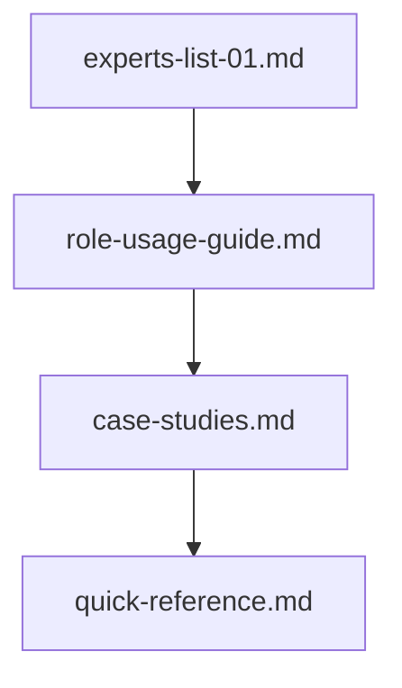
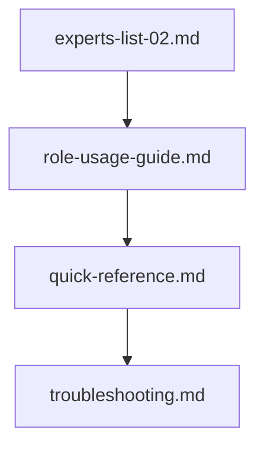
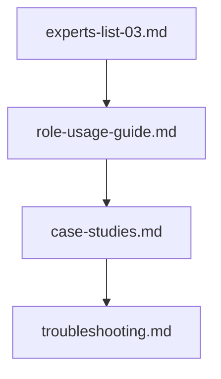

# 分析・改善フェーズのリソースガイド

このディレクトリには、分析・改善フェーズでAIに資料作成を依頼する際の包括的なガイドラインが含まれています。

## 文書構成

### 1. 専門家リスト（3部構成）
- `experts-list-01.md` - 基盤技術の専門家
  - リファクタリング、アーキテクチャ、コード品質の権威
  - 基本的な改善アプローチの提唱者

- `experts-list-02.md` - 特定領域の専門家
  - パフォーマンス、セキュリティ、アクセシビリティの専門家
  - 技術特化型の改善手法の確立者

- `experts-list-03.md` - プロセス改善の専門家
  - メトリクス、組織変革、品質保証の権威
  - 包括的な改善アプローチの提唱者

### 2. 活用ガイドライン
- `role-usage-guide.md`
  - ロール選択のガイドライン
  - プロンプト作成のベストプラクティス
  - 組み合わせパターンの解説

### 3. 実践的リソース
- `case-studies.md`
  - 実際の活用事例
  - 具体的な成功例
  - 得られた教訓

- `quick-reference.md`
  - 状況別のロール選択ガイド
  - プロンプトテンプレート集
  - FAQ集

- `troubleshooting.md`
  - よくある課題と解決策
  - プロジェクトでの適用のコツ
  - チェックリスト

## 使用方法

### 1. 初回利用時
1. `role-usage-guide.md` で基本的な使い方を理解
2. `experts-list-*.md` で適切な専門家を選定
3. `case-studies.md` で実例を参照

### 2. 日常的な利用時
1. `quick-reference.md` で状況に合わせたロールを選択
2. 提供されているテンプレートを活用
3. 必要に応じて `troubleshooting.md` を参照

### 3. 深い理解が必要な時
1. `experts-list-*.md` で詳細な専門性を確認
2. `case-studies.md` で類似事例を研究
3. `role-usage-guide.md` で高度な使用法を学習

## 推奨される使用シナリオ

### 1. コード品質改善

### 2. パフォーマンス最適化

### 3. プロセス改善

## ベストプラクティス

1. **事前準備**
   - 課題の明確な定義
   - 制約条件の整理
   - 期待する成果物の特定

2. **ロール選択**
   - 課題に最適な専門家の選定
   - 必要に応じた複数ロールの組み合わせ
   - 段階的なアプローチの計画

3. **実行とフィードバック**
   - プロンプトの継続的な改善
   - 生成物の品質評価
   - 実践からの学びの蓄積

## メンテナンス

このディレクトリの内容は、以下のタイミングで更新されます：

1. 新しい活用パターンの発見時
2. より効果的なプラクティスの確立時
3. プロジェクトからのフィードバック反映時

## 貢献

プロジェクトでの実践を通じて得られた知見は、以下の形で共有することを推奨します：

1. 成功事例の `case-studies.md` への追加
2. 新しい解決策の `troubleshooting.md` への追加
3. 効果的なプロンプトの `quick-reference.md` への追加
