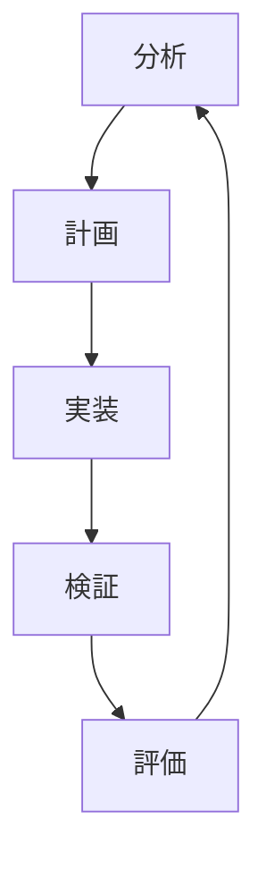
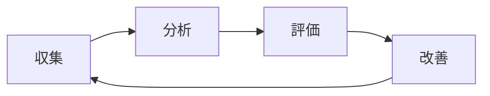

# 分析・改善フェーズの実装ガイド

## 1. 実装パターンと手法

### 1.1 コード品質改善パターン

```typescript
// リファクタリングパターン実装例
class OrderProcessor {
  async processOrder(order: Order): Promise<Result<ProcessedOrder, OrderError>> {
    return pipe(
      order,
      this.validateOrder,
      flatMap(this.calculateTotals),
      flatMap(this.applyDiscounts),
      flatMap(this.processPayment),
      flatMap(this.saveOrder),
      flatMap(this.sendConfirmation)
    );
  }

  private validateOrder(order: Order): Result<Order, OrderError> {
    const validations: ValidationResult[] = [
      this.validateItems(order.items),
      this.validateCustomer(order.customer),
      this.validatePaymentMethod(order.paymentMethod)
    ];

    return validations.every(v => v.isValid)
      ? Result.ok(order)
      : Result.fail(new OrderError(validations.filter(v => !v.isValid)));
  }
}
```

### 1.2 メトリクス収集システム

```typescript
// メトリクス収集と分析
interface MetricsCollector {
  codeQuality: {
    complexity: ComplexityMetrics;
    coverage: CoverageMetrics;
    duplication: DuplicationMetrics;
    maintainability: MaintainabilityMetrics;
  };
  performance: {
    responseTime: ResponseTimeMetrics;
    throughput: ThroughputMetrics;
    resourceUsage: ResourceMetrics;
  };
  process: {
    velocity: VelocityMetrics;
    quality: QualityMetrics;
    efficiency: EfficiencyMetrics;
  };
}

class MetricsAnalyzer {
  async analyzeMetrics(collector: MetricsCollector): Promise<AnalysisResult> {
    const codeAnalysis = await this.analyzeCodeQuality(collector.codeQuality);
    const perfAnalysis = await this.analyzePerformance(collector.performance);
    const processAnalysis = await this.analyzeProcess(collector.process);

    return {
      recommendations: this.generateRecommendations({
        code: codeAnalysis,
        performance: perfAnalysis,
        process: processAnalysis
      }),
      priorities: this.prioritizeImprovements({
        code: codeAnalysis,
        performance: perfAnalysis,
        process: processAnalysis
      }),
      roadmap: this.createImprovementRoadmap({
        code: codeAnalysis,
        performance: perfAnalysis,
        process: processAnalysis
      })
    };
  }
}
```

### 1.3 継続的改善プロセス

```typescript
// 改善サイクルの管理
interface ImprovementCycle {
  planning: {
    analysis: AnalysisPhase;
    goals: ImprovementGoals;
    metrics: TargetMetrics;
  };
  execution: {
    tasks: ImprovementTask[];
    validation: ValidationStep[];
    feedback: FeedbackLoop[];
  };
  review: {
    measurements: MeasurementResults;
    learnings: Learning[];
    adjustments: Adjustment[];
  };
}

class ImprovementManager {
  async manageCycle(cycle: ImprovementCycle): Promise<CycleOutcome> {
    const execution = await this.executeCycle(cycle);
    const validation = await this.validateResults(execution);
    const learnings = this.processLearnings(validation);

    return {
      achievements: this.measureAchievements(validation),
      insights: this.generateInsights(learnings),
      nextSteps: this.planNextCycle(learnings)
    };
  }
}
```

## 2. 評価とメトリクス

### 2.1 コード品質メトリクス

| メトリクス | 説明 | 目標値 | 測定方法 |
|----------|------|--------|----------|
| 循環的複雑度 | メソッドの分岐複雑さ | ≤ 10 | 静的解析ツール |
| コードカバレッジ | テストによるコード網羅率 | ≥ 80% | テストランナー |
| 重複度 | コードの重複率 | ≤ 5% | 重複検出ツール |
| メソッド行数 | 単一メソッドの長さ | ≤ 20行 | 静的解析ツール |

### 2.2 プロセスメトリクス

| メトリクス | 説明 | 目標値 | 測定方法 |
|----------|------|--------|----------|
| リリース頻度 | デプロイメント頻度 | ≥ 週1回 | デプロイログ |
| 変更リードタイム | コミットから本番までの時間 | ≤ 24時間 | パイプラインログ |
| 障害復旧時間 | 問題発生から解決までの時間 | ≤ 4時間 | インシデントログ |
| 変更失敗率 | 失敗したデプロイの割合 | ≤ 5% | デプロイログ |

## 3. 改善プロセス実装

### 3.1 分析フェーズ

```typescript
// 分析フェーズの実装
interface AnalysisPhase {
  dataCollection: {
    metrics: MetricsCollection;
    feedback: FeedbackCollection;
    observations: Observation[];
  };
  analysis: {
    patterns: PatternAnalysis;
    trends: TrendAnalysis;
    correlations: CorrelationAnalysis;
  };
  recommendations: {
    immediate: Action[];
    shortTerm: Action[];
    longTerm: Action[];
  };
}

class AnalysisExecutor {
  async executeAnalysis(phase: AnalysisPhase): Promise<AnalysisResults> {
    const data = await this.collectData(phase.dataCollection);
    const analysis = await this.analyzeData(phase.analysis);
    const recommendations = this.generateRecommendations(analysis);

    return {
      findings: this.summarizeFindings(analysis),
      recommendations: recommendations,
      priorities: this.prioritizeActions(recommendations)
    };
  }
}
```

### 3.2 実装フェーズ

```typescript
// 改善実装の管理
interface ImprovementImplementation {
  planning: {
    tasks: Task[];
    dependencies: Dependency[];
    timeline: Timeline;
  };
  execution: {
    tracking: ProgressTracking;
    validation: ValidationStep[];
    adjustment: AdjustmentStep[];
  };
  review: {
    metrics: MetricComparison;
    feedback: FeedbackCollection;
    learnings: LearningCollection;
  };
}

class ImplementationManager {
  async manageImplementation(
    implementation: ImprovementImplementation
  ): Promise<ImplementationResults> {
    const execution = await this.executeImplementation(implementation);
    const validation = await this.validateResults(execution);
    const review = await this.reviewOutcomes(validation);

    return {
      success: this.evaluateSuccess(review),
      metrics: this.compareMetrics(review),
      recommendations: this.generateRecommendations(review)
    };
  }
}
```

## 4. ベストプラクティス

### 4.1 コード品質改善

1. **単一責任の原則を徹底**
   - 各クラスは単一の責任を持つ
   - メソッドは単一の機能に集中
   - 適切な粒度での分割を維持

2. **テスト容易性の向上**
   - 依存性の注入を活用
   - モック可能な設計を採用
   - テストファーストの開発を推進

3. **継続的なリファクタリング**
   - 小さな改善を定期的に実施
   - テストカバレッジを維持
   - 技術的負債を管理

### 4.2 プロセス改善

1. **フィードバックループの確立**
   - 定期的なレビュー実施
   - メトリクスの継続的な監視
   - 改善案の迅速な実装

2. **自動化の推進**
   - CI/CDパイプラインの整備
   - テスト自動化の拡充
   - コード解析の自動化

3. **知識共有の促進**
   - ペアプログラミングの実施
   - コードレビューの徹底
   - ドキュメンテーションの維持

## 5. チェックリスト

### 5.1 コード品質チェック

- [ ] 複雑度メトリクスの確認
- [ ] テストカバレッジの確認
- [ ] コード重複の確認
- [ ] 命名規則の遵守
- [ ] エラー処理の適切性
- [ ] パフォーマンスの確認
- [ ] セキュリティの確認
- [ ] ドキュメントの更新

### 5.2 プロセス改善チェック

- [ ] メトリクスの定期的な収集
- [ ] フィードバックの収集と分析
- [ ] 改善計画の更新
- [ ] チーム内での共有
- [ ] 自動化の範囲拡大
- [ ] トレーニングの実施
- [ ] ドキュメントの更新
- [ ] 成果の測定と評価

## 6. 継続的改善のサイクル



## 7. メトリクス収集と評価



これらの実装ガイドラインと具体的な例を参考に、プロジェクトの継続的な改善を進めることができます。