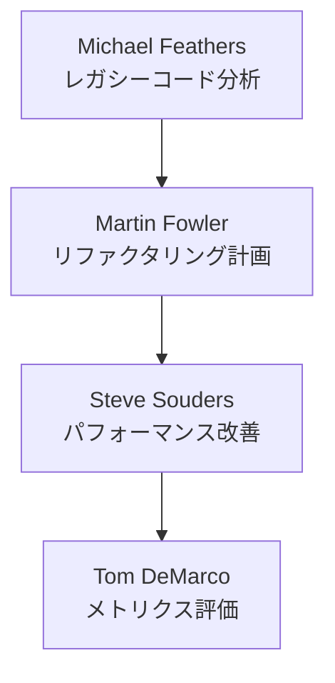
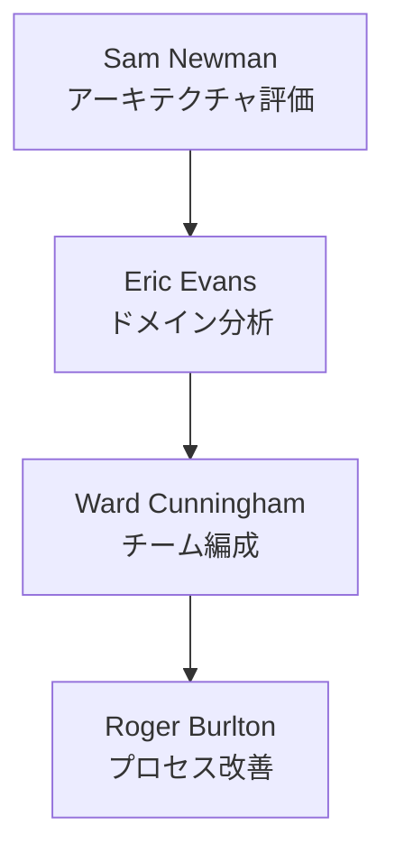
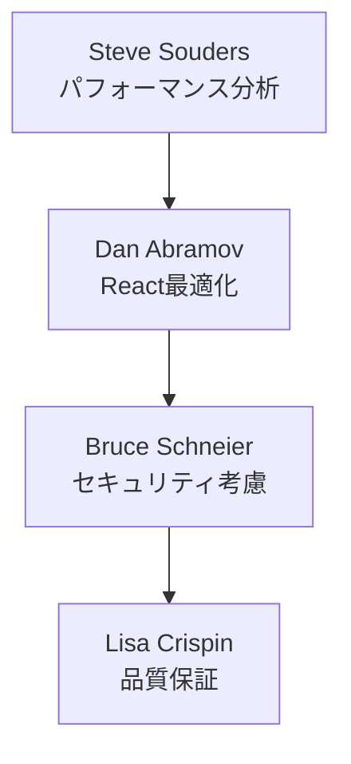

# 分析・改善フェーズの活用事例集

本ドキュメントでは、実際のプロジェクトでの専門家ロールの活用事例とその成果を紹介します。

## 事例1：レガシーコードの改善

### 課題
- 5年以上運用されているECサイト
- 技術的負債の蓄積
- パフォーマンスの低下
- 機能追加の困難化

### アプローチ


### 使用したプロンプト例
```markdown
# 段階1: レガシーコード分析
Michael Feathersとして、以下のレガシーコードベースを分析してください：
- コードサイズ：約10万行
- 主要技術：React, Node.js
- テストカバレッジ：30%
- 主な課題：重複コード、密結合

# 段階2: リファクタリング計画
Martin Fowlerとして、上記の分析結果に基づくリファクタリング計画を提案してください：
- 3ヶ月のタイムライン
- チーム規模：6名
- 優先順位付け
- リスク軽減策
```

### 成果
- テストカバレッジ30%→70%
- デプロイ頻度2倍に向上
- 平均応答時間40%改善
- バグ報告30%減少

## 事例2：マイクロサービス化プロジェクト

### 課題
- モノリスの肥大化
- スケーリングの困難
- デプロイの複雑さ
- チーム間の依存関係

### アプローチ


### 使用したプロンプト例
```markdown
# 段階1: アーキテクチャ評価
Sam Newmanとして、以下のモノリスのマイクロサービス化を評価してください：
- 現状：Javaモノリス
- ユーザー数：10万/日
- 主要機能：認証、注文、在庫、配送
- 課題：スケーリング、デプロイ

# 段階2: ドメイン分析
Eric Evansとして、以下の観点でドメインを分析してください：
- 境界づけられたコンテキスト
- 集約の特定
- チーム編成への示唆
- 段階的な移行計画
```

### 成果
- デプロイ時間80%削減
- チーム自律性の向上
- スケーリング柔軟性の確保
- 機能追加速度2倍に向上

## 事例3：パフォーマンス改善プロジェクト

### 課題
- ページロード遅延
- サーバーリソース逼迫
- ユーザー離脱率上昇
- モバイル対応の課題

### アプローチ


### 使用したプロンプト例
```markdown
# 段階1: パフォーマンス分析
Steve Soudersとして、以下のパフォーマンス課題を分析してください：
- FCP: 3.5秒
- TTI: 5.2秒
- バンドルサイズ: 2.5MB
- 画像最適化なし

# 段階2: React最適化
Dan Abramovとして、以下の最適化案を提示してください：
- コンポーネント設計
- 状態管理
- レンダリング最適化
- コード分割戦略
```

### 成果
- ページロード時間60%改善
- バンドルサイズ50%削減
- コンバージョン率15%向上
- モバイルスコア85点達成

## 学んだ教訓

### 1. ロール選択のポイント
- 課題の性質に応じた適切な専門家の選択
- 複数ロールの相補的な活用
- 段階的なアプローチの重要性

### 2. プロンプト作成のコツ
- 具体的な状況の提示
- 数値による現状説明
- 明確な期待成果の定義
- 制約条件の明示

### 3. フィードバックの活用
- 生成された内容の質の評価
- プロンプトの継続的な改善
- 成果の測定と分析

## 推奨プラクティス

### 1. 事前準備
- 現状の詳細な分析
- 具体的な目標設定
- 制約条件の明確化
- メトリクスの定義

### 2. 実行フェーズ
- 段階的なアプローチ
- 定期的な評価
- フィードバックの収集
- 柔軟な調整

### 3. 成果の定着
- 知見の文書化
- チーム内での共有
- 継続的な改善
- 成功パターンの標準化