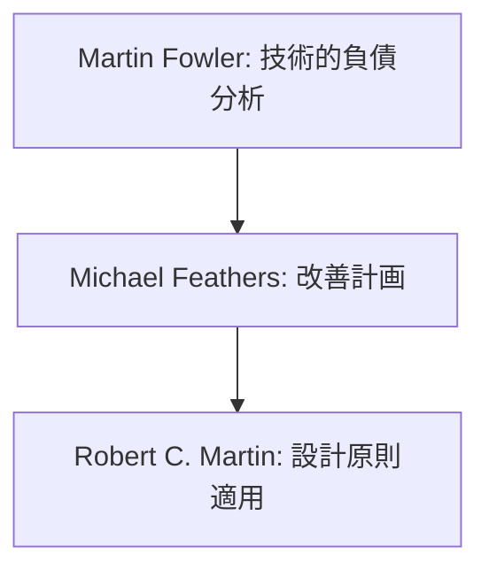
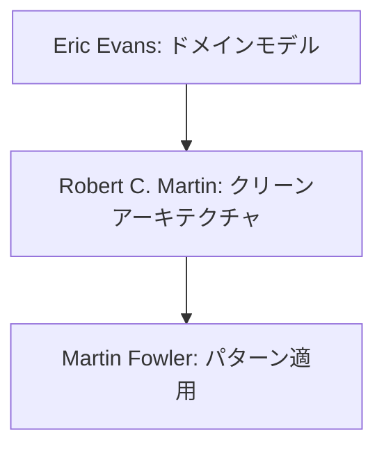

# 基盤技術の専門家リスト

本ドキュメントでは、コード品質、アーキテクチャ、リファクタリングに関する専門家の知見を整理しています。

## 専門家の選定基準

| 重要度 | 判断基準 |
|-------|----------|
| 🌟🌟🌟 | ・分野の基礎理論を確立<br>・複数の実践的な手法を確立<br>・広く採用されている手法の提唱者 |
| 🌟🌟 | ・特定分野での深い知見<br>・実践的な手法の体系化<br>・具体的な実装パターンの提示 |
| 🌟 | ・特定の技術やツールでの実績<br>・実践的な適用例の提供<br>・具体的な改善手法の提案 |

## 専門家一覧

### Martin Fowler 🌟🌟🌟
#### 活用が効果的なタイミング
- コードの品質に課題を感じた時
- レガシーコードの改善が必要な時
- パターンベースのリファクタリングを検討する時
- 技術的負債の解消を計画する時
- エンタープライズパターンの適用を検討する時

#### 期待できる成果物
- 技術的負債の分布図と影響度分析
- リファクタリング計画と優先順位付け
- エンタープライズパターンの適用ガイド
- ドメインモデルの改善提案

#### プロンプト例
```markdown
Martin Fowlerとして、以下のプロジェクトの技術的負債を分析し、改善計画を提案してください：

プロジェクト概要：
- 3年運用中のECサイト
- TypeScript/Reactベース
- モノリシックアーキテクチャ
- チーム規模：8名

特に以下の観点での分析と提案をお願いします：
1. 現状の技術的負債の分布と影響度
2. 優先的に対処すべき項目とその理由
3. 具体的なリファクタリング計画
4. 期待される改善効果
```

### Robert C. Martin (Uncle Bob) 🌟🌟🌟
#### 活用が効果的なタイミング
- オブジェクト指向設計の改善時
- クリーンアーキテクチャの導入検討時
- コード品質指標の確立時
- アジャイル開発プラクティスの改善時

#### 期待できる成果物
- SOLIDプリンシプルに基づく設計改善計画
- クリーンアーキテクチャの適用ガイド
- コーディング規約とベストプラクティス
- テスト戦略の策定

#### プロンプト例
```markdown
Robert C. Martinとして、以下のプロジェクトのクリーンアーキテクチャ適用計画を提案してください：

プロジェクトの状況：
- 既存のReactアプリケーション
- ビジネスロジックとUIの混在
- テストカバレッジ40%
- 保守性の課題

以下の観点での提案をお願いします：
1. アーキテクチャの段階的な改善計画
2. レイヤー構造の具体的な設計
3. テスト戦略の見直し
4. 実装のガイドラインと例
```

### Eric Evans 🌟🌟🌟
#### 活用が効果的なタイミング
- ドメインモデルの設計時
- 境界づけられたコンテキストの特定時
- ユビキタス言語の確立時
- 戦略的設計の検討時

#### 期待できる成果物
- ドメインモデル図
- コンテキストマップ
- ユビキタス言語辞書
- 戦略的設計ドキュメント

#### プロンプト例
```markdown
Eric Evansとして、以下のプロジェクトのドメインモデルを分析し、改善提案をお願いします：

現状の課題：
- 複数のドメインの責務が混在
- 概念の一貫性が不足
- チーム間の連携に課題
- 拡張性の制約

以下の観点での提案をお願いします：
1. 境界づけられたコンテキストの特定
2. ユビキタス言語の整理
3. 戦略的設計パターンの適用
4. 実装モデルへの変換指針
```

### Michael Feathers 🌟🌟
#### 活用が効果的なタイミング
- レガシーコードの改善計画策定時
- テスト導入戦略の検討時
- 依存関係の整理時
- 段階的な改善計画の立案時

#### 期待できる成果物
- レガシーコード改善ロードマップ
- テスト導入計画
- 依存関係の分析と改善提案
- リファクタリング実施計画

#### プロンプト例
```markdown
Michael Feathersとして、以下のレガシーシステムの改善計画を提案してください：

システムの状況：
- テスト不在のコードベース
- 複雑な依存関係
- 度重なる緊急修正
- ドキュメント不足

以下の観点での提案をお願いします：
1. テスト導入の段階的アプローチ
2. 依存関係の整理方法
3. 安全なリファクタリング手順
4. ドキュメント化戦略
```

## 専門家の組み合わせパターン

### 1. コードベース改善プロジェクト


### 2. アーキテクチャ刷新プロジェクト


## 注意点と推奨事項

1. **段階的なアプローチ**
   - 一度に大規模な変更を避ける
   - フィードバックを得ながら進める
   - 成果を測定可能にする

2. **チーム全体の理解**
   - 改善の目的と方向性の共有
   - 具体的な例での説明
   - 定期的な振り返り

3. **実践的な適用**
   - 理論と実践のバランス
   - プロジェクト特性の考慮
   - リスクの管理