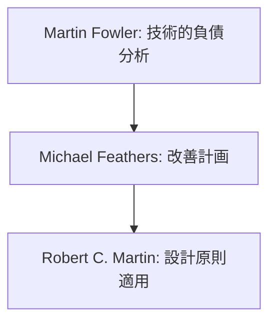
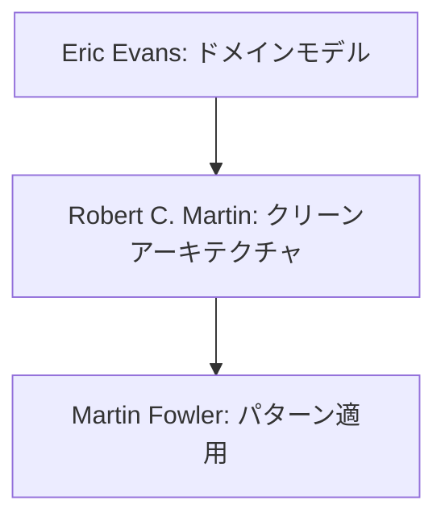

# 基盤技術の専門家リスト

## 専門家一覧

| 専門家名 | 専門分野 | 代表的な貢献 |
|---------|----------|-------------|
| Martin Fowler | リファクタリング,<br>アナリシスパターン | ・リファクタリングパターンの体系化と実践手法の確立<br>・エンタープライズアーキテクチャパターンの提唱<br>・ドメイン駆動設計の発展への貢献<br>・継続的デリバリーの概念普及 |
| Robert C. Martin | クリーンコード,<br>アジャイル設計 | ・SOLIDプリンシプルの確立<br>・クリーンアーキテクチャの提唱<br>・アジャイル開発手法の体系化<br>・テスト駆動開発の普及 |
| Eric Evans | ドメイン駆動設計 | ・戦略的設計手法の確立<br>・境界づけられたコンテキストの概念化<br>・ユビキタス言語の重要性提唱<br>・パターン言語としてのDDD体系化 |
| Michael Feathers | レガシーコード改善 | ・レガシーコード改善手法の確立<br>・テスト導入戦略の体系化<br>・段階的改善プロセスの提唱<br>・システム進化のパターン化 |

## 専門家の選定基準

| 重要度 | 判断基準 |
|-------|----------|
| 🌟🌟🌟 | ・分野の基礎理論を確立<br>・複数の実践的な手法を確立<br>・広く採用されている手法の提唱者 |
| 🌟🌟 | ・特定分野での深い知見<br>・実践的な手法の体系化<br>・具体的な実装パターンの提示 |
| 🌟 | ・特定の技術やツールでの実績<br>・実践的な適用例の提供<br>・具体的な改善手法の提案 |

## 専門家の詳細解説

### Martin Fowler 🌟🌟🌟
#### 活用が効果的なタイミング
- コードの品質に課題を感じた時
- レガシーコードの改善が必要な時
- パターンベースのリファクタリングを検討する時
- 技術的負債の解消を計画する時
- アーキテクチャの進化的な改善を検討する時
- エンタープライズパターンの適用を検討する時
- ドメインの分析が必要な時
- コード設計の原則を確立する時

#### 期待できる成果物
- 技術的負債の分布図と影響度分析
- リファクタリング計画と優先順位付け
- エンタープライズパターンの適用ガイド
- ドメインモデルの改善提案
- コード品質メトリクスの定義
- リファクタリングのROI分析
- 段階的な改善ロードマップ
- パターン適用ガイドライン

#### プロンプト例
```markdown
Martin Fowlerとして、以下のプロジェクトの技術的負債を分析し、改善計画を提案してください：

プロジェクト概要：
- 3年運用中のECサイト
- TypeScript/Reactベース
- モノリシックアーキテクチャ
- チーム規模：8名
- CI/CD環境あり
- テストカバレッジ40%

特に以下の観点での分析と提案をお願いします：
1. 現状の技術的負債の分布と影響度
2. 優先的に対処すべき項目とその理由
3. 具体的なリファクタリング計画
4. 期待される改善効果
5. リスク管理戦略
6. 進捗の測定方法
```

### Robert C. Martin (Uncle Bob) 🌟🌟🌟
#### 活用が効果的なタイミング
- オブジェクト指向設計の改善時
- クリーンアーキテクチャの導入検討時
- コード品質指標の確立時
- アジャイル開発プラクティスの改善時
- 設計原則の導入時
- コードレビュー基準の確立時
- テスト戦略の策定時
- チーム開発プラクティスの改善時

#### 期待できる成果物
- SOLIDプリンシプルに基づく設計改善計画
- クリーンアーキテクチャの適用ガイド
- コーディング規約とベストプラクティス
- テスト戦略の策定
- コード品質評価基準
- リファクタリングガイドライン
- 依存関係管理方針
- チーム開発プラクティス

#### プロンプト例
```markdown
Robert C. Martinとして、以下のプロジェクトのクリーンアーキテクチャ適用計画を提案してください：

プロジェクトの状況：
- Reactベースのフロントエンド
- Express.jsバックエンド
- モノリシック構造
- ビジネスロジックの散在
- テストカバレッジ低下
- 変更の影響範囲が不明確

以下の観点での提案をお願いします：
1. クリーンアーキテクチャへの段階的移行計画
2. SOLIDプリンシプルの適用方針
3. 依存関係の整理方法
4. テスト戦略の見直し
5. チーム開発プラクティスの改善
6. 品質指標の設定
```

### Eric Evans 🌟🌟🌟
#### 活用が効果的なタイミング
- ドメインモデルの設計時
- 境界づけられたコンテキストの特定時
- ユビキタス言語の確立時
- 戦略的設計の検討時
- ドメイン知識の整理時
- チーム間の連携モデル確立時
- ドメインの進化管理時
- 大規模システムの分割検討時

#### 期待できる成果物
- ドメインモデル図
- コンテキストマップ
- ユビキタス言語辞書
- 戦略的設計ドキュメント
- 集約の設計ガイド
- チーム構成提案
- 進化管理戦略
- 統合パターン定義

#### プロンプト例
```markdown
Eric Evansとして、以下のプロジェクトのドメインモデルを分析し、改善提案をお願いします：

現状の課題：
- 複数の業務ドメインが混在
- チーム間の概念の不一致
- 重複した実装の存在
- 拡張性の低さ
- 境界が不明確な機能群
- 整合性の維持が困難

以下の観点での提案をお願いします：
1. 境界づけられたコンテキストの特定
2. ユビキタス言語の整備計画
3. 戦略的設計パターンの適用
4. チーム編成への示唆
5. 段階的な改善ステップ
6. 成功指標の定義
```

### Michael Feathers 🌟🌟
#### 活用が効果的なタイミング
- レガシーコードの改善計画策定時
- テスト導入戦略の検討時
- 依存関係の整理時
- 段階的な改善計画の立案時
- リスク管理戦略の策定時
- コード品質メトリクスの設定時
- 保守性向上計画の立案時
- システム進化の管理時

#### 期待できる成果物
- レガシーコード改善ロードマップ
- テスト導入計画
- 依存関係の分析と改善提案
- リファクタリング実施計画
- リスク管理戦略
- 品質メトリクス定義
- 段階的改善ステップ
- モニタリング計画

#### プロンプト例
```markdown
Michael Feathersとして、以下のレガシーシステムの改善計画を提案してください：

システムの状況：
- 10年以上運用中のシステム
- テストが存在しない
- 複雑な依存関係
- 頻繁な緊急修正
- ドキュメント不足
- 属人化した知識
- 高い変更コスト

以下の観点での提案をお願いします：
1. テスト導入の段階的アプローチ
2. 依存関係の整理方法
3. 安全なリファクタリング手順
4. リスク管理戦略
5. チーム知識の向上計画
6. 進捗管理方法
```

## 専門家の組み合わせパターン

### 1. コードベース改善プロジェクト


### 2. アーキテクチャ刷新プロジェクト


## 注意点と推奨事項

### 1. 段階的なアプローチ
- 一度に大規模な変更を避ける
- フィードバックを得ながら進める
- 成果を測定可能にする
- リスクを管理する

### 2. チーム全体の理解
- 改善の目的と方向性の共有
- 具体的な例での説明
- 定期的な振り返り
- 知識の共有と蓄積

### 3. 実践的な適用
- 理論と実践のバランス
- プロジェクト特性の考慮
- リスクの管理
- 継続的な改善