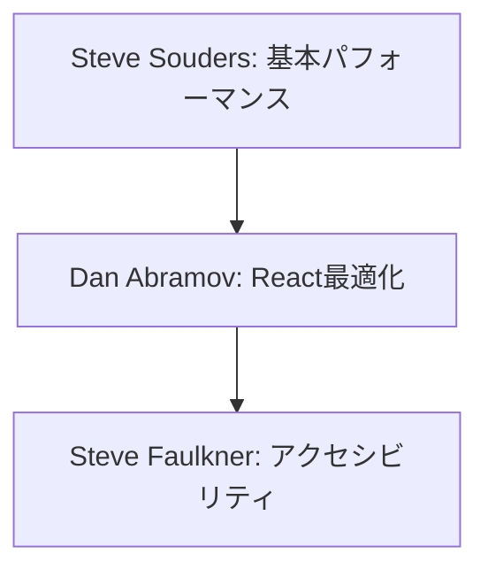
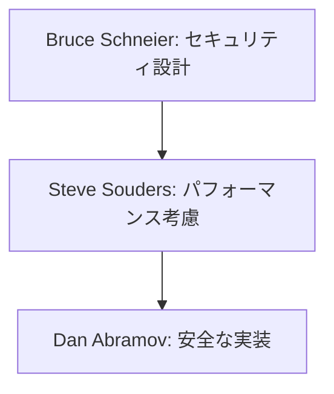

# 特定領域の専門家リスト

本ドキュメントでは、パフォーマンス、セキュリティ、アクセシビリティなど、特定の技術領域に特化した専門家の知見を整理しています。

## 専門家の選定基準

| 重要度 | 判断基準 |
|-------|----------|
| 🌟🌟🌟 | ・領域での標準的な手法を確立<br>・実践的なツールやフレームワークの開発<br>・業界標準への影響力 |
| 🌟🌟 | ・特定領域での深い実装経験<br>・具体的な最適化手法の確立<br>・実用的なパターンの提示 |
| 🌟 | ・特定技術での実績<br>・実装テクニックの提供<br>・具体的な改善事例の共有 |

## 専門家一覧

### Steve Souders 🌟🌟🌟
#### 活用が効果的なタイミング
- Webパフォーマンスの分析時
- フロントエンド最適化計画の策定時
- パフォーマンスメトリクスの設定時
- キャッシュ戦略の検討時

#### 期待できる成果物
- パフォーマンス分析レポート
- 最適化戦略ドキュメント
- パフォーマンスメトリクス定義
- 実装ガイドライン

#### プロンプト例
```markdown
Steve Soudersとして、以下のWebアプリケーションのパフォーマンス改善計画を提案してください：

現状の指標：
- First Contentful Paint: 2.5秒
- Time to Interactive: 4.0秒
- Largest Contentful Paint: 3.2秒
- バンドルサイズ: 2.1MB

以下の観点での分析と提案をお願いします：
1. 重要なパフォーマンスボトルネックの特定
2. 優先的に実施すべき最適化施策
3. 期待される改善効果
4. 実装手順とベストプラクティス
```

### Bruce Schneier 🌟🌟🌟
#### 活用が効果的なタイミング
- セキュリティアーキテクチャの設計時
- 脅威分析の実施時
- セキュリティ要件の定義時
- インシデント対応計画の策定時

#### 期待できる成果物
- セキュリティ分析レポート
- 脅威モデル文書
- セキュリティ要件定義
- インシデント対応手順

#### プロンプト例
```markdown
Bruce Schneierとして、以下のシステムのセキュリティ分析と改善提案をお願いします：

システム概要：
- クラウドベースのSaaS
- OAuth2.0による認証
- マイクロサービスアーキテクチャ
- 決済機能あり

以下の観点での分析と提案をお願いします：
1. 潜在的な脅威と脆弱性の特定
2. リスク評価と優先順位付け
3. セキュリティ対策の具体的な実装方針
4. 継続的なセキュリティ監視計画
```

### Steve Faulkner 🌟🌟
#### 活用が効果的なタイミング
- アクセシビリティ要件の定義時
- WCAG準拠の評価時
- WAI-ARIA実装の検討時
- ユーザビリティテストの設計時

#### 期待できる成果物
- アクセシビリティ監査レポート
- WCAG適合性評価
- 実装ガイドライン
- テスト計画書

#### プロンプト例
```markdown
Steve Faulknerとして、以下のWebアプリケーションのアクセシビリティ改善計画を提案してください：

現状の課題：
- スクリーンリーダー対応が不十分
- キーボード操作の課題
- カラーコントラスト基準未対応
- 動的コンテンツの認識性課題

以下の観点での提案をお願いします：
1. WCAG 2.1準拠のための改善項目
2. WAI-ARIA実装ガイドライン
3. テスト計画と評価基準
4. 段階的な改善ロードマップ
```

### Dan Abramov 🌟🌟
#### 活用が効果的なタイミング
- Reactアプリケーションの最適化時
- 状態管理設計の見直し時
- パフォーマンス課題の解決時
- コンポーネント設計の改善時

#### 期待できる成果物
- パフォーマンス最適化計画
- 状態管理設計文書
- コンポーネント設計ガイド
- リファクタリング提案

#### プロンプト例
```markdown
Dan Abramovとして、以下のReactアプリケーションの改善計画を提案してください：

現状の課題：
- 不必要な再レンダリング
- 状態管理の複雑化
- メモリリーク
- バンドルサイズの肥大化

以下の観点での提案をお願いします：
1. パフォーマンス最適化戦略
2. 状態管理の再設計
3. コンポーネント分割の見直し
4. 実装ベストプラクティス
```

## 専門家の組み合わせパターン

### 1. Webアプリケーション最適化


### 2. セキュアなアプリケーション開発


## 実践的な注意点

1. **バランスの取れた改善**
   - パフォーマンスとセキュリティのトレードオフ
   - アクセシビリティと視覚的デザインの両立
   - 段階的な改善の実施

2. **継続的なモニタリング**
   - パフォーマンスメトリクスの監視
   - セキュリティスキャンの定期実行
   - アクセシビリティテストの自動化

3. **ユーザー影響の考慮**
   - エンドユーザーへの影響評価
   - 段階的なロールアウト
   - フィードバックの収集と反映