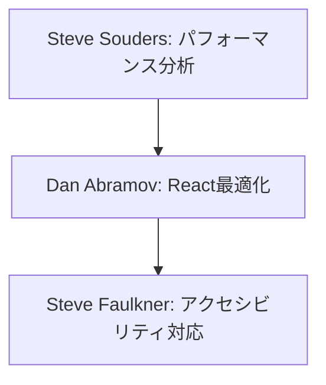
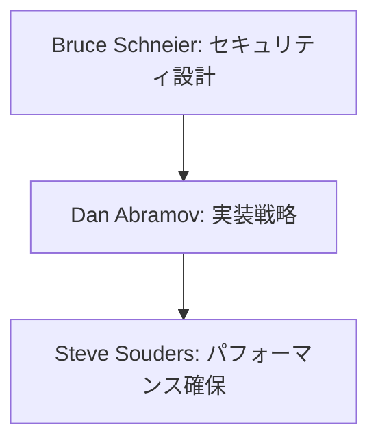

# 特定領域の専門家リスト

## 専門家一覧

| 専門家名 | 専門分野 | 代表的な貢献 |
|---------|----------|-------------|
| Steve Souders | Webパフォーマンス<br>最適化 | ・フロントエンド最適化手法の確立<br>・パフォーマンス計測手法の体系化<br>・ブラウザ最適化技術の普及<br>・High Performance Websitesの提唱 |
| Bruce Schneier | セキュリティ分析,<br>暗号技術 | ・実践的なセキュリティ分析手法の確立<br>・暗号プロトコルの設計と評価手法<br>・セキュリティリスク分析フレームワーク<br>・プライバシー設計原則の提唱 |
| Dan Abramov | React,<br>フロントエンド開発 | ・Reduxアーキテクチャの確立<br>・React Hooksの設計と実装<br>・Hot Reloadingの革新<br>・開発者ツールの進化 |
| Steve Faulkner | アクセシビリティ,<br>Web標準 | ・WAI-ARIA仕様への貢献<br>・アクセシビリティテスト手法の確立<br>・インクルーシブデザインの普及<br>・HTML5セマンティクスの標準化 |

## 専門家の詳細解説

### Steve Souders 🌟🌟🌟
#### 活用が効果的なタイミング
- Webパフォーマンスの分析時
- フロントエンド最適化計画の策定時
- パフォーマンスメトリクスの設定時
- キャッシュ戦略の検討時
- リソース最適化の検討時
- レンダリング最適化時
- ネットワーク効率化時
- ユーザー体験の改善時

#### 期待できる成果物
- パフォーマンス分析レポート
- 最適化戦略ドキュメント
- パフォーマンスメトリクス定義
- キャッシュ設計ガイド
- リソース最適化計画
- モニタリング設計
- ベンチマーク結果
- 改善ロードマップ

#### プロンプト例
```markdown
Steve Soudersとして、以下のWebアプリケーションのパフォーマンス改善計画を提案してください：

現状の指標：
- First Contentful Paint: 2.5秒
- Time to Interactive: 4.0秒
- Largest Contentful Paint: 3.2秒
- Cumulative Layout Shift: 0.25
- First Input Delay: 150ms
- バンドルサイズ: 2.1MB
- 画像最適化未実施
- キャッシュ戦略なし

以下の観点での分析と提案をお願いします：
1. クリティカルなパフォーマンス課題の特定
2. 優先度付きの改善施策
3. 具体的な実装ガイドライン
4. パフォーマンスバジェットの設定
5. モニタリング戦略
6. 期待される改善効果
```

### Bruce Schneier 🌟🌟🌟
#### 活用が効果的なタイミング
- セキュリティアーキテクチャの設計時
- 脅威分析の実施時
- セキュリティ要件の定義時
- インシデント対応計画の策定時
- リスク評価の実施時
- セキュリティ監査の準備時
- プライバシー設計時
- セキュリティ文化の確立時

#### 期待できる成果物
- セキュリティ分析レポート
- 脅威モデル文書
- セキュリティ要件定義
- インシデント対応手順
- リスク評価マトリクス
- セキュリティ監査計画
- トレーニング計画
- 暗号化戦略

#### プロンプト例
```markdown
Bruce Schneierとして、以下のシステムのセキュリティ分析と改善提案をお願いします：

システム概要：
- クラウドベースのSaaS
- マイクロサービスアーキテクチャ
- OAuth2.0による認証
- クレジットカード情報の取り扱いあり
- 個人情報の保管あり
- グローバル展開予定
- モバイルアプリ連携

以下の観点での分析と提案をお願いします：
1. 潜在的な脅威と脆弱性の特定
2. リスク評価とその優先順位付け
3. 具体的なセキュリティ対策
4. コンプライアンス要件への対応
5. インシデント対応計画
6. セキュリティ監視戦略
```

### Dan Abramov 🌟🌟
#### 活用が効果的なタイミング
- Reactアプリケーションの最適化時
- 状態管理設計の見直し時
- パフォーマンス課題の解決時
- コンポーネント設計の改善時
- バンドルサイズの最適化時
- 開発者体験の向上時
- ホットリロードの実装時
- アプリケーションアーキテクチャの刷新時

#### 期待できる成果物
- パフォーマンス最適化計画
- 状態管理設計文書
- コンポーネント設計ガイド
- バンドル最適化戦略
- Hooks設計パターン
- リファクタリング提案
- 開発環境改善計画
- メンテナンス戦略

#### プロンプト例
```markdown
Dan Abramovとして、以下のReactアプリケーションの改善計画を提案してください：

現状の課題：
- 不必要な再レンダリング
- グローバル状態の複雑化
- コンポーネントの肥大化
- Propsドリル
- メモリリーク
- バンドルサイズ増大
- 開発環境の遅延

以下の観点での提案をお願いします：
1. パフォーマンス最適化戦略
2. 状態管理アーキテクチャ
3. コンポーネント分割指針
4. Hooks活用ガイドライン
5. バンドル最適化手法
6. 開発者体験の改善策
```

### Steve Faulkner 🌟🌟
#### 活用が効果的なタイミング
- アクセシビリティ要件の定義時
- WCAG準拠の評価時
- WAI-ARIA実装の検討時
- ユーザビリティテストの設計時
- インクルーシブデザインの導入時
- スクリーンリーダー対応時
- キーボード操作の改善時
- セマンティクスの見直し時

#### 期待できる成果物
- アクセシビリティ監査レポート
- WCAG適合性評価
- 実装ガイドライン
- テスト計画書
- WAI-ARIA実装ガイド
- キーボード操作仕様
- トレーニング資料
- 改善ロードマップ

#### プロンプト例
```markdown
Steve Faulknerとして、以下のWebアプリケーションのアクセシビリティ改善計画を提案してください：

現状の課題：
- WCAG 2.1未対応
- スクリーンリーダーでの操作性低下
- キーボード操作の不完全さ
- カラーコントラスト基準未達
- フォーカス管理の問題
- 動的コンテンツの認識性
- 代替テキストの不足
- セマンティクスの不適切さ

以下の観点での提案をお願いします：
1. WCAG 2.1準拠のための改善項目
2. WAI-ARIA実装ガイドライン
3. キーボード操作の改善
4. スクリーンリーダー対応
5. テスト計画と評価基準
6. 段階的な改善ロードマップ
```

## 専門家の組み合わせパターン

### 1. パフォーマンスとアクセシビリティの最適化


### 2. セキュアなフロントエンド開発


## 注意点と推奨事項

### 1. バランスの取れた改善
- パフォーマンスとアクセシビリティのトレードオフ
- セキュリティと使いやすさの両立
- 開発効率と品質の均衡

### 2. 継続的なモニタリング
- パフォーマンスメトリクスの監視
- セキュリティスキャンの定期実行
- アクセシビリティテストの自動化

### 3. ユーザー体験の最適化
- 多様なユーザーへの配慮
- フィードバックの収集と反映
- 継続的な改善サイクルの確立