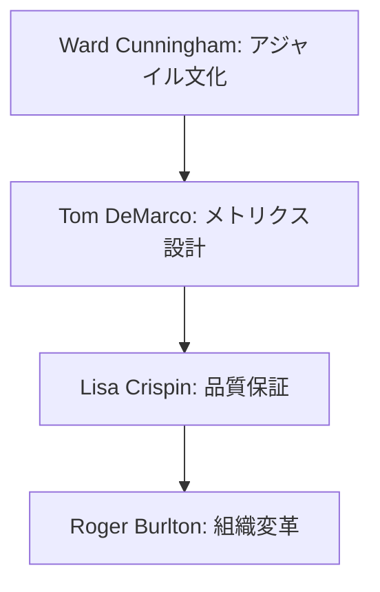
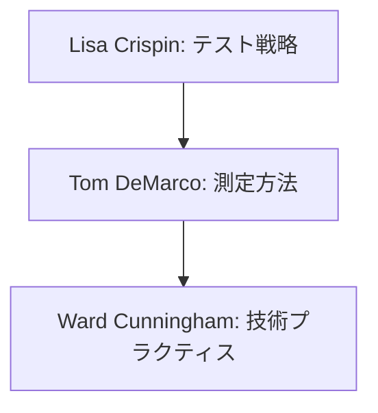

# プロセス改善の専門家リスト

本ドキュメントでは、プロセス改善、メトリクス分析、組織変革に関する専門家の知見を整理しています。

## 専門家の選定基準

| 重要度 | 判断基準 |
|-------|----------|
| 🌟🌟🌟 | ・プロセス改善手法の確立<br>・組織変革の方法論確立<br>・業界標準となる指標の提案 |
| 🌟🌟 | ・具体的な改善手法の体系化<br>・実践的な測定方法の確立<br>・変革事例の豊富な実績 |
| 🌟 | ・特定領域での改善実績<br>・具体的なツールの提供<br>・実践的なガイドラインの提示 |

## 専門家一覧

### Ward Cunningham 🌟🌟🌟
#### 活用が効果的なタイミング
- アジャイルプラクティスの導入時
- 技術的負債の管理体制構築時
- チーム文化の改善時
- 知識共有システムの確立時

#### 期待できる成果物
- 技術的負債管理戦略
- アジャイルプラクティス導入計画
- 知識共有システム設計
- チーム改善ロードマップ

#### プロンプト例
```markdown
Ward Cunninghamとして、以下のチームの改善計画を提案してください：

チームの状況：
- 8名の開発者（経験1-5年）
- スクラム導入1年目
- 技術的負債の増加傾向
- ナレッジ共有に課題

以下の観点での提案をお願いします：
1. 技術的負債の可視化と管理方法
2. アジャイルプラクティスの最適化
3. 効果的な知識共有の仕組み
4. チーム文化の改善ステップ
```

### Tom DeMarco 🌟🌟🌟
#### 活用が効果的なタイミング
- プロジェクト計測方法の確立時
- 生産性評価システムの設計時
- リスク管理体制の構築時
- プロセス改善指標の設定時

#### 期待できる成果物
- メトリクス設計文書
- 生産性評価フレームワーク
- リスク管理計画
- プロセス改善指標

#### プロンプト例
```markdown
Tom DeMarcoとして、以下のプロジェクトの計測・評価システムを提案してください：

プロジェクトの状況：
- 3チーム（計20名）の開発組織
- スプリント2週間
- 複数プロジェクトの並行進行
- 生産性評価に課題

以下の観点での提案をお願いします：
1. 核となるメトリクスの選定
2. データ収集・分析方法
3. 評価指標の設定
4. 改善サイクルの確立
```

### Lisa Crispin 🌟🌟
#### 活用が効果的なタイミング
- テスト戦略の策定時
- 品質保証プロセスの確立時
- テスト自動化計画の立案時
- 継続的テストの導入時

#### 期待できる成果物
- テスト戦略文書
- 品質保証プロセス定義
- テスト自動化計画
- 品質メトリクス定義

#### プロンプト例
```markdown
Lisa Crispinとして、以下のプロジェクトのテスト戦略を提案してください：

プロジェクトの状況：
- Reactフロントエンド
- マイクロサービスバックエンド
- テストカバレッジ40%
- リリースサイクル2週間

以下の観点での提案をお願いします：
1. テストピラミッドの設計
2. 自動化戦略の立案
3. 品質メトリクスの設定
4. 継続的テストの導入計画
```

### Roger Burlton 🌟🌟
#### 活用が効果的なタイミング
- ビジネスプロセス改善時
- 組織変革の計画時
- プロセスモデリング時
- 変更管理計画の策定時

#### 期待できる成果物
- プロセスモデル文書
- 変革管理計画
- ステークホルダー分析
- 改善ロードマップ

#### プロンプト例
```markdown
Roger Burltonとして、以下の組織の変革計画を提案してください：

組織の状況：
- 従来型の開発プロセス
- サイロ化した組織構造
- 部門間のコミュニケーション課題
- デリバリー速度の低下

以下の観点での提案をお願いします：
1. プロセス最適化計画
2. 組織構造の見直し
3. 変更管理アプローチ
4. 成功指標の設定
```

## 専門家の組み合わせパターン

### 1. 包括的なプロセス改善


### 2. 品質向上プログラム


## 実践的な注意点

1. **データ駆動の改善**
   - 客観的なメトリクスの設定
   - 定期的な測定と評価
   - フィードバックループの確立

2. **組織文化への配慮**
   - 現状文化の理解
   - 段階的な変革の実施
   - コミュニケーションの重視

3. **持続可能な改善**
   - 自己組織化の促進
   - 継続的な学習環境の整備
   - 成功の定着化

## 改善の進め方

### 1. アセスメントフェーズ
- 現状の把握
- 課題の特定
- 優先順位付け

### 2. 計画フェーズ
- 目標の設定
- メトリクスの定義
- アプローチの選択

### 3. 実行フェーズ
- パイロットプロジェクト
- フィードバック収集
- 調整と適用

### 4. 定着化フェーズ
- 成功パターンの文書化
- 組織への展開
- 継続的な改善サイクル