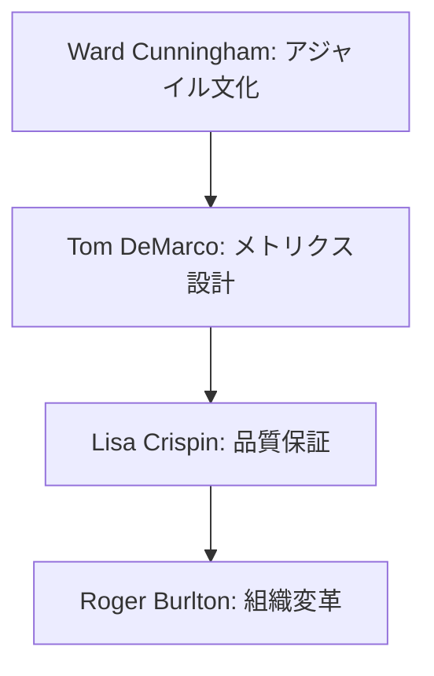
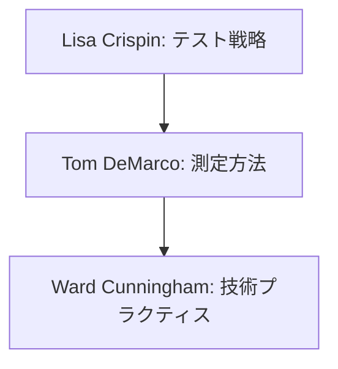

# プロセス改善の専門家リスト

## 専門家一覧

| 専門家名 | 専門分野 | 代表的な貢献 |
|---------|----------|-------------|
| Ward Cunningham | アジャイル手法,<br>技術的負債 | ・技術的負債の概念確立<br>・Wikiの発明と知識共有手法の革新<br>・アジャイルマニフェスト共同作成<br>・パターンコミュニティの形成 |
| Tom DeMarco | プロジェクト計測,<br>品質管理 | ・ソフトウェア計測手法の確立<br>・プロジェクト管理手法の体系化<br>・リスク管理フレームワークの提唱<br>・品質管理プロセスの標準化 |
| Lisa Crispin | テスト戦略,<br>品質保証 | ・アジャイルテスト手法の確立<br>・継続的テストの実践方法の体系化<br>・テストピラミッドの普及<br>・品質文化の構築手法 |
| Roger Burlton | ビジネスプロセス<br>改善 | ・プロセスモデリング手法の確立<br>・ビジネスアーキテクチャの体系化<br>・変革管理手法の標準化<br>・プロセス最適化フレームワーク |

## 専門家の詳細解説

### Ward Cunningham 🌟🌟🌟
#### 活用が効果的なタイミング
- アジャイルプラクティスの導入時
- 技術的負債の管理体制構築時
- チーム文化の改善時
- 知識共有システムの確立時
- パターンベースの改善時
- 反復的な開発プロセスの確立時
- コミュニティ形成時
- 技術的プラクティスの改善時

#### 期待できる成果物
- 技術的負債管理戦略
- アジャイルプラクティス導入計画
- 知識共有システム設計
- チーム改善ロードマップ
- パターンカタログ
- コミュニティガイドライン
- プラクティス評価基準
- 改善メトリクス定義

#### プロンプト例
```markdown
Ward Cunninghamとして、以下のチームの改善計画を提案してください：

チームの状況：
- 8名の開発者（経験1-5年）
- スクラム導入1年目
- 技術的負債の増加傾向
- ナレッジ共有に課題
- チーム間の連携不足
- プラクティスの不統一
- 改善活動の停滞

以下の観点での提案をお願いします：
1. 技術的負債の可視化と管理方法
2. アジャイルプラクティスの最適化
3. 効果的な知識共有の仕組み
4. チーム文化の改善ステップ
5. コミュニティ形成戦略
6. メトリクスによる評価方法
```

### Tom DeMarco 🌟🌟🌟
#### 活用が効果的なタイミング
- プロジェクト計測方法の確立時
- 生産性評価システムの設計時
- リスク管理体制の構築時
- プロセス改善指標の設定時
- 品質管理プロセスの確立時
- プロジェクト見積もりの改善時
- チーム効率化の検討時
- マネジメント手法の見直し時

#### 期待できる成果物
- メトリクス設計文書
- 生産性評価フレームワーク
- リスク管理計画
- プロセス改善指標
- 品質管理プロセス
- 見積もり手法ガイド
- チーム効率化計画
- マネジメント改善策

#### プロンプト例
```markdown
Tom DeMarcoとして、以下のプロジェクトの計測・評価システムを提案してください：

プロジェクトの状況：
- 3チーム（計20名）の開発組織
- スプリント2週間
- 複数プロジェクトの並行進行
- 生産性評価に課題
- リスク管理体制が不十分
- メトリクスの未整備
- 見積もり精度の低さ

以下の観点での提案をお願いします：
1. 核となるメトリクスの選定
2. データ収集・分析方法
3. リスク管理フレームワーク
4. 生産性評価手法
5. 見積もり手法の改善
6. マネジメントプロセスの最適化
```

### Lisa Crispin 🌟🌟
#### 活用が効果的なタイミング
- テスト戦略の策定時
- 品質保証プロセスの確立時
- テスト自動化計画の立案時
- 継続的テストの導入時
- テストプロセスの改善時
- 品質文化の構築時
- チーム間協働の改善時
- テストメトリクスの設定時

#### 期待できる成果物
- テスト戦略文書
- 品質保証プロセス定義
- テスト自動化計画
- 品質メトリクス定義
- テストプロセス改善計画
- 品質文化構築ガイド
- チーム協働フレームワーク
- テスト環境設計

#### プロンプト例
```markdown
Lisa Crispinとして、以下のプロジェクトのテスト戦略を提案してください：

プロジェクトの状況：
- Reactフロントエンド
- マイクロサービスバックエンド
- テストカバレッジ40%
- リリースサイクル2週間
- テスト自動化の部分的導入
- 品質課題の増加
- チーム間連携の不足

以下の観点での提案をお願いします：
1. テストピラミッドの設計
2. 自動化戦略の立案
3. 品質メトリクスの設定
4. チーム協働の改善
5. 継続的テストの導入
6. 品質文化の醸成方法
```

### Roger Burlton 🌟🌟
#### 活用が効果的なタイミング
- ビジネスプロセス改善時
- 組織変革の計画時
- プロセスモデリング時
- 変更管理計画の策定時
- ステークホルダー分析時
- プロセス最適化時
- 戦略的アライメント時
- 組織成熟度評価時

#### 期待できる成果物
- プロセスモデル文書
- 変革管理計画
- ステークホルダー分析
- 改善ロードマップ
- プロセス最適化計画
- 組織成熟度評価
- 戦略アライメント文書
- 変革評価フレームワーク

#### プロンプト例
```markdown
Roger Burltonとして、以下の組織の変革計画を提案してください：

組織の状況：
- 従来型の開発プロセス
- サイロ化した組織構造
- 部門間のコミュニケーション課題
- デリバリー速度の低下
- ステークホルダーの期待値乖離
- プロセスの非効率性
- 戦略との不整合

以下の観点での提案をお願いします：
1. プロセス最適化計画
2. 組織構造の見直し
3. 変更管理アプローチ
4. ステークホルダー管理
5. 成功指標の設定
6. 持続可能な改善の仕組み
```

## 専門家の組み合わせパターン

### 1. 包括的なプロセス改善


### 2. 品質向上プログラム


## 実践的な注意点

### 1. データ駆動の改善
- 客観的なメトリクスの設定
- 定期的な測定と評価
- フィードバックループの確立
- 改善の効果測定

### 2. 組織文化への配慮
- 現状文化の理解
- 段階的な変革の実施
- コミュニケーションの重視
- 抵抗への対処

### 3. 持続可能な改善
- 自己組織化の促進
- 継続的な学習環境の整備
- 成功の定着化
- モチベーションの維持