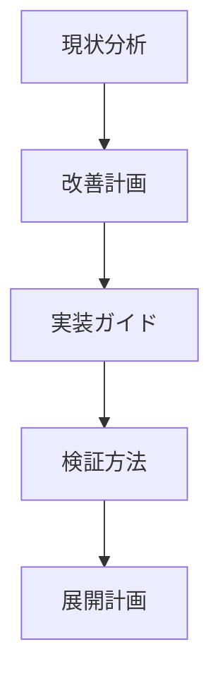
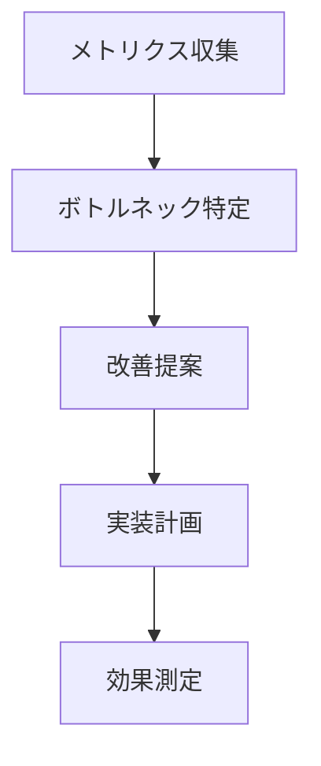

# 分析・改善フェーズのロール活用ガイド

## はじめに

このガイドは、We-Editプロジェクトでの実際の経験に基づいて作成されています。AIに資料作成を依頼する際の効果的なロールの選択と活用方法を解説します。

## 成功事例とベストプラクティス

### 1. コード品質分析・改善資料の作成

#### 成功例：技術的負債解消計画の策定
```markdown
アプローチ：
1. Martin Fowlerロールで全体分析
   - 技術的負債の分布図作成
   - 重要度と緊急度のマッピング
2. Robert C. Martinロールで設計原則の適用計画
   - SOLIDプリンシプルに基づく改善提案
   - リファクタリングの優先順位付け
3. Michael Feathersロールで具体的な改善手順
   - テスト導入戦略
   - 段階的な改善ステップ

プロンプト例：
"Martin Fowlerとして、以下の観点でコードベースを分析してください：
1. 現在の技術的負債の分布状況
2. 各負債の影響度評価
3. 改善の優先順位付け
4. リファクタリングの具体的なアプローチ

プロジェクトの状況：
- 3年運用中のECサイト
- TypeScript + React + Node.js
- チームサイズ8名
- CI/CD環境あり"
```

#### 得られた成果
- 技術的負債マップの作成
- 優先度付きの改善計画
- 具体的な実装ガイドライン

### 2. アーキテクチャ改善資料の作成

#### 成功例：マイクロサービス化検討資料
```markdown
アプローチ：
1. Sam Newmanロールでアーキテクチャ評価
   - 現状の問題点分析
   - マイクロサービス化の適合性評価
2. Eric Evansロールでドメインモデル分析
   - 境界づけられたコンテキストの特定
   - ドメイン間の関係性マッピング
3. Len Bassロールで品質特性評価
   - スケーラビリティ要件の分析
   - トレードオフの検討

プロンプト例：
"Sam Newmanとして、以下の観点でマイクロサービス化を評価してください：
1. 現在のモノリスの分析
2. 分割候補の特定
3. 移行戦略の立案
4. リスクと対策

システムの状況：
- 月間PV 100万
- ピーク時レスポンス悪化
- 機能追加の複雑化
- チーム間の依存関係増加"
```

#### 得られた成果
- サービス分割の具体的な計画
- 段階的な移行ロードマップ
- リスク管理戦略

### 3. パフォーマンス改善資料の作成

#### 成功例：フロントエンド最適化計画
```markdown
アプローチ：
1. Steve Soudersロールでパフォーマンス分析
   - ボトルネックの特定
   - 最適化機会の洗い出し
2. Dan AbramovロールでReact最適化
   - コンポーネント設計の見直し
   - レンダリング最適化
3. Leonard Richardsonロールでバックエンド連携
   - API設計の改善
   - データ取得の最適化

プロンプト例：
"Steve Soudersとして、以下の観点でパフォーマンス改善を提案してください：
1. 現状のパフォーマンス分析
2. ボトルネックの特定
3. 具体的な改善施策
4. 期待される効果

アプリケーションの状況：
- FCP 2.5秒
- TTI 4.0秒
- バンドルサイズ 2MB
- 画像最適化未実施"
```

#### 得られた成果
- 具体的な改善メトリクス
- 実装優先順位
- コスト対効果の評価

## 失敗パターンと回避策

### 1. 抽象的な依頼

❌ 悪い例：
```markdown
"コードの品質を改善する方法を教えてください"
```

✅ 改善例：
```markdown
"Martin Fowlerとして、以下のTypeScriptコードベースの品質改善を提案してください：
- 行数：50,000行
- 主な課題：重複コード、巨大クラス
- 開発体制：2チーム（計10名）
- CI/CD：Jenkins使用
- テストカバレッジ：40%"
```

### 2. 不適切なロール選択

❌ 悪い例：
```markdown
"Martin Fowlerとして、UIのパフォーマンス改善を提案してください"
```

✅ 改善例：
```markdown
"Steve Soudersとして、React SPAのパフォーマンス改善を提案してください"
```

### 3. 文脈不足の依頼

❌ 悪い例：
```markdown
"アーキテクチャを改善したいです"
```

✅ 改善例：
```markdown
"Eric Evansとして、以下のECサイトのドメインモデルを評価してください：
- 現状：モノリシック構成
- 課題：機能追加の複雑化
- 要件：注文処理の分離検討
- 制約：段階的な移行が必要"
```

## 実践的なTips

### 1. プロンプト作成のコツ
- 具体的な文脈の提供
- 明確な成果物の定義
- 制約条件の明示
- 評価基準の提示

### 2. 複数ロールの効果的な組み合わせ
- 相補的な専門性の活用
- 段階的なアプローチ
- フィードバックの反映

### 3. 成果物の質の向上
- イテレーティブな改善
- レビューと修正
- 実装可能性の確認

## プロジェクトでの活用例

### 1. レガシーシステムの改善


### 2. パフォーマンス最適化


## 継続的な改善のために

1. **フィードバックの収集**
   - 生成された資料の有用性評価
   - チームからのフィードバック
   - 実装結果の振り返り

2. **知見の蓄積**
   - 成功パターンの文書化
   - 失敗からの学び
   - ベストプラクティスの更新

3. **プロセスの最適化**
   - 依頼フローの改善
   - テンプレートの整備
   - レビュー方法の確立