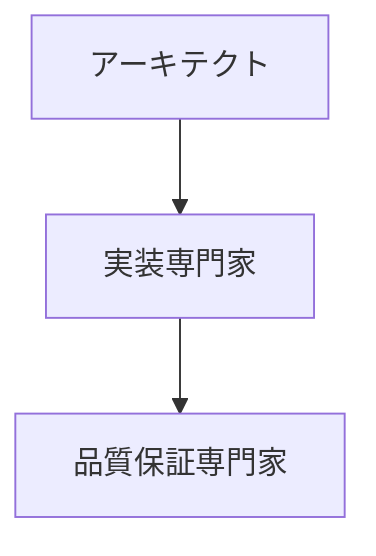
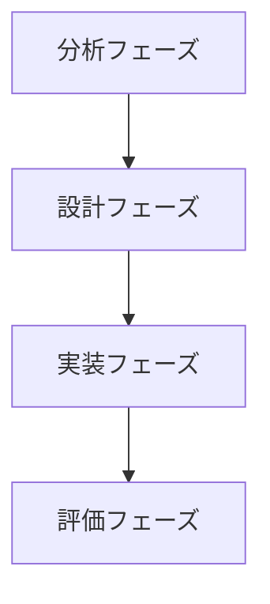
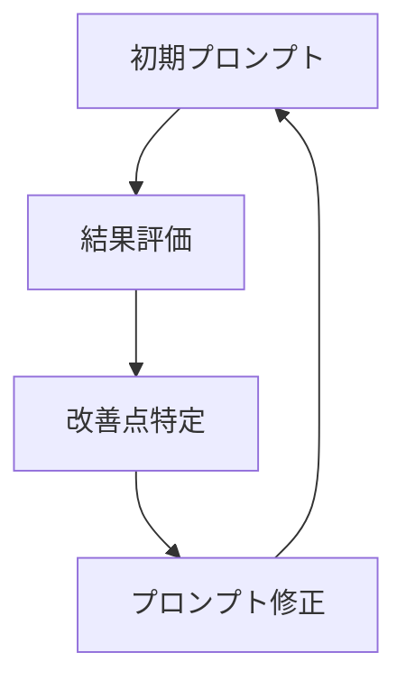

# フェーズ別資料集作成の手順書

## 1. 基本的なファイル構成

### 1.1 標準ディレクトリ構成
```
phase-name/
├── README.md                                     # フェーズの概要と資料の使用方法
├── experts-list-foundation-01.md                 # 基盤技術の専門家リスト（1セット目）
├── experts-list-foundation-02.md                 # 基盤技術の専門家リスト（2セット目）
├── experts-list-domain-specific-01.md           # 特定領域の専門家リスト（1セット目）
├── experts-list-domain-specific-02.md           # 特定領域の専門家リスト（2セット目）
├── experts-list-process-improvement-01.md        # プロセス改善の専門家リスト（1セット目）
├── experts-list-process-improvement-02.md        # プロセス改善の専門家リスト（2セット目）
├── role-usage-guide.md                          # ロールの具体的な活用方法
├── case-studies.md                              # 実際の活用事例集
└── troubleshooting.md                           # よくある課題と解決策
```

### 1.2 カテゴリ詳細定義

#### 1.2.1 基盤技術（Foundation Technology）
- **命名規則**: `experts-list-foundation-[number].md`
- **対象分野**:
  - ソフトウェアアーキテクチャ
  - 設計原則とパターン
  - コード品質と保守性
  - リファクタリング手法
  - テスト戦略
  - 開発プラクティス

#### 1.2.2 特定領域（Domain Specific）
- **命名規則**: `experts-list-domain-specific-[number].md`
- **対象分野**:
  - パフォーマンス最適化
  - セキュリティ設計
  - UI/UXデザイン
  - データベース設計
  - 分散システム
  - マイクロサービス
  - フロントエンド技術
  - バックエンド技術

#### 1.2.3 プロセス改善（Process Improvement）
- **命名規則**: `experts-list-process-improvement-[number].md`
- **対象分野**:
  - アジャイル開発手法
  - プロジェクト管理
  - 品質保証プロセス
  - チーム開発手法
  - DevOps実践
  - 継続的改善
  - 組織変革
  - メトリクス管理

### 1.3 ファイル分割の詳細ガイドライン

#### 1.3.1 基本原則
- 1ファイルあたり4-5名の専門家を推奨
- 各専門家について詳細な解説を含める
- 相互補完的な専門家をグループ化

#### 1.3.2 分割パターン
1. **関連性による分割**
   ```
   experts-list-foundation-01.md
   - アーキテクチャ設計の専門家
   - 設計原則の専門家
   - パターン設計の専門家
   
   experts-list-foundation-02.md
   - コード品質の専門家
   - リファクタリングの専門家
   - テスト戦略の専門家
   ```

2. **フェーズによる分割**
   ```
   experts-list-domain-specific-01.md
   - 初期設計フェーズの専門家
   - アーキテクチャ決定フェーズの専門家
   
   experts-list-domain-specific-02.md
   - 実装フェーズの専門家
   - 最適化フェーズの専門家
   ```

3. **スコープによる分割**
   ```
   experts-list-process-improvement-01.md
   - チームレベルの改善専門家
   - プロジェクトレベルの改善専門家
   
   experts-list-process-improvement-02.md
   - 組織レベルの改善専門家
   - エンタープライズレベルの改善専門家
   ```

## 2. 専門家リストの作成手順

### 2.1 専門家の選定基準

#### 2.1.1 基本要件
- 分野での重要な貢献
- 広く認知された手法の確立
- 実践的なアプローチの提供
- 継続的な影響力

#### 2.1.2 重要度の評価
🌟🌟🌟 最重要レベル
- 分野の基礎理論を確立
- 複数の実践的手法を提供
- 広く採用されている手法の提唱者

🌟🌟 重要レベル
- 特定分野での深い知見
- 実践的な手法の体系化
- 具体的な実装パターンの提示

🌟 基本レベル
- 特定技術での実績
- 実践的な適用例の提供
- 具体的な改善手法の提案

### 2.2 専門家情報の記述

#### 2.2.1 基本テンプレート
```markdown
# [カテゴリ名]の専門家リスト - [セット番号]

## 専門家一覧
| 専門家名 | 専門分野 | 代表的な貢献 |
|---------|----------|-------------|
| [名前] | [主分野] | ・[主要な貢献1]<br>・[主要な貢献2]<br>・[主要な貢献3] |

## 重要度の定義
[重要度の説明]

## 専門家の詳細解説
### [専門家名] 🌟🌟🌟
#### プロフィール
- 専門分野: [詳細]
- 主な著書: [書籍リスト]
- 重要な貢献: [具体的な貢献]

#### 活用が効果的なタイミング
- [具体的なタイミング1]
- [具体的なタイミング2]
- [具体的なタイミング3]

#### 期待できる成果物
- [成果物1の詳細]
- [成果物2の詳細]
- [成果物3の詳細]

#### プロンプトの基本構造
```text
[専門家名]として、以下の[課題/状況]について分析と提案をお願いします：

[状況の具体的な説明]
- [詳細1]
- [詳細2]
- [詳細3]

期待する成果物：
1. [成果物1]
2. [成果物2]
3. [成果物3]

考慮すべき制約：
- [制約1]
- [制約2]
- [制約3]
```

#### 具体的なプロンプト例
```text
[実際のプロンプト例]
```

#### 補足情報
- [関連する専門家]
- [組み合わせ推奨事項]
- [注意点]
```

### 2.3 プロンプト設計の詳細

#### 2.3.1 基本構造
1. **ロールの確立**
   ```markdown
   [専門家名]として、
   ```

2. **文脈の提供**
   ```markdown
   以下の状況について分析と提案をお願いします：
   
   プロジェクトの状況：
   - [具体的な状況]
   - [課題]
   - [制約条件]
   ```

3. **期待する成果物の明確化**
   ```markdown
   以下の観点での分析と提案をお願いします：
   1. [分析観点1]
   2. [分析観点2]
   3. [分析観点3]
   ```

#### 2.3.2 詳細化のポイント
1. **状況の具体化**
   - 数値による現状説明
   - 具体的な課題の列挙
   - 制約条件の明確化

2. **期待値の明確化**
   - 具体的な成果物の形式
   - 必要な詳細度
   - 優先順位

3. **フィードバックの組み込み**
   - 中間確認ポイント
   - 詳細化の要求
   - 修正指示

### 2.4 プロンプトパターン集

#### 2.4.1 分析・評価パターン
```markdown
[専門家名]として、以下の[対象]を分析・評価してください：

現状：
- [具体的な状況]
- [メトリクス]
- [課題]

以下の観点での分析をお願いします：
1. 現状の評価
2. 主要な課題
3. 改善提案
4. 優先順位
```

#### 2.4.2 改善提案パターン
```markdown
[専門家名]として、以下の[対象]の改善計画を提案してください：

改善対象：
- [具体的な対象]
- [現状の課題]
- [改善目標]

制約条件：
- [時間的制約]
- [リソース制約]
- [技術的制約]

期待する提案内容：
1. 具体的な改善ステップ
2. 期待される効果
3. リスクと対策
4. 評価指標
```

#### 2.4.3 レビュー・評価パターン
```markdown
[専門家名]として、以下の[成果物]をレビュー・評価してください：

対象：
- [成果物の説明]
- [作成背景]
- [要件]

評価観点：
1. [観点1]
2. [観点2]
3. [観点3]

期待する出力：
1. 評価結果
2. 改善提案
3. 優先順位
```

## 3. よくある課題と対応策

### 3.1 専門家選定の課題

#### 3.1.1 専門家の重複
問題：
- 複数のカテゴリに当てはまる専門家の扱い

解決策：
1. 主たる貢献分野でカテゴリ分け
2. 他カテゴリでの参照を追加
3. 組み合わせパターンで補完

#### 3.1.2 専門家情報の不足
問題：
- 詳細情報が十分に得られない

解決策：
1. 主要な著作からの情報収集
2. 実践事例からの補完
3. コミュニティでの評価の参照

### 3.2 プロンプト作成の課題

#### 3.2.1 抽象的な回答
問題：
- 具体性に欠ける回答

解決策：
1. 具体的な数値や例の提示
2. 文脈情報の充実
3. 詳細度の明示

#### 3.2.2 非現実的な提案
問題：
- 実現可能性の低い提案

解決策：
1. 制約条件の明確化
2. 段階的なアプローチの要求
3. 実現可能性の評価基準提示

## 4. 実践的なTips

### 4.1 効果的な専門家の組み合わせ

#### 4.1.1 補完的な組み合わせ


#### 4.1.2 段階的な活用


### 4.2 プロンプト改善のサイクル

#### 4.2.1 イテレーティブな改善


#### 4.2.2 フィードバックの収集
1. 生成結果の評価
2. チームからのフィードバック
3. 実装結果の検証
4. メトリクスの測定

## 5. 成果物の品質管理

### 5.1 品質評価基準

#### 5.1.1 内容の品質
- [ ] 専門家の選定が適切
- [ ] 情報が正確で最新
- [ ] 実践的な価値がある
- [ ] 一貫性がある

#### 5.1.2 構造の品質
- [ ] 標準形式に従っている
- [ ] 必要な要素が揃っている
- [ ] 参照が適切
- [ ] 更新履歴が明確

#### 5.1.3 実用性の品質
- [ ] 具体的な例が充実
- [ ] 実践的なガイドライン
- [ ] トラブルシューティング
- [ ] フィードバック反映

### 5.2 レビュープロセス

#### 5.2.1 技術的レビュー
1. 情報の正確性
2. 実現可能性
3. ベストプラクティスとの整合性

#### 5.2.2 実用性レビュー
1. 具体例の充実度
2. ガイドラインの明確さ
3. トラブルシューティングの充実度

## 6. メンテナンスガイドライン

### 6.1 更新サイクル

#### 6.1.1 定期更新
- 3ヶ月ごとの内容確認
- 6ヶ月ごとの大規模見直し
- 年次の完全レビュー

#### 6.1.2 イベントベース更新
- 新しい専門家の追加時
- 重要な知見の発見時
- 大きな技術変更時

### 6.2 品質維持

#### 6.2.1 レビュープロセス
1. 技術的正確性
2. 実践的有用性
3. 最新動向との整合性

#### 6.2.2 フィードバック管理
1. ユーザーフィードバックの収集
2. 実践からの学びの反映
3. 改善提案の管理

## 7. 推奨されるワークフロー

### 7.1 初期セットアップ

#### 7.1.1 準備フェーズ
1. フェーズの特性理解
2. 必要な専門家の特定
3. カテゴリ分けの実施
4. ファイル構成の計画

#### 7.1.2 基本資料作成
1. README.mdの作成
2. 専門家リストの作成
3. 活用ガイドの作成
4. 事例集の作成

### 7.2 継続的な改善

#### 7.2.1 モニタリング
1. 使用状況の追跡
2. フィードバックの収集
3. 効果の測定
4. 課題の特定

#### 7.2.2 改善サイクル
1. 課題の分析
2. 改善案の作成
3. 変更の実装
4. 効果の確認