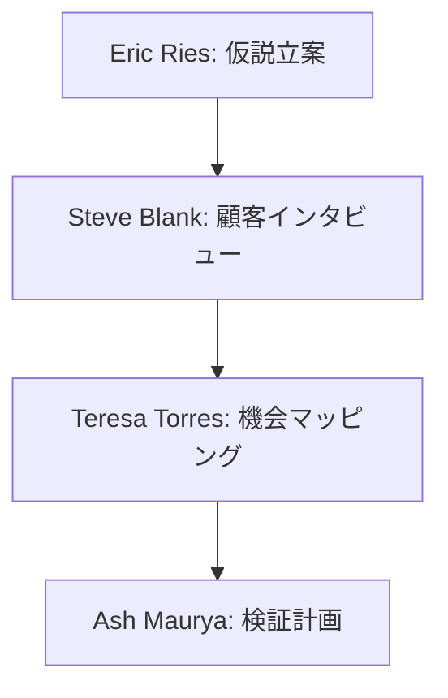
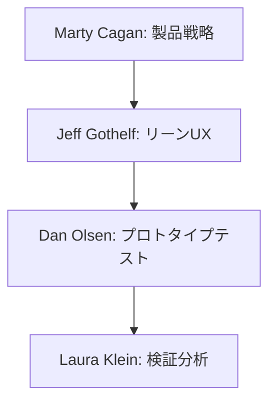

# 仮説検証フェーズのリソースガイド

このディレクトリには、仮説検証フェーズでAIに資料作成を依頼する際の包括的なガイドラインが含まれています。

## ディレクトリ構成

```
hypothesis-testing/
├── README.md                                        # 全体の概要と使用方法
├── experts-list-startup-methodology-01.md           # スタートアップ方法論の専門家
├── experts-list-startup-methodology-02.md           # スタートアップ方法論の専門家（続き）
├── experts-list-product-development-01.md           # プロダクト開発の専門家
├── experts-list-customer-development-01.md          # 顧客開発の専門家
├── experts-list-validation-techniques-01.md         # 検証手法の専門家
├── role-usage-guide.md                             # ロールの具体的な活用方法
├── case-studies.md                                  # 実際の活用事例集
├── quick-reference.md                              # クイックリファレンス
├── validation-templates/                           # 各種検証テンプレート
│   ├── problem-validation.md                       # 課題検証
│   ├── solution-validation.md                      # 解決策検証
│   ├── market-validation.md                        # 市場検証
│   └── business-model-validation.md                # ビジネスモデル検証
└── troubleshooting.md                              # よくある課題と解決策
```

## 専門家カテゴリ

### 1. スタートアップ方法論（Startup Methodology）
- Lean Startup
- Running Lean
- Design Thinking
- Jobs to be Done
- Customer Development

主な専門家：
- Eric Ries
- Ash Maurya
- Steve Blank
- Clayton Christensen

### 2. プロダクト開発（Product Development）
- プロダクトマネジメント
- MVP開発
- プロトタイピング
- ユーザーリサーチ

主な専門家：
- Marty Cagan
- Jeff Gothelf
- Josh Seiden
- Teresa Torres

### 3. 顧客開発（Customer Development）
- インタビュー手法
- ユーザーリサーチ
- マーケット分析
- ペルソナ開発

主な専門家：
- Steve Blank
- Bob Dorf
- Giff Constable
- Rob Fitzpatrick

### 4. 検証手法（Validation Techniques）
- 実験デザイン
- データ分析
- 定性・定量調査
- A/Bテスト

主な専門家：
- Dan Olsen
- Laura Klein
- Jeff Sauro
- Erika Hall

## 活用シナリオ例

### 1. 問題仮説の検証


### 2. 解決策仮説の検証


## 使用方法

### 1. 仮説の種類に応じた専門家の選択
1. 問題仮説 → スタートアップ方法論の専門家
2. 解決策仮説 → プロダクト開発の専門家
3. 市場仮説 → 顧客開発の専門家
4. 検証方法 → 検証手法の専門家

### 2. 推奨される使用ステップ
1. `validation-templates/` から適切なテンプレートを選択
2. 該当する専門家のロールを選択
3. `quick-reference.md` からプロンプトテンプレートを参照
4. `case-studies.md` で類似事例を確認

### 3. 検証サイクルの実施
1. 仮説の設定
2. 検証方法の設計
3. 実験の実施
4. データの分析と学び

## 品質管理のポイント

1. **仮説の質**
   - 検証可能性
   - 具体性
   - 測定可能性

2. **検証方法の適切性**
   - コスト効率
   - 時間効率
   - 信頼性

3. **データの質**
   - 客観性
   - 信頼性
   - 再現性

## メンテナンス方針

このディレクトリの内容は、以下のタイミングで更新されます：

1. 新しい検証手法の発見時
2. より効果的なプラクティスの確立時
3. プロジェクトからのフィードバック反映時

## 貢献方法

プロジェクトでの実践を通じて得られた知見は、以下の形で共有することを推奨します：

1. 成功事例の追加
2. 検証テンプレートの改善
3. 新しい専門家の追加